<p align="center">
  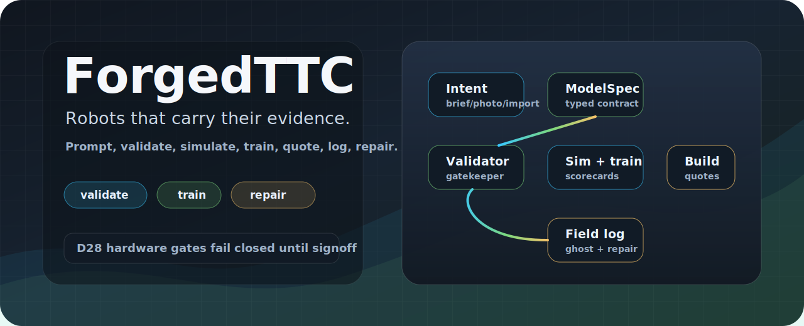
</p>

<h1 align="center">ForgedTTC</h1>

<p align="center">
  <strong>Describe a robot, validate the design, train the twin, and turn field telemetry into repair evidence.</strong>
</p>

<p align="center">
  <a href="#the-problem-we-are-solving"><strong>Painpoints</strong></a>
  &nbsp;&nbsp;|&nbsp;&nbsp;
  <a href="#how-ttc-works-for-users"><strong>How it works</strong></a>
  &nbsp;&nbsp;|&nbsp;&nbsp;
  <a href="#what-you-can-do"><strong>Features</strong></a>
  &nbsp;&nbsp;|&nbsp;&nbsp;
  <a href="#visual-proof-the-core-already-renders-real-contracts"><strong>Visual proof</strong></a>
  &nbsp;&nbsp;|&nbsp;&nbsp;
  <a href="#architecture"><strong>Architecture</strong></a>
  &nbsp;&nbsp;|&nbsp;&nbsp;
  <a href="#run-it-locally"><strong>Run locally</strong></a>
</p>

<p align="center">
  
  
  
  
</p>

<p align="center">
  <code>brief -> generated model -> validator report -> sim/replay -> scorecard -> BOM/quotes -> telemetry -> repair sheet</code>
</p>

ForgedTTC is an open-core robotics design system for people who want AI-assisted
robot design without giving up engineering discipline. It combines a browser
studio, a Rust validator, a simulation/export stack, a Python worker plane, and a
platform layer for sharing, courses, policy scorecards, quote links, and
maintenance records.

> The product bet: a useful robot model is not just geometry. It is the design,
> parts, assumptions, validation results, scorecards, quotes, telemetry, and repair
> history moving together.

<table>
  <tr>
    <td width="33%">
      <h3>Generate with guardrails</h3>
      <p>Start from a brief, photo, import, or catalog-backed template. Every candidate is checked before it becomes a real model.</p>
    </td>
    <td width="33%">
      <h3>Know why it passes</h3>
      <p>Validation reports, lockfiles, provenance, license policy, scorecards, and replay hashes travel with the model.</p>
    </td>
    <td width="33%">
      <h3>Close the loop</h3>
      <p>BOMs, quote links, training outputs, field telemetry, and repair sheets all point back to the same design contract.</p>
    </td>
  </tr>
</table>

---

## The Problem We Are Solving

Robotics builders do not need another isolated viewport. They need the design,
parts, physics, training, build evidence, and field evidence to agree.

| User painpoint | What usually happens today | What ForgedTTC does instead |
|---|---|---|
| "I can sketch the robot, but I do not know if it will build." | CAD shows shape while mass, thrust, component fit, wiring, and BOM live elsewhere | The model contract carries geometry, parts, drivers, sim assumptions, lockfiles, and provenance together |
| "AI can draw something plausible, but I cannot trust it." | Generated designs hallucinate parts, skip constraints, or disappear when validation fails | Generation runs through retrieval, synthesis, validation, and repair; failed attempts persist as editable drafts with diagnostics |
| "I need a BOM and vendor links, not just an STL." | Build planning becomes a spreadsheet hunt across vendors and print services | BOM rows, license state, vendor offers, DfM artifacts, and print quote links are platform objects |
| "Training results are impossible to compare." | A policy blob arrives without observation layout, task definition, randomization, scorecard, or lineage | Policy artifacts include ONNX metadata, I/O headers, scorecards, randomization grids, and export gates |
| "Sharing a model loses context." | Marketplaces distribute files without validator reports, license policy, moderation, or usage data | Listings require admitted validator reports, policy gates where needed, moderation paths, and usage rollups |
| "Field evidence rarely improves the next design." | Telemetry, damage notes, and repairs become disconnected logs | Field telemetry can become replay evidence, system-ID input, wear estimates, impact analysis, and repair sheets |
| "Hardware deployment is too easy to make unsafe." | A UI button can quietly become real-world authority | Real hardware actions are blocked by default. They only unlock after legal/safety signoff, explicit lab mode, approved reference rigs, and physical confirmation |

---

## How TTC Works For Users

The user loop is deliberately concrete. You are not expected to understand the whole
repo to understand the product.

<table>
  <tr>
    <td width="50%">
      <h3>1. Describe or import</h3>
      <p>Start with a natural-language brief, a saved model, a catalog-backed archetype, a photo/multiview scan, or an external URDF/MJCF import.</p>
    </td>
    <td width="50%">
      <h3>2. Generate a ModelSpec</h3>
      <p>TTC turns the input into a typed robotics contract: skeleton, parts, slots, ports, drivers, materials, sim assumptions, and lockfile pins.</p>
    </td>
  </tr>
  <tr>
    <td width="50%">
      <h3>3. Validate before it counts</h3>
      <p>The Rust validator checks structure, geometry, compatibility, physics assumptions, provenance, and export policy. Passing models become admitted; failing models remain editable drafts.</p>
    </td>
    <td width="50%">
      <h3>4. Inspect and configure</h3>
      <p>The Studio renders the same contract the validator sees. You can inspect parts, patch colors/materials/dimensions, align scans, launch jobs, and see consequences.</p>
    </td>
  </tr>
  <tr>
    <td width="50%">
      <h3>5. Train, score, and share</h3>
      <p>Training jobs produce policy artifacts with ONNX headers, task metadata, scorecards, randomization grids, and export gates. Shares and listings carry the validator evidence.</p>
    </td>
    <td width="50%">
      <h3>6. Build, log, and repair</h3>
      <p>BOM rows, vendor links, print quote handoffs, telemetry logs, wear estimates, impact analysis, and repair sheets all stay attached to the design lineage.</p>
    </td>
  </tr>
</table>

### How model generation works

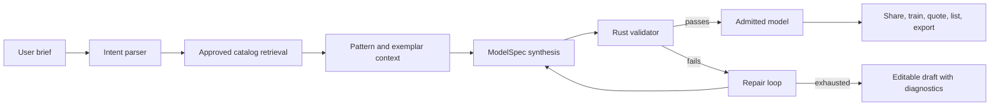

Generation is not a black-box image prompt. It is a constrained pipeline:

- The prompt is converted into an archetype, constraints, and retrieval query.
- Only approved catalog rows and consented patterns enter the generation context.
- The generator emits a real `ModelSpec`, not hidden code.
- The validator checks every candidate.
- Repair attempts are tracked.
- If the model still fails, the work is saved as a draft with reasons, not thrown away.
- Admitted models carry prompt hash, seed, model provenance, contract hash, and validator report.

## What You Can Do

| User action | What you get back | Why it matters |
|---|---|---|
| Generate from a brief | An admitted model or an editable diagnostic draft | AI output is useful only when it survives validation |
| Edit a model conversationally | A JSON-Patch, re-baked geometry, and a fresh validator report | Changes are real contract edits, not visual-only tweaks |
| Upload photos or multiview images | Photoscan artifacts, refit metrics, candidate component rows | Physical parts can become reviewed components instead of loose meshes |
| Validate a design | A deterministic report with pass/fail diagnostics | Share, train, export, and listing gates have one source of truth |
| Export MJCF/URDF | Training/deployment artifacts from the same model | Sim and external tooling do not fork the design |
| Train a policy | ONNX metadata, I/O headers, task scorecard, export gate | Policy artifacts are inspectable and comparable |
| Create a course or leaderboard run | EnvSpec validation and server-side replay verification | Community challenges can double as training curricula |
| List a model or skill | Marketplace entry with validator evidence and usage rollup | Files become accountable product artifacts |
| Request build handoff | Vendor links and print quote links | Users leave with actionable build steps, not just downloads |
| Ingest field telemetry | Replay, system-ID, wear, impact, and repair records | Real use improves the twin and the next design |

### A design loop that keeps carrying evidence forward

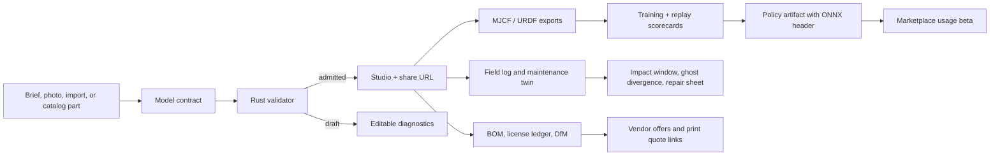

### A trust ladder that does not pretend hardware is just another API

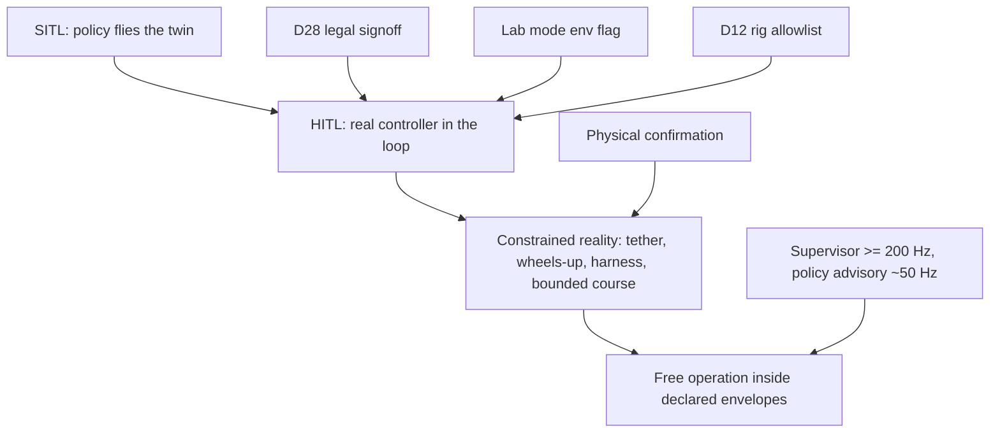

The ladder is not product theater. The current implementation deliberately blocks
live hardware writes and live capture until the gate conditions are met.

---

## Visual Proof: The Core Already Renders Real Contracts

These are generated parity captures from the repo, used to compare the browser
studio against the frozen prototype camera views.

| Three-quarter | Profile | Rear/high |
|---|---|---|
| 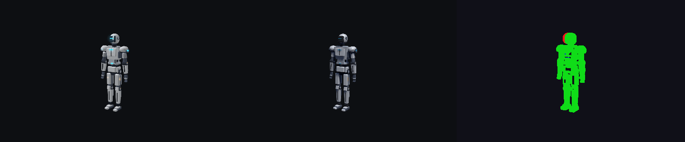 | 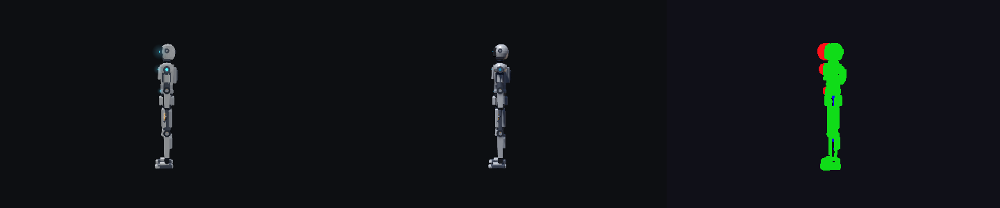 | 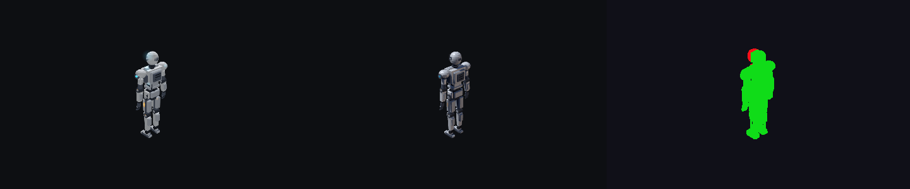 |
| 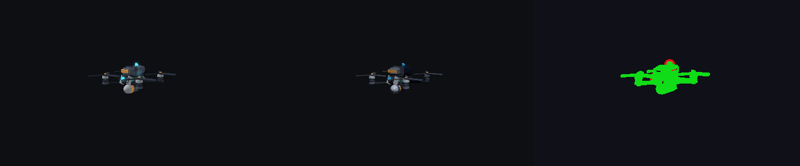 | 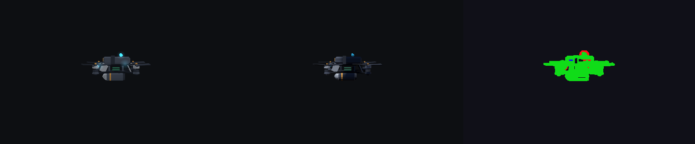 |  |

The important part is not the screenshot. It is that the visual, validator report,
mass properties, BOM, replay, and policy metadata all come from the same model data.

---

## Why This Matters

### For builders

You get faster answers to the questions that usually appear too late:

- Will this design validate?
- What parts does it actually need?
- What changed when I swapped a battery, motor, or frame?
- Can I share it without leaking restricted geometry?
- Can a stranger equip it and still see the validator report?
- Can I get a quote link for the printed parts without building a checkout system?
- If a field run damages hardware, can I turn the telemetry into repair steps?

### For teams

You get an audit trail instead of folklore:

- Model versions carry prompt hashes, lockfiles, and validator reports.
- Catalog rows carry citations, license classes, price rows, and review state.
- Policies carry scorecards, I/O headers, randomization metadata, and lineage.
- Leaderboards re-verify replay tapes server-side.
- Platform gates show whether hardware, policy sharing, and economics are accepted or blocked.

### For the product

The moat is not a renderer. The moat is accumulated, validated robotics evidence:

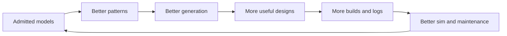

---

## Feature Map

| Area | What users see | What keeps it honest |
|---|---|---|
| Model generation | Brief-to-ModelSpec pipeline, staged progress, repair attempts, editable drafts | Approved retrieval context, validator-in-loop repair, Brief-25 gate |
| Studio editing | Visual inspection, conversational edits, JSON-Patch changes, revalidation | The visible model and validator contract stay the same object |
| Catalog and BOM | Approved parts, BOM rows, prices, citations, license state | License ledger, review queue, immutable revisions |
| Photoscan | Image/multiview job artifacts, scale/axis/port alignment UI | D13 primitive-refit metrics and owner review flags |
| Simulation and export | HUD, replay, MJCF/URDF, parity contracts | Rust source of truth and engine parity tolerances |
| Policy training | Scorecards, ONNX headers, task metadata, playback metadata | Estimator-only observations and export gates |
| Courses | EnvSpec validation, assignments, leaderboards | Server-side replay verification |
| Marketplace | Listed models/skills, usage rollups, moderation | Admitted reports, policy gate, D29 usage beta |
| Commerce | Vendor links and print quote handoff | Off-platform checkout only, no payout/payment ledger |
| Desktop/bridge | Future serial and recorder surface | D28 fail-closed native commands |
| Maintenance | Wear estimates, impact windows, repair steps, fleet summaries | Field logs become records, not screenshots |

---

## What Is Live vs Gated

ForgedTTC is intentionally split into two truths:

1. **Fixture truth**: deterministic, keyless, CI/local paths that prove the product surface.
2. **Live truth**: GPU, vendor, print-service, engine, and hardware paths enabled only with explicit capabilities and gates.

| Capability | Default | Live path |
|---|---|---|
| Fixture jobs | On | Always available for tests and local acceptance |
| Modal / GPU jobs | Off | Requires Modal/env configuration |
| COLMAP / TRELLIS-class photoscan | Off | External command or Modal adapter |
| SB3 / MuJoCo training | Off | External command integration |
| Rapier / MuJoCo parity | Fixture contracts | Engine-backed baseline capture still gated |
| Vendor offers | Sandboxable | Provider endpoint configuration |
| Print quotes | Sandboxable | Provider quote endpoint, checkout off-platform |
| Hardware writes/capture | Blocked | D28 signoff + lab env + D12 rig + physical confirmation |

No seller payouts. No revenue share. No direct checkout. D29 records marketplace as
a usage-data beta until real thresholds justify the next economics decision.

---

## Architecture

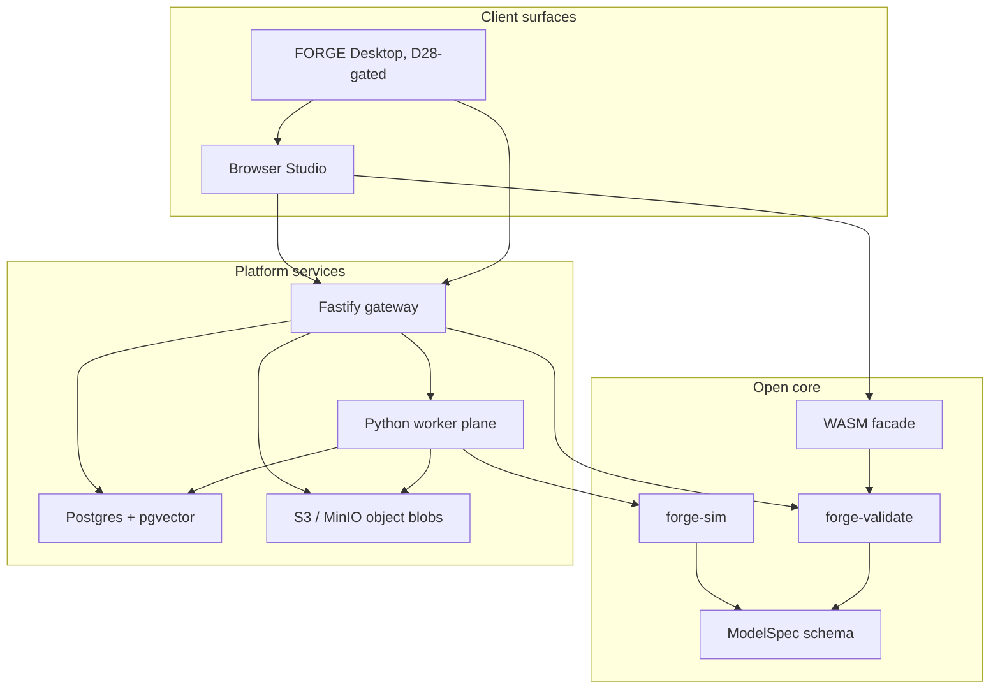

The design principle is boring and strict: one schema, one validator, one evidence
trail, many surfaces.

---

## Run It Locally

### Prerequisites

- Node 24 with Corepack
- pnpm 10.33.0
- Rust toolchain
- Python 3.12 for the worker plane
- Docker, if you want the Postgres/MinIO stack

### Install

```bash
corepack enable
pnpm install
cargo build -p forge-validate
pnpm build:wasm
pnpm demo:sync
```

### Fastest Studio-only path

```bash
pnpm --filter @forge/studio dev
```

Open the Vite URL and inspect the bundled demo contracts.

### Full local stack

```bash
docker compose -f infra/docker-compose.yml up -d postgres minio
pnpm db:migrate
pnpm db:seed-catalog
pnpm db:assert-p3
pnpm --filter @forge/gateway dev
pnpm --filter @forge/studio dev
```

For an app-profile Docker run:

```bash
docker compose -f infra/docker-compose.yml --profile app up
```

If your machine already has a Postgres service on port 5432, set `DATABASE_URL` or
adjust the compose port before running migrations.

---

## Verification Commands

```bash
pnpm --filter @forge/gateway typecheck
pnpm --filter @forge/gateway test
pnpm --filter @forge/studio typecheck
pnpm --filter @forge/desktop test
cargo test -p forge-sim
cd workers && PYTEST_DISABLE_PLUGIN_AUTOLOAD=1 PYTHONPATH=. python3 -m pytest
git diff --check
```

Additional gates:

```bash
pnpm eval:brief25
pnpm pilot:check
node scripts/validate-all.mjs
```

---

## Repo Map

| Path | Purpose |
|---|---|
| `crates/` | Rust contract, validator, geometry, motion, sim, WASM facade |
| `packages/studio` | React/Three.js browser studio |
| `packages/gateway` | Fastify API, auth, jobs, blobs, platform routes |
| `packages/desktop` | Tauri bridge shell and D28 fail-closed native command contract |
| `workers` | Python jobs for ETL, photoscan, training, replay, bridge, co-design, maintenance |
| `infra/migrations` | Postgres schema for catalog, jobs, artifacts, gates, commerce |
| `catalog` | Component and reference rig data |
| `examples` | First-party model contracts |
| `docs` | Roadmap, system design, decisions, pilot playbooks |
| `evals` | Brief-25 generation benchmark |
| `scripts` | Codegen, migrations, checks, parity, evals |

---

## The Non-Goals Are Part Of The Product

ForgedTTC is not trying to be every CAD system, every flight stack, or a reckless
hardware deploy button.

- Surface-perfect industrial CAD is not the wedge. Mass-properties-correct,
  buildable, validated robotics systems are.
- Hardware deployment is not a default. It is a gated lab path.
- Marketplace payments are not in the first platform slice. Usage data comes first.
- AI is not allowed to outrank the validator.

That restraint is where the value comes from.

---

## Licensing

ForgedTTC is open-core.

- Apache-2.0 zone: `crates/`, `schema/`, and `examples/`
- Proprietary zone: Studio, gateway, workers, catalog data, infra, docs, scripts,
  and platform services

See `LICENSE`, `NOTICE`, and `docs/DECISIONS.md` for the binding split.

---

## Current North Star

Robotics should not reset at every tool boundary.

```text
Describe it.
Validate it.
Sim it.
Train it.
Share it.
Build it.
Log what happened in the real world.
Repair what changed.
Feed the evidence back into the next design.
```

Not because the workflow needs more spectacle.
Because every step should preserve what was learned.
