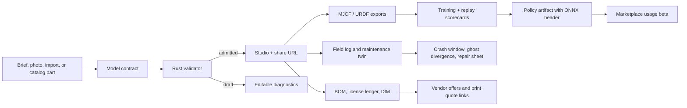
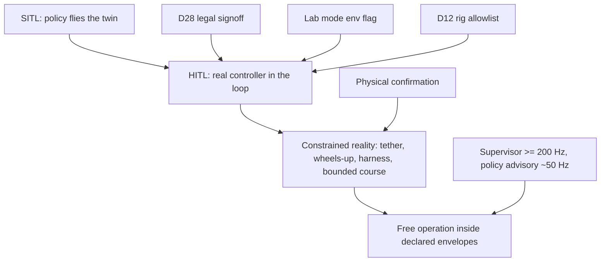
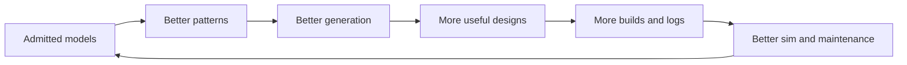
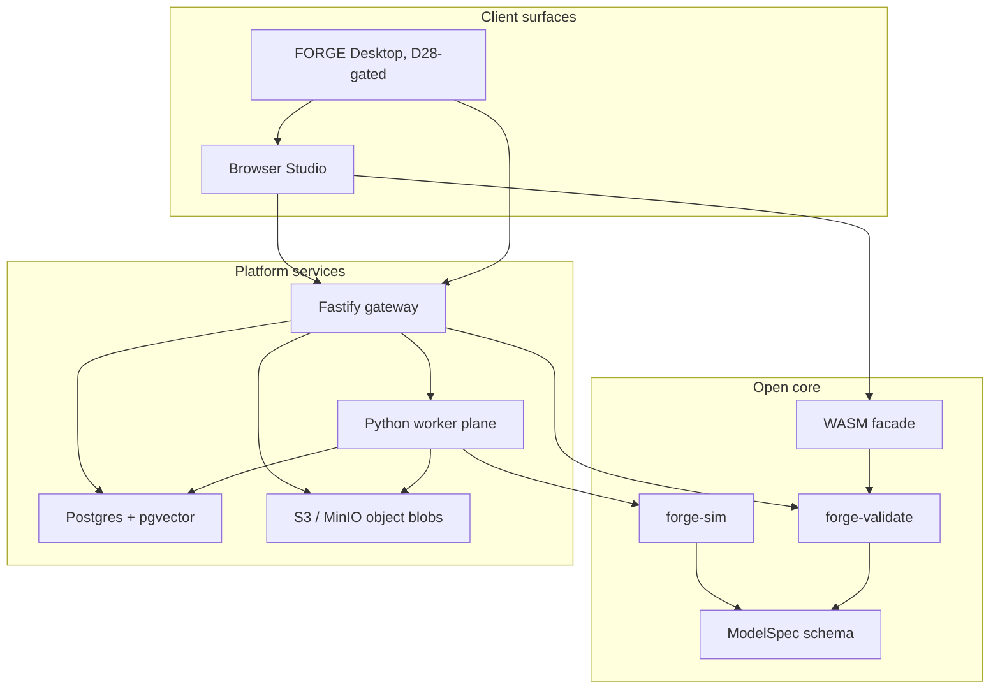

<p align="center">
  
</p>

<h1 align="center">ForgedTTC</h1>

<p align="center">
  <strong>Design robots from intent, prove them before you build, and keep the model alive after the crash.</strong>
</p>

<p align="center">
  <a href="#the-problem-we-are-solving"><strong>Painpoints</strong></a>
  &nbsp;&nbsp;|&nbsp;&nbsp;
  <a href="#what-you-get"><strong>What users get</strong></a>
  &nbsp;&nbsp;|&nbsp;&nbsp;
  <a href="#visual-proof-the-core-already-renders-real-contracts"><strong>Visual proof</strong></a>
  &nbsp;&nbsp;|&nbsp;&nbsp;
  <a href="#architecture"><strong>Architecture</strong></a>
  &nbsp;&nbsp;|&nbsp;&nbsp;
  <a href="#run-it-locally"><strong>Run locally</strong></a>
</p>

<p align="center">
  
  
  
  
</p>

<p align="center">
  <code>prompt -> admitted model -> sim/replay -> policy scorecard -> BOM/quotes -> field log -> repair sheet</code>
</p>

ForgedTTC is an open-core robotics design system: a browser studio, a Rust
validator, a simulation/export stack, a Python worker plane, and a platform layer
for sharing, courses, policy scorecards, quote links, and maintenance records.

> The product bet: robotics design should not end at a file export. It should carry
> evidence from first idea to build, training, field logs, and repair.

<table>
  <tr>
    <td width="33%">
      <h3>Evidence-first design</h3>
      <p>Every serious artifact carries a validator report, lockfile, provenance, scorecard, license state, or replay hash.</p>
    </td>
    <td width="33%">
      <h3>One source of truth</h3>
      <p>The browser, gateway, worker jobs, exports, replay, and policy metadata all orbit the same typed model contract.</p>
    </td>
    <td width="33%">
      <h3>Gated reality</h3>
      <p>Live GPU, provider, engine, and hardware paths exist, but default to deterministic fixtures and explicit gates.</p>
    </td>
  </tr>
</table>

---

## The Problem We Are Solving

Robotics builders do not fail because they lack another pretty viewport.
They fail because the tools disagree until the hardware does.

| Painpoint | What usually happens | What ForgedTTC does instead |
|---|---|---|
| CAD knows shape, not truth | Mass, thrust, wiring, policy limits, and BOM drift into spreadsheets | One typed model contract carries geometry, parts, drivers, sim assumptions, lockfiles, and provenance |
| "Looks buildable" is not enough | Interference, wrong mounts, bad hover margins, and missing citations surface late | The Rust validator is the gatekeeper before share, train, export, list, or deploy |
| AI design is mostly vibes | Generated outputs vanish, hallucinate parts, or bypass review | Generation is validator-in-loop; failed generations persist as editable drafts with diagnostics |
| Simulation is disconnected | Browser sim, training sim, and field replay become separate worlds | Rapier/MuJoCo/export paths consume the same compiled source of truth and are parity-gated |
| Policies are hard to trust | A policy blob arrives without observation layout, scorecard, or lineage | Policy artifacts include ONNX metadata, I/O headers, scorecards, randomization, and export gates |
| Marketplace files are dead ends | Downloads do not know if they are legal, buildable, repairable, or safe | Listings require admitted validator reports, moderation paths, license/export policy, and usage rollups |
| Hardware authority gets blurry | "Deploy" buttons quietly become risky write paths | D28 hardware gates fail closed until legal signoff, lab mode, D12 rig allowlist, and physical confirmation exist |

---

## What You Get

### A studio that is useful before the cloud exists

| Surface | User value | Current state |
|---|---|---|
| Browser Studio | Inspect, configure, validate, share, launch jobs, view artifacts | Live in `packages/studio` |
| Rust core + WASM | One deterministic bake, validate, patch, and tick path | Live in `crates/` |
| Gateway API | Models, shares, jobs, blobs, courses, listings, gates, quotes | Live in `packages/gateway` |
| Worker plane | Photoscan, training, replay, bridge, co-design, maintenance jobs | Fixture truth plus live adapter seams |
| Desktop shell | Native bridge surface for future serial and background recording | Fail-closed D28-gated Tauri scaffold |
| Platform layer | Usage beta marketplace, classroom, moderation, license ledger | Live local APIs and Studio rows |

### A design loop that keeps carrying evidence forward



### A trust ladder that does not pretend hardware is just another API



The ladder is not product theater. The current implementation deliberately blocks
live hardware writes and live capture until the gate conditions are met.

---

## Visual Proof: The Core Already Renders Real Contracts

These are generated parity captures from the repo, used to compare the browser
studio against the frozen prototype camera views.

| Three-quarter | Profile | Rear/high |
|---|---|---|
|  |  |  |
|  |  |  |

The important part is not the screenshot. It is that the visual, validator report,
mass properties, BOM, replay, and policy metadata all come from the same model data.

---

## Why This Matters

### For builders

You get faster answers to the questions that usually appear too late:

- Will this design validate?
- What parts does it actually need?
- What changed when I swapped a battery, motor, or frame?
- Can I share it without leaking restricted geometry?
- Can a stranger equip it and still see the validator report?
- Can I get a quote link for the printed parts without building a checkout system?
- If it crashes, can I turn the log into a repair sheet?

### For teams

You get an audit trail instead of folklore:

- Model versions carry prompt hashes, lockfiles, and validator reports.
- Catalog rows carry citations, license classes, price rows, and review state.
- Policies carry scorecards, I/O headers, randomization metadata, and lineage.
- Leaderboards re-verify replay tapes server-side.
- Platform gates show whether hardware, policy sharing, and economics are accepted or blocked.

### For the product

The moat is not a renderer. The moat is accumulated, validated robotics evidence:



---

## Feature Map

| Area | What users see | What keeps it honest |
|---|---|---|
| Generation | Prompted models, staged progress, editable drafts | Validator-in-loop repair and Brief-25 gate |
| Catalog | Approved parts, BOM rows, prices, citations | License ledger, review queue, immutable revisions |
| Photoscan | Image/multiview job artifacts and alignment UI | D13 primitive-refit metrics and owner review flags |
| Simulation | HUD, replay, MJCF/URDF, parity contracts | Rust source of truth and engine parity tolerances |
| Training | Policy scorecards, ONNX headers, playback metadata | Estimator-only observations and export gates |
| Courses | EnvSpec validation, assignments, leaderboards | Server-side replay verification |
| Marketplace | Listed models/skills, usage rollups, moderation | Admitted reports, policy gate, D29 usage beta |
| Commerce | Vendor links and print quote handoff | Off-platform checkout only, no payout/payment ledger |
| Desktop/bridge | Future serial and recorder surface | D28 fail-closed native commands |
| Maintenance | Wear, crash windows, repair steps, fleet summaries | Logs become records, not screenshots |

---

## What Is Live vs Gated

ForgedTTC is intentionally split into two truths:

1. **Fixture truth**: deterministic, keyless, CI/local paths that prove the product surface.
2. **Live truth**: GPU, vendor, print-service, engine, and hardware paths enabled only with explicit capabilities and gates.

| Capability | Default | Live path |
|---|---|---|
| Fixture jobs | On | Always available for tests and local acceptance |
| Modal / GPU jobs | Off | Requires Modal/env configuration |
| COLMAP / TRELLIS-class photoscan | Off | External command or Modal adapter |
| SB3 / MuJoCo training | Off | External command integration |
| Rapier / MuJoCo parity | Fixture contracts | Engine-backed baseline capture still gated |
| Vendor offers | Sandboxable | Provider endpoint configuration |
| Print quotes | Sandboxable | Provider quote endpoint, checkout off-platform |
| Hardware writes/capture | Blocked | D28 signoff + lab env + D12 rig + physical confirmation |

No seller payouts. No revenue share. No direct checkout. D29 records marketplace as
a usage-data beta until real thresholds justify the next economics decision.

---

## Architecture



The design principle is boring and strict: one schema, one validator, one evidence
trail, many surfaces.

---

## Run It Locally

### Prerequisites

- Node 24 with Corepack
- pnpm 10.33.0
- Rust toolchain
- Python 3.12 for the worker plane
- Docker, if you want the Postgres/MinIO stack

### Install

```bash
corepack enable
pnpm install
cargo build -p forge-validate
pnpm build:wasm
pnpm demo:sync
```

### Fastest Studio-only path

```bash
pnpm --filter @forge/studio dev
```

Open the Vite URL and inspect the bundled demo contracts.

### Full local stack

```bash
docker compose -f infra/docker-compose.yml up -d postgres minio
pnpm db:migrate
pnpm db:seed-catalog
pnpm db:assert-p3
pnpm --filter @forge/gateway dev
pnpm --filter @forge/studio dev
```

For an app-profile Docker run:

```bash
docker compose -f infra/docker-compose.yml --profile app up
```

If your machine already has a Postgres service on port 5432, set `DATABASE_URL` or
adjust the compose port before running migrations.

---

## Verification Commands

```bash
pnpm --filter @forge/gateway typecheck
pnpm --filter @forge/gateway test
pnpm --filter @forge/studio typecheck
pnpm --filter @forge/desktop test
cargo test -p forge-sim
cd workers && PYTEST_DISABLE_PLUGIN_AUTOLOAD=1 PYTHONPATH=. python3 -m pytest
git diff --check
```

Additional gates:

```bash
pnpm eval:brief25
pnpm pilot:check
node scripts/validate-all.mjs
```

---

## Repo Map

| Path | Purpose |
|---|---|
| `crates/` | Rust contract, validator, geometry, motion, sim, WASM facade |
| `packages/studio` | React/Three.js browser studio |
| `packages/gateway` | Fastify API, auth, jobs, blobs, platform routes |
| `packages/desktop` | Tauri bridge shell and D28 fail-closed native command contract |
| `workers` | Python jobs for ETL, photoscan, training, replay, bridge, co-design, maintenance |
| `infra/migrations` | Postgres schema for catalog, jobs, artifacts, gates, commerce |
| `catalog` | Component and reference rig data |
| `examples` | First-party model contracts |
| `docs` | Roadmap, system design, decisions, pilot playbooks |
| `evals` | Brief-25 generation benchmark |
| `scripts` | Codegen, migrations, checks, parity, evals |

---

## The Non-Goals Are Part Of The Product

ForgedTTC is not trying to be every CAD system, every flight stack, or a reckless
hardware deploy button.

- Surface-perfect industrial CAD is not the wedge. Mass-properties-correct,
  buildable, validated robotics systems are.
- Hardware deployment is not a default. It is a gated lab path.
- Marketplace payments are not in the first platform slice. Usage data comes first.
- AI is not allowed to outrank the validator.

That restraint is where the value comes from.

---

## Licensing

ForgedTTC is open-core.

- Apache-2.0 zone: `crates/`, `schema/`, and `examples/`
- Proprietary zone: Studio, gateway, workers, catalog data, infra, docs, scripts,
  and platform services

See `LICENSE`, `NOTICE`, and `docs/DECISIONS.md` for the binding split.

---

## Current North Star

Make robotics design feel like this:

```text
Describe it.
Validate it.
Sim it.
Train it.
Share it.
Build it.
Log it.
Repair it.
Improve the next one.
```

Not because each step is flashy. Because each step keeps the evidence.
