# External acceptance and field-evidence protocol

Owner: quality workstream with the owning product, security/privacy, operations, and
hardware workstreams · Evidence format: **`forge.external-acceptance.v1`** · Registry:
[`external-acceptance/milestones.json`](external-acceptance/milestones.json)

This is the operating contract for `QA-010` and the evidence front door for
`EXT-001..008`. It turns the roadmap's builder, photoscan, training, course, lab,
print, marketplace, and maintenance milestones into repeatable scripts and
machine-checked evidence packs. It does not perform an external run, supply a
participant, grant provider or hardware authority, or close an `EXT-*` task by
itself.

## 1. Purpose and proof boundary

Deterministic fixtures answer whether the product can execute a known flow. External
acceptance answers whether the intended person, provider, or controlled rig can
complete the promised outcome under the real boundary. Those are separate facts.

The acceptance kit provides:

- one versioned registry for the eight milestone definitions;
- explicit prerequisites, roles, independent-role requirements, authority records,
  steps, evidence kinds, measurements, and stop conditions;
- a CLI that generates a milestone-specific manifest and runbook outside the
  repository;
- structural validation for completed, failed, and stopped evidence;
- permanent policy tests that prevent milestone steps or safety terms from silently
  disappearing.

The kit proves only evidence **shape and completeness**. A passing manifest is not
proof that a statement inside it is true. The acceptance owner must still resolve the
retained artifacts, inspect their hashes and signoffs, bind them to the exact product
revision and deployment, and reconcile the owning TODO/phase only after protected
repository gates pass.

```mermaid
flowchart LR
  A["Ready milestone and named authority"] --> B["Initialize private run pack"]
  B --> C["Freeze revision, environment, roles, and criteria"]
  C --> D["Execute steps and preserve pass/fail/stop evidence"]
  D --> E["Review measurements, findings, incidents, and limitations"]
  E --> F["Required roles sign retained attestations"]
  F --> G["Machine-validate completed manifest"]
  G --> H["Acceptance owner resolves hashes and external evidence"]
  H --> I["Protected gates and living ledgers reconciled"]
```



## 2. Non-negotiable acceptance rules

1. **Freeze before observing.** Record full commit SHA, product version, deployment,
   environment, participants, thresholds, inputs, and authority before execution.
   Changing them starts a new run; it never edits an inconvenient result.
2. **No repository knowledge for independent roles.** Builder, competitor, verifier,
   or equipper independence means no source access, direct database manipulation,
   unpublished owner state, hidden fixture knowledge, or implementation coaching.
3. **A stop is evidence.** Safety, consent, authorization, validator, license,
   integrity, cost, privacy, or operational stop conditions are preserved as
   `stopped` or `failed`. They are never relabeled or deleted to manufacture a pass.
4. **Validator sovereignty remains intact.** No external milestone can waive
   admission, citations, review, lockfile, license/export, replay, scorecard, or
   hardware gates.
5. **Maturity labels remain exact.** A provider sandbox does not become live; a
   deterministic browser loop does not become external-user proof; a controlled lab
   record does not enable hardware beta.
6. **Evidence never outranks people or hardware safety.** The supervisor, flight
   controller, physical operator, consent withdrawal, and incident owner retain stop
   authority. Capture may be incomplete when safety requires it.
7. **No secrets or raw private material in Git.** The manifest contains pseudonymous
   roles and bounded references, not credentials, identity, raw photos, telemetry,
   provider payloads, signed URLs, or signed originals.
8. **No self-certification where independence is required.** A person cannot fill an
   independent participant role and an owner/facilitator role in the same run.
9. **One exact run, one verdict.** Retrying after a product, deployment, criterion, or
   participant change creates a new run ID and links the prior result.
10. **Task closure follows reviewed evidence.** `QA-010` closes when the kit itself is
    protected and green. Each `EXT-*`, gate, phase, and maturity claim closes only
    from its own reviewed external evidence.

## 3. Evidence storage, privacy, and lifecycle

Run packs are private working records. Initialize them outside the repository on an
access-controlled volume or evidence service. The CLI refuses repository-local
output deliberately.

The manifest may contain:

- pseudonymous role IDs and independence attestations;
- exact product revision, version, environment, and opaque deployment ID;
- authority references and SHA-256 digests;
- step status and content-addressed/access-controlled artifact references;
- finite measurements, bounded findings/incidents, signoffs, verdict, limitations,
  and follow-up task IDs.

The manifest must not contain:

- real names, email addresses, account IDs, object keys, or free-form legal detail;
- raw photos, videos, audio, telemetry, models, provider responses, or signatures;
- passwords, session material, OAuth/provider tokens, API keys, authorization
  headers, cookies, signed URLs, or query-bearing evidence links;
- unsupported claims that a provider backup, external log, or third-party system has
  been erased.

Each referenced artifact records a content hash, evidence kind, visibility, retention
class, and whether it contains personal data. Personal-data artifacts must stay
non-public and carry a pseudonymous subject digest plus deletion deadline. Apply
[`DATA-LIFECYCLE.md`](DATA-LIFECYCLE.md): consent and withdrawal remain
purpose-specific, user export/deletion remain available, holds do not grant use, and
backup deletion/restore claims require provider and restore evidence.

For repository or public evidence, prefer `urn:sha256:<digest>` plus a bounded report
over a storage URL. The acceptance owner may publish a minimized manifest only after
reviewing every field and confirming that its retained references remain resolvable
by authorized reviewers.

## 4. Evidence manifest contract

`acceptance.json` is the machine record. Its major sections are:

| Section | Required meaning |
|---|---|
| identity | evidence/registry versions, pseudonymous run ID, milestone, task IDs, program gate, status, and exact target maturity |
| time and source | canonical UTC creation/start/end times, full commit SHA, product version, allowed environment, opaque deployment ID |
| participants | every registered role in order, pseudonymous ID, independence boolean, and statement for independent roles |
| authority | every milestone-specific approval/consent/policy reference with a SHA-256 digest |
| steps | exact registered step order, `passed/failed/stopped`, evidence references, and bounded observed-result notes |
| artifacts | unique ID/kind, safe reference, SHA-256, retention class, visibility, personal-data flag, and lifecycle fields when applicable |
| measurements | every milestone-specific metric as a finite number, including zero when zero is the observed value |
| findings | bounded categorized findings and an explicit usability/correctness review, including an honest no-findings statement when applicable |
| incidents | preserved stop/failure/incident summaries, dispositions, and evidence references |
| signoffs | registered signoff roles, matching pseudonymous IDs, bounded attestation, UTC signature time, and retained signature artifact reference |
| outcome | criteria boolean, verdict/boundary summary, limitations, and valid follow-up task IDs |

Allowed terminal statuses are:

- `passed`: every registered step passed, every required evidence kind exists, and
  `outcome.criteriaMet` is true;
- `failed`: at least one step failed and the milestone remains open;
- `stopped`: at least one step stopped under a declared boundary and the milestone
  remains open;
- `incomplete`: scaffold/work in progress; complete validation rejects it.

The validator rejects missing or reordered roles/steps/measurements, unknown
artifacts, missing evidence kinds, duplicate IDs, non-canonical timestamps, unsafe
references, credential-shaped values, public personal data, mismatched signoffs,
independence conflicts, pass-without-all-steps, and fail/stop records without a
corresponding failed or stopped step. Local input is bounded before acceptance:
2 MiB per manifest, 25,000 nodes, 16 nesting levels, 2,000 entries per container,
and 4,096 characters per string.

## 5. Commands

Inspect the protected milestone catalog:

```bash
pnpm verify:external-acceptance
node scripts/external-acceptance.mjs list
```

Create a private run pack. Use an opaque run ID; never put a participant name or
account ID in it:

```bash
node scripts/external-acceptance.mjs init builder \
  --out /secure/evidence/builder-run \
  --run-id builder-20260713-a1
```

This writes mode-restricted `acceptance.json` and `RUNBOOK.md`. The generated
runbook contains the exact prerequisites, stop conditions, script, evidence kinds,
measurements, roles, and signoffs for that milestone.

Validate a completed pack from the repository root:

```bash
node scripts/external-acceptance.mjs validate /secure/evidence/builder-run
```

The focused repository policy gate is:

```bash
node --test scripts/external-acceptance-policy.test.mjs
node scripts/external-acceptance.mjs check
```

It is also part of `pnpm verify`; no external participant, credential, provider,
spend, or hardware is required for this deterministic policy check.

## 6. Milestone matrix and dependency order

| Milestone | Tasks / gate | Target evidence | Hard dependency and boundary |
|---|---|---|---|
| builder | `EXT-001` / G2 | `field-proven` | QA-002, reviewed catalog, admitted configuration, share boundary, lawful BOM/export; participant has no repository knowledge |
| photoscan | `EXT-002` / G3 | `sandbox` | real owned/consented motor, TRELLIS/COLMAP, cache/integrity, D13, owner alignment, catalog review, equip/validate, SLO/lifecycle |
| training | `EXT-003` / G3 | `sandbox` | frozen task/threshold/seed, real SB3/MuJoCo, held-out scorecard, exact ONNX export, actual browser inference, failure/recovery and cost |
| lab | `EXT-004` / G4 | `field-proven` in controlled lab | D30/D12 only, rover before quad, local authority, physical confirmation, no-auto-arm, supervisor/kill/recovery, signed lab record; no external beta |
| course | `EXT-005` / G6 | `field-proven` | public versioned course, unrelated competitor and verifier, server replay verification, consented board, direct training-task reuse, moderation/support drill |
| marketplace | `EXT-006` / G6 | `field-proven` | G2/privacy/moderation/support/external-beta gate, admitted public model, unrelated equipper, public/private boundary, report/takedown/appeal drill |
| print | `EXT-007` / G6 | `sandbox` | admitted DfM part, exact manufacturing profile, D10 export, artifact integrity, real provider quote/link, negative boundaries; quote is not manufacture/order |
| maintenance | `EXT-008` / G7 | `field-proven` | real consented Desktop event, replay, ghost divergence, reviewable system-ID decision, sourced repair evidence, usefulness and lifecycle review |

This is the execution order, not permission to run everything immediately:

1. **Wave 2:** builder after reviewed catalog/generation readiness (`QA-010 ->
   EXT-001`).
2. **Wave 3:** photoscan and training only with real provider credentials, budget,
   operations, and data authority.
3. **Wave 4:** controlled hardware only after the entire D30/D12 lab entry gate; rover
   evidence precedes the quad.
4. **Wave 5:** course, marketplace, and print after G6 dependencies; marketplace
   policy sharing also needs G5/`SEC-007` where applicable.
5. **Wave 5/7:** maintenance only after a controlled, consented field/log source and
   the G7 retention/support boundary.

## 7. Milestone-specific reviewer guidance

### Builder

Watch for hidden assistance. Record every intervention and whether the participant
could understand compatibility and validator diagnostics. Correctness review must
compare the BOM/export facts to cited sources and inspect restricted geometry,
attribution, and public/private routing. A completion that required source edits or
direct database work fails G2.

### Photoscan

The input is a real authorized object, not a fixture image. Record provider/model,
latency, cost, retry/cancellation, cache outcome, integrity, and deletion boundary.
D13 either passes both thresholds or the result stays mesh-class. Nothing becomes a
catalog truth until owner alignment and human review approve citations, dimensions,
mass, confidence, license, and conflicts.

### Training

Freeze the task and scorecard before training. Retain failed seeds and provider
failures. The browser must load the exact hashed ONNX artifact; a fixture controller
or visually similar flight is not acceptance. Record inference rate, simulator,
hardware inventory, requested/resolved execution device and fallback policy, seed,
wall time, separate simulated-vehicle and host-energy meanings, provider/electricity
cost basis, estimator status, held-out score, and interruption/resume evidence. A
GPU-capable host is not proof that the GPU executed; an adapter-rating-times-wall-time
upper bound is not measured consumption.

### Course

The competitor and verifier are independent from the author. Course/version/scoring
hashes bind every submission. The server rejects tampering before publication, and
leaderboard consent remains independently withdrawable. Direct course-to-task reuse
must resolve the same version rather than reproduce it by hand.

### Lab

Follow [`pilots/reference-rover-pilot.md`](pilots/reference-rover-pilot.md) before
[`pilots/reference-quad-pilot.md`](pilots/reference-quad-pilot.md). No software may
auto-arm or overrule the supervisor/flight controller. Record preflight authority,
props-removed quad HITL, physical restraint, veto/kill, reconnect, power-loss,
telemetry, replay, ghost, system-ID review, every anomaly, and all required role
signatures. Stop immediately when safety requires it; incomplete evidence is the
correct result.

### Print

Bind part, profile, license manifest, export, provider request, and response with
hashes. Verify restricted substitutions and negative cases before the provider run.
Record quote expiry, price/currency, latency, terms, profile/orientation, and what the
provider actually received. A quote link does not prove purchase or manufacture.

### Marketplace

Separate publisher, reviewer/moderator, and unrelated equipper authority. Prove that
only admitted/listed data is public and private owner/account/job/blob routes remain
closed. Publication, pattern contribution, policy use, leaderboard participation,
and training reuse are separate choices. Exercise report, takedown, appeal,
escalation, and support ownership; no payout or direct-checkout claim is created.

### Maintenance

Bind the real Desktop tape to owner, model, deployment, firmware/config, and
monotonic time. Quantify ghost divergence. The system-ID patch is proposed and then
explicitly accepted or rejected from held-out evidence; it never auto-applies.
Repair outputs cite parts, prices, licenses, quote links, uncertainty, and the bounded
event window. Ask whether the evidence changed a real inspection/repair decision.

## 8. Review, publication, and ledger reconciliation

After structural validation, the acceptance owner performs a semantic audit:

1. resolve every authority, evidence, and signature reference under authorized
   access;
2. independently recompute content hashes and verify the exact product revision,
   deployment, versions, timestamps, role separation, thresholds, and artifact
   lineage;
3. review raw evidence only for the declared purpose and record discrepancies as
   findings rather than modifying the source;
4. confirm security/privacy/license/hardware and operations owners accepted the
   relevant residual risks and limitations;
5. verify required local and remote repository gates on the final tree;
6. publish only the minimized record needed for review, with no raw private material;
7. update `PROJECT-STATE.md`, `ROADMAP.md`, `TODO.md`, `EXECUTION-ROADMAP.md`, risks,
   decisions where needed, and a newest-first changelog entry with exact evidence;
8. keep the target maturity no higher than the reviewed evidence.

If evidence later becomes unavailable, compromised, withdrawn, superseded, or shown
incorrect, append a correction, reopen the affected task/gate, and update public
claims. Never rewrite or delete the historical verdict.

## 9. Definition of done

`QA-010` is done when the registry, CLI, generated templates, safety/data boundaries,
tests, docs, `AGENTS.md` entry, protected PR checks, and protected-main checks are
green and linked.

An individual `EXT-*` task is done only when:

- its registered prerequisites were actually satisfied;
- the intended external person/provider/hardware completed the exact script;
- the manifest validates at a terminal status and the retained evidence is
  semantically reviewed;
- all required roles signed and authority remains current;
- failures, stops, findings, incidents, costs, and limitations are preserved;
- the exact product revision and required protected gates are green;
- the task, phase, gate, maturity, project state, risk, and changelog claims agree.

The presence of this document, a generated runbook, or a structurally valid manifest
does not satisfy any of those external conditions.
