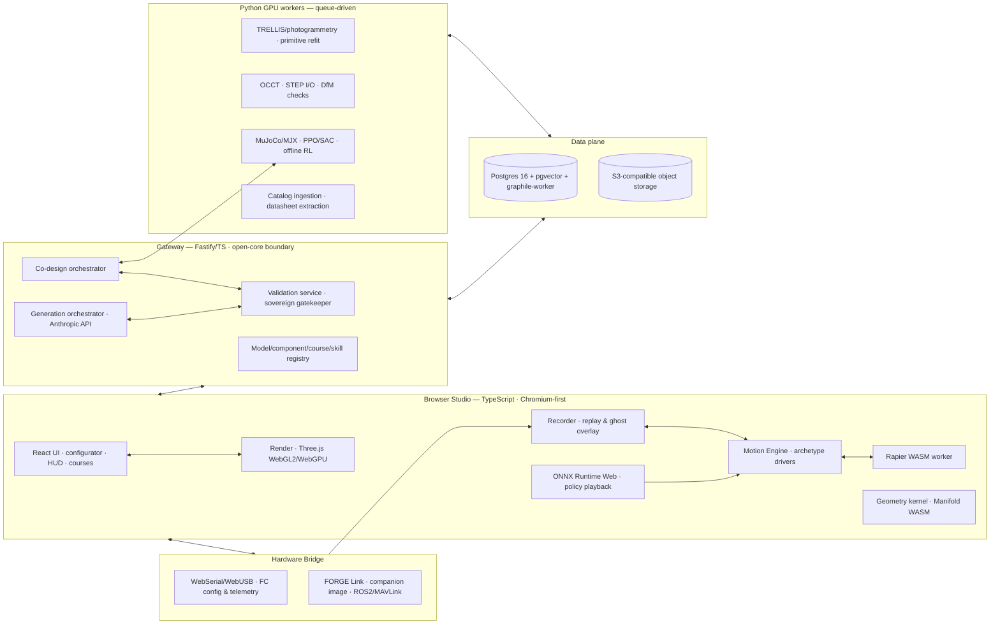

# FORGE — A Text-to-CAD Robotics Studio
### The Complete Plan, v2.0 — Vision · Strategy · Architecture · Decisions · Roadmap
*Working codename: **FORGE** — Fabricate · Operate · Rehearse · Generate · Export*
*Version 2.0 · June 2026 · Status: decisions-complete planning document*

**Changes from v1.0:** all open strategic and technical questions are now answered and recorded as binding decisions (§21); the vision is extended with the data flywheel, objective-driven co-design, generative training environments, URDF import, design-for-manufacture and print ordering, the flight recorder and ghost protocol, classroom mode, the skills marketplace, and the maintenance twin; the roadmap is restructured P0–P12 with these absorbed; the contract schema gains environment, estimator, lockfile, license-class, and collision-compound semantics.

---

## 0. Abstract

FORGE is a browser-first studio in which a person describes a machine in natural language, receives a fully realized, animated, physically parameterized 3D model, swaps its components for real, purchasable parts with exact geometry and real electrical and mass properties, verifies on paper and in simulation that the machine works, trains autonomous behaviors for it in a rehearsal space, deploys both the parts list and the trained behavior onto the physical machine built from those parts — and then keeps evolving it, because every real flight, drive, and repair feeds back into the digital twin. The loop is **describe → assemble → verify → rehearse → deploy → evolve**. The proven prototype — a single-file studio containing a software rasterizer, two articulated models with 31 swappable component variants, procedural couplers, locomotion and flight controllers, and a headless validation harness — is hereby promoted from product to executable specification. This document is the complete, self-contained plan for the real system: strategy and economics, architecture, technology stack with justifications, the five engines and their algorithms, AI integrations, the component database, the training and sim-to-real pipeline, co-design optimization, generative environments, interop and manufacturing, lifecycle products, safety and legal posture, performance budgets, a twelve-phase roadmap with exit criteria, a risk register, and the full decision record. Governing doctrine: **not a toy** — SI units, sourced masses, checked compatibility, derived claims, manufacturable exports, and a sovereign validator that gates everything.

---

## 1. Vision

### 1.1 The loop, end to end

A user types: *"a 5-inch freestyle quad with a long-range battery option and ducted props, under 650 g."* Thirty seconds later they orbit a rendered, explodable, flyable model whose motors, stack, battery, and props are schema-generated parts or real SKUs. The HUD reads all-up weight, thrust-to-weight, hover throttle, and endurance — computed, with inspectable assumptions. They click the battery; the configurator offers real packs that physically fit and electrically suffice; the numbers update live. They press Drive and fly it on real thrust curves. They open Training, pick "gate slalom," and a policy trains overnight against a physics-accurate twin under domain randomization. In the morning the policy flies the virtual quad through a course the community built; they export the BOM, order the parts (including the 3D-printed structural parts, ordered in the same flow), build the machine, and walk the same policy up a guarded deployment ladder onto the real aircraft. Every subsequent flight is logged: the ghost overlay shows where reality diverged from the twin, system identification tightens the twin, the logs become training curriculum, and when something breaks, the explode view becomes the repair manual with reorder links. The same loop holds for rovers, arms, quadrupeds, and in time bipeds — *whatever is possible*. And because every design is a document, the loop has a final gear: an optimizer that searches design space itself — *"the lightest quad that finishes this course in twenty seconds with eight minutes of endurance"* — co-designing morphology and behavior together.

### 1.2 The three promises and the flywheel

**Generate.** Users create components and complete machines through conversation with Claude (the Fable 5 class model via the Anthropic API), emitting schema-constrained contracts that the validation gatekeeper must admit. Generated machines are never static: materials everywhere, blueprint projection, idle animation, working archetype driver, staged explode — **completeness is enforced, not encouraged**.

**Real parts.** A curated component database turns datasheets and manufacturer CAD into exact parametric parts carrying mass, electrical constants, mount patterns, and purchase links. The long tail without published CAD enters through photographs: image-to-3D reconstruction followed by primitive refitting returns editable parametric parts, not triangle soup.

**Autonomy.** Each model compiles to a physics description, trains under randomization, and exports a portable policy with an honest scorecard. The same policy demonstrates autonomy on the twin in-browser and — through an explicit, safety-gated sim-to-real protocol — on the physical machine.

**The flywheel** binds them: every admitted model enriches the pattern library that grounds generation; every catalog part makes generation more real; every real telemetry log tightens a twin and seeds imitation curricula; every shared course, model, and skill gives the next user a head start. The product compounds because its artifacts are data.

### 1.3 Doctrine: not a toy

Seven commitments. **(1)** SI units everywhere. **(2)** Mass and inertia computed from geometry and density or sourced from datasheets — never invented. **(3)** Electrical and mechanical compatibility checked, not assumed. **(4)** Every HUD claim derived from a stated, inspectable model. **(5)** Manufacturability is an export target: STEP/3MF with design-for-manufacture checks, BOMs naming real SKUs. **(6)** The validator is sovereign: nothing — human-authored, parametric, or LLM-generated — enters the registry, marketplace, or training queue without passing it. **(7)** Provenance everywhere: every artifact (contract, component, policy, deployment) carries its origin chain — model versions, prompt hashes, seeds, validator reports, telemetry lineage.

---

## 2. Strategy: wedge, openness, economics, moat

### 2.1 The wedge — verify first **(Decision D1)**
FORGE enters the market as the place where an FPV build is **verified before money is spent**: real parts, real numbers, honest hover throttle and endurance, compatibility explained on every greyed card. Builders arrive for truth — a category currently served by aging calculators and spreadsheets — and stay for generation, simulation, and training, which are the wow layers no incumbent has. Consequence: the component database and proof pair (P3) ship and get marketing attention before text-to-CAD GA (P4); the first public artifact is a configurator that is simply *right*.

### 2.2 Open-core **(Decision D2)**
The **contract schema, the five engine libraries, and the validation harness are open source (Apache-2.0)**. The platform — generation orchestrator, catalog and its data, compute services, marketplace, accounts — is proprietary. Rationale: for a solo-built project, an open engine is the trust engine and the contribution engine; the schema becoming a de-facto standard *is* strategic position. The defensible assets are explicitly not the code: they are the **validated-model corpus and pattern library** (which ground generation), the **curated component database with its license ledger and thrust tables**, the **provenance graph**, and the **community's courses, skills, and scorecards**. Accordingly, the terms of service state from day one that admitted models contribute anonymized structural patterns to the library (opt-out per model, opt-in for marketplace-listed models by default).

### 2.3 Economics before the marketplace **(Decision D3)**
Compute costs begin at P4 (LLM tokens) and P5 (GPU jobs), long before marketplace revenue. The answer is two-track from day one: **bring-your-own Anthropic API key** — the integration pattern already vetted as compliant — makes generation effectively free to operate per user; **metered credits** cover keyless users and all GPU work (photoscan, training) at transparent cost-plus pricing. Paid tiers arrive with the platform phases: training passes, catalog pro features (price tracking, availability alerts), marketplace fees. The studio itself — viewing, configuring, validating, local simulation — is free forever; it is the wedge.

### 2.4 Share early **(Decision D4)**
Read-only contract URLs ship at P4, not P9: any model renders for anyone with the link — orbit, explode, blueprint, drive demo — no account required. Sharing is the growth loop and costs almost nothing once the studio loads contracts; the marketplace later adds discovery, listing, and transactions on top of an already-viral artifact.

---

## 3. Prototype audit — the executable specification

The single-file prototype proved the data model and interaction language now being promoted into a system. **Carried forward:** the node/part/slot/port contract with procedural couplers generated from equipped variants' port dimensions; the animation stack (phase gait with closed-form 2-bone IK and planted-feet idle, FPV angle-mode flight with a per-motor mixer, critically damped servo layer, scan detents, actuator telltales, per-joint limits, click-to-move, follow camera); the inspection language (staged explode with leader lines, blueprint mode, component-scoped selection, jog teach-pendant, pause and frame-step); the configurator (31 validated variants across 11 slots, rebuild-in-place preserving state); the material system; and above all the **headless validation harness** — simulated clock, synthetic input, NaN scans, ground-contact probes, joint-sweep clearance, variant sweeps, drive regressions — the embryo of the sovereign gatekeeper. **At end of life:** the painter's-algorithm renderer (made stable by deterministic tie-broken sorting, bias layers, cap-fan tessellation, and strut de-interpenetration — but a painter can be stable, never *true*, where solids deliberately overlap; the observed residual shimmer is structural), the single-file monolith, the CPU raster budget, and drivers-as-closures. **Conclusion binding on the roadmap:** the depth-buffered renderer is Phase 1 with "shimmer gone" as a literal exit criterion; the part format (vertices, faces, normals, materials) already matches what a GPU pipeline consumes, so the model layer survives the swap untouched.

---

## 4. The Model Contract v2.1 — data, not code

A model is a JSON document; the only code lives in versioned engine libraries the document references by name and parameterizes. This single decision makes models simultaneously LLM-generable, machine-checkable, diffable, shareable, and safe.

### 4.1 Schema overview
A `ModelSpec` contains: **`meta`** (id, name, semver, archetype, license, provenance chain); **`skeleton`** (named nodes with parent, pose, per-axis limits, and joint blocks `{type, axis, maxTorqueNm, maxVelRad}` so one tree drives visuals and physics export); **`parts`** (tagged-union geometry over `box | cbox | taper | cyl | lathe | squircle | loft | mesh(ref)`, material class, color, explode windows, render-bias hint, component tag, mass-or-density, collision policy); **`slots`** (mount nodes, joint, variants — inline parts or `componentRef` into the catalog — each with port declarations); **`ports`** (typed connection points from the connector taxonomy: mechanical patterns, electrical connectors, data buses; couplers, fasteners, and wire lists are *generated* from port resolution); **`chains`** (staged disassembly); **`driver`** (`archetype` + parameter block — never code; the future user-controller path is sandboxed WASM with a capability-limited API, post-P7); **`materials`** (the five-class system mapped to PBR, extensible to textured PBR for imported meshes); **`sim`** (masses, collision compounds, propulsion block, **estimator block**, see below); **`env`** defaults (gravity 9.80665 m/s², air density, wind profile) so no physical constant is ambient.

### 4.2 New in v2.1 — the answered questions, encoded
**Lockfile and pinning (D5).** Every `componentRef` and pattern reference is semver-pinned; each model carries a lockfile resolving refs to immutable catalog revisions. Catalog updates never silently change a model; an explicit upgrade flow re-resolves, re-validates, and diffs the consequences (mass, hover throttle, price) before the user accepts. Package-manager discipline for hardware.
**Collision compounds (D7).** Visual parts and physics colliders are decoupled by policy: colliders are authored or auto-fitted **per node** as compounds of primitives/hulls, with validator-enforced budgets (≤ 8 convex pieces per node, ≤ 24 per model) — preventing the 136-collider physics cliff while keeping contact fidelity where it matters (feet, props, bumpers).
**Estimator block (D8).** The sim block includes a state-estimator spec (complementary or EKF, with sensor noise/bias/latency parameters). Policies are trained on the **estimator's output, never ground truth** — one of the three biggest sim-to-real killers, eliminated by schema.
**License classes (D10).** Mesh assets carry a license class — `open | attribution | no-redistribution | view-only` — consumed by the export matrix (§17.3).
**Environment defaults (env block).** Gravity, density, wind: pinned per model, overridable per scene/course.

### 4.3 Completeness gates — "no static models"
Admission requires: a material on every part; the blueprint projection renders cleanly; a declared driver archetype passing its smoke test (biped walks 1 m without NaN or >1 mm ground penetration; multirotor holds altitude ±5 cm; rover tracks a 1 m arc); an idle pose holding ground contact in tolerance; explode coverage ≥ 80 % with at least one leader-flagged subassembly per slot; all ports resolved or explicitly capped; mass closure within 2 %; collision compounds within budget.

### 4.4 Compile targets — and the import direction
One contract, many artifacts: GPU mesh buffers and scene graph (render); **MJCF** (training); **URDF + ros2_control** (deployment and third-party sims); **STEP / 3MF / STL** (manufacturing, license-filtered); **BOM** (purchasing); firmware configuration diffs (bridge); the **ONNX policy I/O header** (derived observation/action layout). New in v2: the mapping runs **backwards** — a **URDF/MJCF importer** (§14.1) turns the existing robotics world's models into contracts (skeleton + mesh parts; no slots initially), the cheapest large adoption lever in the plan.

---

## 5. Target architecture



Five planes, unchanged in spirit, extended in scope. The **client studio** is local-first: contracts live on the user's machine, and viewing/configuring/validating/simulating works offline; the server exists for generation, heavy geometry, training, catalog, courses, and sharing. The **gateway** is thin and owns the **validation service** — the harness productized into a deterministic headless runner invoked on every admission, plus the **co-design orchestrator** that drives optimization loops against it. The **compute plane** stays Python where the ecosystem's gravity is (TRELLIS, MuJoCo, COLMAP, OCCT). The **data plane** is one Postgres (pgvector for embeddings, graphile-worker for transactional jobs) plus S3-compatible object storage. The **hardware bridge** is browser-native where the platform allows, with **FORGE Link** — a flashable companion-computer image — making the deployment ladder turnkey.

---

## 6. Technology stack — decisions and justifications

| Layer | Decision | Why (and what it beat) |
|---|---|---|
| Language / repo | TypeScript end-to-end, strict; Vite + pnpm + Turborepo monorepo (`contract`, `geometry`, `engines/*`, `studio`, `gateway`, `harness`, `link`) | the contract is a type-system problem; schema↔types codegen via TypeBox |
| UI | React 19 + Zustand | ecosystem depth; loop state stays out of React; Solid revisited only if P1 profiling demands (D-open) |
| 3D | Three.js — WebGL2 baseline, WebGPURenderer behind a flag | largest ecosystem, BatchedMesh/instancing, mature lines/outline/post stack, TSL gives a WebGPU path without rewrite; beat Babylon (heavier framework, we need a thin CAD layer) and raw WebGL (cost without benefit) |
| Client physics | Rapier (Rust→WASM) in a worker, 240 Hz substeps | maintained, deterministic-leaning, TS-first, joints map from the contract; beat Jolt-wasm (bindings maturity) and Ammo (legacy) |
| In-browser inference | ONNX Runtime Web (WASM/WebGPU EP) | ONNX is the export lingua franca from PyTorch |
| Geometry kernel | our primitive library (TS port) + Manifold (CSG/hulls/offsets) + OpenCascade.js (lazy worker: STEP I/O, fillets, DfM) + meshoptimizer (decimation/LOD) | OCCT only where B-rep truth is required; Manifold covers the fast 95 % |
| Optimization | CMA-ES / Bayesian optimization (Optuna) server-side for co-design | gradient-free fits a constraint-oracle landscape |
| Gateway | Fastify + TypeBox on Node 22 | schema-validated routes for free; boring |
| Compute workers | Python 3.12, queue-driven, no public surface | TRELLIS/MuJoCo/COLMAP/OCC gravity |
| DB / queue / search | Postgres 16 + pgvector + graphile-worker — one stateful service | transactional jobs; pgvector adequate at catalog scale; the proven single-database discipline |
| Object storage | S3-compatible (Hetzner Object Storage / Cloudflare R2) | meshes, photos, policies, logs, renders; presigned browser upload |
| Training sim | MuJoCo (CPU) → MJX (GPU/JAX) when batch RL or co-design demands | best contact-quality-to-simplicity ratio; MJCF is our compile target; beat Isaac (operational anchor for a solo team) |
| RL stack | PyTorch + Stable-Baselines3 (PPO/SAC); imitation/offline-RL additions for log-derived curricula | boring, reproducible baselines first |
| Image→3D | TRELLIS-class single-image + COLMAP multi-view, burst GPU (Modal/RunPod), cached forever | none of it runs client-side credibly |
| LLM | Anthropic API — Fable 5 class for synthesis/repair, smaller tiers for edits and ETL; tool use with JSON-Schema-constrained output; prompt caching; Batch API for ETL; **BYO key supported (D3)** | model strings/limits/pricing pinned at implementation from https://docs.claude.com/en/api/overview |
| Deploy | Docker Compose on a Hetzner VM + CDN; GPU burst only | the €-budget single-VM discipline; k8s is a someday-problem |
| Browser floor **(D11)** | **Chromium-first, declared**: full studio + bridge on Chromium; Firefox/Safari get viewer-grade (no WebSerial, possibly no SAB/WebGPU); iOS is explicitly a viewer | stop pretending; budgets and docs state it |
| Auth / observability | Auth.js, anonymous-local mode first; pino + optional OTel + Sentry | identity and SRE are not the product |

**Two physics engines remain a feature**: Rapier for interactive truth-enough, MuJoCo for training-grade contact and the RL ecosystem — both consuming the *same* compiled MJCF from the *same* contract, held together by a parity suite (drop tests, pendulum periods, hover trim, gait CoM trajectories) that runs on every engine or exporter upgrade. Where they disagree, training-side is canonical. **Determinism policy (D6):** client replay is tolerance-banded with drift detection (cross-browser floating point makes bit-exactness a lie); bit-exact replay and all official scorecards are computed server-side.

---

## 7. The five engines

### 7.1 Geometry Engine
The primitive vocabulary (1:1 port with smoothing groups and analytic normals); CSG via Manifold (union/difference/intersection, convex hulls, shell/offset); fillets and STEP via OCCT jobs; **mass properties** by signed-tetrahedron sums (volume, centroid, inertia per part; density by material class or override); **interference detection** via per-part BVHs — the validator sweeps every joint through its limit box and asserts solid-solid penetration ≤ 0.5 mm, replacing eyeballed clipping fixes forever; **procedural connections v2** — port-graph resolution emitting couplers sized from equipped variants, fastener sets at mount patterns, and a wire list from electrical port pairs (v1 wiring is cosmetic verlet splines plus an exact BOM wire list; true routed harness design with slack management through joints is an explicitly deferred research item, **D-r1**); **primitive refit** for scans (efficient RANSAC for planes/cylinders/spheres/cones; lathe profiles via PCA axis, radial binning, spline fit; acceptance metric: ≥ 70 % surface-area fit coverage and Hausdorff residual ≤ 1.5 % of bounding diagonal, else the part is admitted as mesh-class, **D13**); **decimation/LOD** via quadric error metrics (catalog parts ≤ 800 tris LOD0 / ≤ 150 LOD1); and new in v2, **DfM checks** for printable structural parts — minimum wall thickness, overhang angle, support-volume estimate, bed-fit per process profile (FDM/SLA presets) — feeding §14.2.

### 7.2 Render Engine
Three.js scene graph mirroring the node tree; parts as indexed BufferGeometries batched per material class (a model is a handful of draw calls). Material classes map to PBR (gloss: metalness 0.05 / roughness 0.12 + clearcoat; metal: 0.95/0.35; satin 0.1/0.45; matte 0.0/0.85; rubber 0.0/0.95 + sheen). A three-point IBL-lite rig — key directional with PCF soft shadows, cool sky hemisphere, warm ground bounce — makes the prototype's per-face studio grade physically consistent for free. Blueprint mode is a normal/depth-edge post pass over a flat pass with the grid shader. Explode reuses the chain/window math verbatim on instance matrices; leader lines are dashed Line2 with datum dots; selection is a stencil outline; AO via N8AO at quality tiers. **The shimmer dies by construction** — a z-buffer resolves interpenetrating solids per pixel; `renderBias` survives only as a polygon-offset hint for true coplanar decals.

### 7.3 Motion Engine
A deterministic fixed-step (120 Hz) layer stack in a worker, render-interpolated. **Base layer:** archetype drivers — biped (the proven phase gait, closed-form 2-bone IK, planted-feet idle, heading spring, arrive controller), multirotor (angle-mode, physics-coupled when sim is active), rover (differential/Ackermann), arm (damped-least-squares IK with null-space posture), quadruped (trot/walk generator with per-leg 3-DOF IK — the first new archetype, proving the contract generalizes). **Constraint layer:** joint limits, velocity clamps, self-collision guards from Geometry's interference queries. **Secondary layer:** critically damped servos (ω, ζ per joint class), detents, telltales, verlet cables. **Policy layer:** an active ONNX policy writes targets *into* the pipeline beneath the constraint layer — trained behavior can never command an invalid pose. Keyframe clips and blend trees are additive authoring, never required for function.

### 7.4 Simulation Engine
Client: Rapier bodies from the contract — **per-node compound colliders within budget (D7)** — revolute joints with motors honoring contract torque/velocity limits, friction-materialed ground, slopes and steps native. **Propulsion:** per-motor n ≈ Kv·V_eff·u with V_eff = V₀ − I·R_total; T = C_T·ρ·n²·D⁴, Q = C_Q·ρ·n²·D⁵, coefficients interpolated from catalog thrust tables where published, blade-element-lite estimates where not; battery sag and capacity integration. The HUD's AUW, TWR, hover throttle, instantaneous current, and endurance are closed-form consequences with inspectable assumptions. **Estimator-in-sim (D8):** the contract's estimator block runs inside the simulation, producing the noisy, latent, biased state that policies actually observe. Disturbance injectors (gusts, payload shifts, sensor dropout) serve play and pre-training sanity. **Replay:** every session serializes to {contract hash + lockfile, env, seed, input tape}; client replay is tolerance-banded with drift detection, server replay is bit-exact (D6). Server training uses MuJoCo from the same compiled MJCF under the parity discipline.

### 7.5 Learning Engine
**Tasks** as versioned environment definitions: hover-hold, waypoint chain, gate slalom, velocity tracking; walk-to-target, rough-terrain traverse, push recovery; line-follow, obstacle course; reach/track. **Observation/action spaces derive from the contract** — estimator state, joint angles/velocities, target vectors in body frame; normalized joint or thrust targets out — so a policy header is portable metadata. **Algorithms:** PPO (clipped surrogate + GAE) as the workhorse, SAC where sample efficiency matters, via Stable-Baselines3 for reproducibility; **behavior cloning and offline RL** over real telemetry logs (§11.3) as the curriculum-from-reality path. **Domain randomization** is a first-class config: mass ±15 %, Kv ±8 %, sag ±20 %, actuation latency 0–30 ms, IMU noise/bias, friction 0.4–1.2, wind 0–4 m/s, observation dropout. **Curriculum** stages belong to task definitions. **Outputs:** an ONNX policy plus a **scorecard** — success rate, robustness across the randomization grid, energy — itself a gatekeeper artifact; sub-threshold policies do not export. One consumer GPU handles CPU-MuJoCo PPO for these morphologies overnight; MJX unlocks the batch parallelism that co-design (§12) and harder tasks demand (claims hedged until benchmarked on our models).

---

## 8. AI integrations

### 8.1 Text-to-CAD — the validator-gated pipeline
**(1) Intent parse:** the user's message plus studio context → a structured brief (archetype, scale, mass budget, style tags, real-part preferences). **(2) Retrieval:** pgvector over the component catalog and the **pattern library** of validated part-group idioms harvested from every admitted model (§2.2 consent terms); retrieved exemplars are schema-true few-shot context; the schema and engine docs sit in a prompt-cached prefix. **(3) Constrained synthesis:** Claude emits *only* contract JSON via tool use with the JSON Schema enforced — skeleton/slots/ports/driver first, per-slot parts second, materials/explode/sim third; multi-pass keeps emissions small, checkable, cheap to repair. **(4) Validator in the loop:** every pass runs the harness; failures return machine-readable diagnostics (`ground_penetration: an1 −4.2 mm @ phase 0.31`, `port_unresolved: XT60@batt`, `collider_budget: 31 > 24`) and the model self-repairs, bounded at three iterations. **(5) Admission or draft (D14):** passing contracts are provenance-stamped and admitted; exhausted repairs land as an **editable draft** carrying its diagnostics — drafts render and edit but cannot train, export, or be shared until they pass. **Conversational editing** compiles "make the arms 20 % longer" / "swap to ducted props" into JSON-Patch operations, validated incrementally, applied with rebuild-in-place. **Cost discipline:** frontier tier for synthesis and repair reasoning; smaller tiers for edits/classification/ETL; Batch API for ingestion; **BYO key honored throughout (D3)**.

### 8.2 Generation quality as CI **(D9-evals)**
The "Brief-25" benchmark — twenty-five canonical briefs spanning archetypes, scales, and real-part constraints — is a **permanent regression suite**, re-run on every prompt change, schema change, pattern-library update, and LLM model-version bump, with admission rate, repair-iteration count, and diversity metrics tracked over time. Generation quality is an engineering quantity with a dashboard, not a launch-day anecdote.

### 8.3 Catalog ingestion agents
ETL workers turn published truth into rows: fetch manufacturer pages/datasheets/STEP → Claude-extracted specs against the component schema with per-field source citations → OCCT tessellation + LOD chain → dedupe by (brand, model, rev) → license-ledger entry. Low-confidence extractions queue for human review; nothing auto-publishes.

### 8.4 Image → 3D (the TRELLIS flow)
Photos → GPU job: background removal → TRELLIS-class single-image reconstruction (COLMAP multi-view when N is large) → manifold repair → decimation → **primitive refit** with the D13 acceptance metric → browser alignment UI (one known dimension sets scale; axis snap; port authoring) → optional datasheet merge → admission with `source: photoscan` provenance. Burst-GPU, cached forever. Photos are the long tail; datasheet-parametric and manufacturer CAD remain primary because they are exact.

### 8.5 Environment generation
The same pipeline, smaller schema: text → **EnvSpec** (§13) — terrain, gates, obstacles, win conditions — through the same gatekeeper (reachability, bounds, spawn validity). Courses are generated, validated, shared, and raced.

### 8.6 Ambient intelligence
Embedding search across models, parts, patterns, courses, and skills; the **BOM agent** resolving catalog slots to live vendor offers (platform phase); the **doc agent** compiling any admitted model into a build sheet — exploded steps in chain order, fastener counts from port resolution, the wire list from electrical ports.

---

## 9. The component database and compatibility engine

### 9.1 Schema (Postgres)
`components(id, brand, model, rev, category, dims jsonb, mass_g, elec jsonb, mech jsonb, geometry_ref, lods, ports jsonb, price_ref, license_id, source, confidence, embedding vector)` with `elec = {kv, cells_min, cells_max, max_current_a, r_int_mohm, capacity_mah, c_rating}` and `mech = {mount_pattern, shaft, thread, prop_interface}` as applicable. Supporting tables: `connector_types` (the taxonomy: `stack-30.5×30.5-M3`, `stack-20×20-M2`, `motor-mount-16×16-M3`, `prop-shaft-M5`, `XT60`, `XT30`, `JST-PH`, `UART`, `I2C`, …), `licenses` (class + terms + source), `thrust_tables(component_id, voltage, throttle, thrust_g, current_a, rpm)`, `prices`, `provenance`, and `component_revisions` — immutable rows that lockfiles pin against **(D5)**.

### 9.2 Compatibility rules
Declarative constraints evaluated at equip time and by the validator: mount-pattern equality across stack and frame; voltage-window intersection battery↔ESC↔motor; current budget (battery max discharge ≥ Σ motor max × 1.2); prop tip-circle clearance versus frame and adjacent tips; TWR floor per preset (reject < 1.8 freestyle, warn < 2.5); connector matching across electrical ports. Violations render as the explained reason a card is greyed.

### 9.3 The proof pair and the reference rigs **(D12)**
Phase 3 converts the VX-2's `rotors` and `battery` slots to `componentRef`-backed variants using one real 2207-class motor and one real 4S 1500 mAh-class pack — all dimensions, masses, Kv, and sag parameters taken from manufacturer datasheets at ingestion (the citation rule binds us too). Simultaneously, the **reference rigs** are selected and frozen: one 5-inch ArduPilot-capable quad build (companion-computer-ready FC, 2207 motors, 4S) and one Pi-class differential rover kit. Exact SKUs are pinned at ingestion against datasheets; the rigs become the P8 pilot hardware, the tutorial content, and the standing sim-to-real test fixtures. Exit proof: rendered geometry matches datasheet dimensions in tolerance, HUD physics responds to the pack swap, and the BOM exports purchasable SKUs.

---

## 10. Validation and QA as a product surface

The harness becomes infrastructure: a deterministic headless runner (Node + engine libraries, render stubbed) executing the full suite (Appendix B) on every contract write — CI for first-party models, admission for generated ones, publish for marketplace submissions, and now also: **upgrade re-validation** when lockfiles move (D5), **collider-budget enforcement** (D7), **estimator-smoke** (a policy trained against ground truth is rejected at scorecard time, D8), and **DfM checks** on printable parts. Platform-scale additions: golden-image render tests (canonical cameras, perceptual diff); physics regression (trajectory tolerance bands per canonical scene) so engine upgrades cannot silently change behavior; schema versioning with migrations and a compatibility matrix; generator fuzzing with every failure minimized into a regression case; and the **Brief-25** generation suite (§8.2). The gatekeeper is what makes a marketplace possible: community content is admitted by the same machine that admits ours, and the validator report ships with every listing.

---

## 11. Autonomy: training, the recorder, and sim-to-real

### 11.1 The deployment ladder
Never skipped, enforced by product flow. **(1) SITL:** the policy flies the twin under full randomization; the scorecard must pass. **(2) HITL:** the real FC/microcontroller runs in the loop over serial, validating timing and interfaces. **(3) Constrained reality:** tethered hover / wheels-off-ground / harness walking with the **safety supervisor** active — geofence, attitude and rate envelopes, battery floor, hardware kill switch, fallback controller owning the air gap. **(4) Free operation** within declared envelopes. **Control-rate contract (D9):** the policy advises at ~50 Hz; the supervisor runs at ≥ 200 Hz; the FC rate loop is never touched; a missed inference tick degrades to the fallback by design, and the ladder UX states these numbers.

### 11.2 System identification
Bench thrust pulls, logged flights, and joint step responses flow through a fitting job that updates the contract's sim block — true Kv under load, R_int, motor time constants, friction — and the policy fine-tunes against the corrected twin. A guided ritual, not an expert chore.

### 11.3 The flight recorder and ghost protocol
Every real session through the bridge is logged into the same replay format as sim sessions ({contract+lockfile, env, telemetry tape}). The studio replays reality with the twin's prediction overlaid — the **ghost** — making divergence visible second by second: crash forensics becomes scrubbing the last three seconds and watching where the ghost separated. Logs feed two pipelines: the system-ID fitter (§11.2) and the **curriculum-from-reality** path — behavior cloning and offline RL over the user's own flying, so every flight improves the twin and seeds the next policy. This converts the bridge from a deployment feature into the data flywheel's heaviest gear.

### 11.4 Deployment targets and honesty
Multirotor policies do not run on rate-loop firmware; they run on a companion computer (**FORGE Link** image: Pi/Jetson-class, ONNX/TFLite runtime, MAVLink offboard to ArduPilot/PX4-class stacks) or remain at trajectory-command level for simpler stacks. Rovers and arms deploy via ROS 2 (URDF + ros2_control) or direct microcontroller targets. Legged deployment targets small commercial quadruped/biped kits via vendor SDKs — late-phase, experimental, behind the harness-walking gate. We promise a rigorous rehearsal space, portable policies, honest scorecards, guided system ID, and a supervised path onto hardware the user owns; we do not promise any policy is safe in the open world, and the UX says so at every gate.

---

## 12. Objective-driven co-design

Because a design is a document, an optimizer can mutate it. The co-design orchestrator searches contract space against user objectives — *"lightest quad that finishes this course under 20 s with ≥ 8 min endurance"* — with the **validator as constraint oracle** and **multi-fidelity evaluation** keeping cost sane: (tier 0) schema + compatibility + static physics in milliseconds; (tier 1) Rapier smoke runs in seconds; (tier 2) short MuJoCo rollouts with a frozen or lightly tuned policy; (tier 3) full training only for finalists. Search is gradient-free — CMA-ES or Bayesian optimization over the exposed parameter manifold (slot choices as categoricals, dimensions and driver params as continuous, all within validator bounds) — returning a **Pareto front** (mass × endurance × task time) rather than a single answer, each point a fully admitted contract the user can open, inspect, and build. Morphology-and-policy co-design as a consumer surface is the crown-jewel consequence of contract-as-data; MJX's batch parallelism is what makes tier 2/3 budgets feasible. Ships as its own phase (P9) once training (P7) is boring.

---

## 13. Generative environments, courses, and community

An **EnvSpec** is the contract's sibling: terrain patches (heightfield or primitive composition), gates and obstacles with poses, spawn points, win conditions (gate order, time, contact penalties), and an env block (wind, lighting). The same discipline applies — schema-constrained generation, a gatekeeper (reachability between spawn and goals, bounds sanity, no degenerate colliders), provenance, sharing by URL. Courses become **community objects with leaderboards**: per-course, per-archetype, and per-class (stock VX-2 versus open class), with scorecard-verified runs server-replayed for the boards (D6 makes this honest). The FPV simulator culture has already proven this loop commercially; for FORGE it doubles as training curriculum — every popular course is a ready-made RL task — and as the first genuinely social surface, arriving with P10.

---

## 14. Interop and manufacturing

### 14.1 URDF/MJCF import
The exporters' mapping, reversed: URDF links → skeleton nodes; visual geoms → mesh parts (with decimation and optional primitive refit); collision geoms → collision compounds; joints → joint blocks with limits; no slots initially (imported models are monolithic until a user carves slots in the editor). This single feature lets the existing robotics world walk into the studio with the robots they already have — the cheapest large adoption lever in the plan — and ships with the exporters in P6 where the mapping code already lives.

### 14.2 Design-for-manufacture and print ordering
Generated structural parts pass DfM checks (minimum wall, overhang angle, support volume, bed fit per FDM/SLA profile) at validation; failing parts carry diagnostics and suggested fixes (thicken to 1.6 mm, add chamfer). Passing parts export as oriented 3MF with print profiles, and the BOM gains a "printed parts" section that hands off to print-service APIs (Craftcloud-class aggregators) alongside the catalog SKUs — closing *build it* for custom geometry, not just purchased parts. Liability posture: we transmit geometry and recommended profiles; the service and the user own print outcomes (§17).

---

## 15. Hardware bridge

Browser-native where the platform allows: **WebSerial** flight-controller configuration in the Betaflight-configurator pattern, writing the firmware config diffs the contract compiles; **WebSerial/WebUSB telemetry** ingestion feeding the recorder and system ID; the **ghost overlay** rendering live. Where the browser cannot reach — ROS 2 graphs, MAVLink routing, onboard policy installation — the **FORGE Link** companion image (flashable; Pi-class; rosbridge + MAVLink router + ONNX runtime + pairing-code auth) makes the ladder turnkey, with a single-binary daemon as the minimal fallback. The bridge never auto-arms anything; every transition up the ladder is a deliberate physical-confirmation interaction. Chromium-only by declaration (D11); non-Chromium users get the viewer and the files.

---

## 16. Lifecycle products

**Classroom mode.** Briefs become assignments; the gatekeeper becomes the grader — an instructor authors a brief plus a rubric (validator config + scorecard thresholds), students submit contracts and policies, and grading is automatic, explainable, and identical to production admission. Education is a sim-only-safe beachhead with real budgets; ships with the platform phase.

**Skills marketplace.** Policies are tradeable artifacts: an ONNX file + its derived I/O header + its scorecard ("gate-slalom v3 · success 94 % across the randomization grid"). Transfer across morphologies is honest about its limits — same archetype and compatible observation layout transfer directly; otherwise the listing offers a fine-tune job against the buyer's twin. Every skill carries provenance back to its training run.

**Maintenance twin.** After deployment the model becomes the living manual: telemetry-driven wear estimates (motor hours, pack cycle counts and internal-resistance drift from logged sag), crash forensics via the ghost, damage assessment mapping to the explode view as **repair steps in chain order with reorder links**. The model outlives the build — and pulls the user back into the loop where the flywheel spins again.

---

## 17. Security, safety, legal

**No code in contracts** remains the central security decision: drivers are parameterized references into versioned libraries; the future user-controller path is sandboxed WASM (no I/O, fuel-metered, capability-limited API) and marketplace-reviewed, post-P7. **Provenance everywhere:** prompts and outputs are hash-logged; every generated asset carries its validator report; every policy carries its training-run lineage; every deployment carries its ladder history.

### 17.1 Legal as gates, not posture
A real **terms-of-service and liability review is the entry condition for P8** — no hardware-deployment feature ships before counsel has reviewed the ladder UX, the supervisor disclaimers, and the telemetry consent language. A **dual-use sanity check** (export-control adjacency for autonomy software: EU dual-use regulation, US EAR) is the entry condition for policy sharing in the P11 marketplace — at hobby scale the exposure is expected to be minimal, but the check is scheduled, not assumed. A written **UGC moderation policy** (models, courses, skills, listings: report flow, takedown SLA, repeat-infringer rule) ships with the marketplace itself.

### 17.2 Platform exclusions
FORGE excludes weapons: no targeting systems, munition payloads, or interdiction modules in the catalog, the generation pipeline, or the marketplace — briefs in that direction are refused, and the refusal is logged. The prototype's "combat" naming flavor does not survive into the product.

### 17.3 License-aware export matrix **(D10)**

| License class | Studio render | STEP / 3MF export | BOM |
|---|---|---|---|
| `open` | ✓ | ✓ full geometry | ✓ |
| `attribution` | ✓ | ✓ with embedded attribution manifest | ✓ |
| `no-redistribution` | ✓ (derived LODs only) | **excluded** — replaced by bounding envelope + datum ports + link-out to source CAD | ✓ (SKU link) |
| `view-only` | ✓ (derived LODs only) | **excluded** — envelope substitute | ✓ (SKU link) |

A whole-assembly export is therefore always legal by construction: restricted meshes degrade to dimensioned envelopes that preserve fit while the BOM points at the source. The license ledger is populated at ingestion and is non-optional.

### 17.4 Privacy
Local-first contracts mean designs never leave the machine unless shared. Server artifacts are user-scoped; the single-Postgres plane keeps the audit surface small. Photo uploads grant processing rights only — deletion on request, never training data without explicit opt-in. Telemetry logs are the user's: sharing a log (for a leaderboard run or a marketplace scorecard) is an explicit per-log action. Pattern-library contribution follows §2.2: anonymized structural idioms, opt-out per model, no geometry attribution without consent.

### 17.5 Operating reality
The studio surfaces, but does not adjudicate, airspace and robotics rules — EU drone classes, Remote ID, RF regulation — with jurisdiction-aware pointers. Operation remains the user's responsibility, and the ladder gates repeat it. Print ordering transmits geometry and recommended profiles; print outcomes belong to the service and the user (§14.2).

---

## 18. Performance budgets

| Surface | Budget | Mechanism |
|---|---|---|
| Client frame | 16.6 ms total: ≤ 6 ms render, ≤ 3 ms motion, ≤ 4 ms physics (worker, amortized), ≤ 2 ms UI | BatchedMesh ≤ 40 draw calls per model; 150 k-tri scene cap; LODs on catalog parts |
| Scene scale | 3 models or 400 k tris before degradation tiers engage | quality tiers: AO off → shadow resolution → pixel ratio |
| Physics | 240 Hz substeps, 120 Hz driver tick, render-interpolated | SharedArrayBuffer state mirror; zero per-frame allocation |
| Cold load | < 2.5 s to interactive on mid hardware; OCCT/ONNX lazy | code-split engines; streaming WASM compile |
| Generation | < 60 s brief → validated model | multi-pass with cached prefix; slots stream into the viewport as they validate |
| Photoscan job | < 5 min photo → parametric part on burst GPU | queue SLO; permanent cache |
| Training | hover-class task to passing scorecard overnight on one consumer GPU | SB3 PPO baseline; MJX when exceeded |
| Co-design | tier-0/1 candidate evaluation < 5 s; a 200-candidate CMA-ES generation overnight at tier 2 | multi-fidelity ladder (§12); MJX batching |
| Validator | < 10 s full suite per model | headless, parallel checks, BVH reuse |
| Replay/ghost | scrubbing at 60 fps over a 10-min log | indexed telemetry tape; decimated overlay geometry |

Budgets are stated against the **Chromium floor (D11)**: full studio and bridge on Chromium-class browsers with COOP/COEP for SharedArrayBuffer; Firefox/Safari receive viewer-grade targets (no WebSerial, possible SAB/WebGPU gaps); iOS is explicitly a viewer. Documentation says so plainly rather than letting users discover it.

---

## 19. Roadmap — twelve phases

| Phase | Scope | Exit criteria | Est. (solo + AI pair) |
|---|---|---|---|
| **P0 Freeze & extract** | Monolith tagged as the executable reference; contract schema v2.1 written (env, estimator, lockfile, license classes, collider compounds); mechanical translation of both models and all 31 variants to JSON; monorepo scaffold | both contracts validate in a Node runner with part/face counts byte-equivalent to the monolith | 1–2 wk |
| **P1 Render & core port** | Three.js studio: scene graph, PBR materials, blueprint, explode + leaders, selection, jog, pane, orbit; motion-engine port (gait/IK, mixer, servos); Rapier worker skeleton | golden-scene parity gallery versus the monolith; **shimmer gone**; 60 fps on mid hardware | 3–4 wk |
| **P2 Data-driven models** | Validation service productized (check IDs, diagnostic format, draft semantics); archetype driver library formalized; parametric family #1 — quadruped generator with leg-count/wheelbase/mass sliders | a quadruped spec becomes a valid walking model with zero hand-written code; CI green on the full suite | 3 wk |
| **P3 Component DB + proof pair + reference rigs** | Schema, connector taxonomy, compatibility rules, ETL worker, license ledger, lockfile resolution; VX-2 rotors and battery component-backed; reference quad and rover SKUs pinned at ingestion **(D12)** | proof pair renders to datasheet dimensions; HUD physics responds to the pack swap; BOM exports purchasable SKUs | 2–3 wk |
| **P4 Text-to-CAD GA** | Generation orchestrator: retrieval, multi-pass constrained synthesis, validator-in-loop repair, draft fallback, JSON-Patch editing, provenance stamps; **share URLs (D4)**; **BYO key + credits (D3)**; **Brief-25 suite live (D-evals)** | ≥ 20/25 briefs admitted without human repair; edits apply < 3 s; a shared link renders for a logged-out visitor | 3–4 wk |
| **P5 Image → 3D** | TRELLIS/photogrammetry workers, primitive refit with D13 acceptance, alignment UI, photoscan admission | a photographed motor becomes an equipable parametric component end to end | 3 wk |
| **P6 Simulation depth + interop out/in** | Full Rapier coupling, propulsion/battery/estimator models, HUD analytics, disturbance injectors; MJCF/URDF exporters with parity suite; **URDF/MJCF importer (§14.1)** | hover trim agrees across Rapier and MuJoCo in tolerance; an external URDF round-trips into a driveable contract | 3–4 wk |
| **P7 Training service** | Task suite v1, SB3 PPO/SAC pipeline, randomization config, scorecards, ONNX export, in-browser policy playback; estimator-smoke gate | a trained hover + waypoint policy flies the twin in-browser from a one-click job; ground-truth-trained policies rejected | 4 wk |
| **P8 Hardware bridge + recorder** | WebSerial config writer, telemetry ingest, system-ID fitting, **flight recorder + ghost overlay (§11.3)**, **FORGE Link image**, deployment-ladder UX with the supervisor and the control-rate contract; pilot on both reference rigs; **ToS/liability review as entry gate (§17.1)** | a real quad configured from its contract; SITL → HITL → tethered demonstrated and documented; a real log replayed with ghost divergence visible | 4–6 wk |
| **P9 Co-design optimizer** | CMA-ES/BO orchestrator, multi-fidelity evaluation ladder, Pareto-front UI; MJX batching as needed | "lightest quad for this course under constraints" returns ≥ 3 admitted Pareto points overnight | 4 wk |
| **P10 Environments & courses** | EnvSpec schema + gatekeeper, environment generation, course sharing, leaderboards with server-replayed verification **(D6)** | a community course races with a verified leaderboard; a popular course doubles as an RL task | 3–4 wk |
| **P11 Platform** | Accounts, marketplace (models + **skills** with scorecards), classroom mode (briefs as assignments, gatekeeper as grader), BOM agent vendor links, **DfM + print-service ordering (§14.2)**, moderation policy, **dual-use check as entry gate (§17.1)** | first external user publishes a model that strangers equip; first printed structural part ordered through the flow | open |
| **P12 Maintenance twin** | Wear models from telemetry, crash forensics workflow, repair-steps-from-explode with reorder links, fleet view | a logged crash produces an actionable repair sheet with parts in the cart | 3 wk |

**Cross-cutting TODO backlog** (tracked from day one): contract JSON-Schema with TypeBox codegen; harness check IDs and the diagnostic format; lockfile resolver and upgrade-diff UI; MJCF/URDF exporter goldens; URDF importer fixtures; thrust-table interpolation module; battery-sag unit tests; estimator (complementary/EKF) module with noise injection; BVH interference service; collider-compound auto-fitter; port-graph coupler generator v2; wire-list emitter; pattern-library harvester with consent flags; prompt-cache prefix builder; Brief-25 corpus and dashboard; draft-state UX; license-ledger UI and export filter; DfM check module; pairing-code auth and FORGE Link image build; ghost-overlay telemetry view; scorecard renderer; quality-tier autoswitcher; schema migration runner; fuzz corpus seed set; leaderboard replay verifier.

---

## 20. Risk register

| Risk | Likelihood | Impact | Mitigation |
|---|---|---|---|
| Sim-to-real gap (especially legged) | High | High | archetype gradient (quads/rovers first), estimator-in-sim (D8), randomization + system ID as rituals, ladder gating, honest scorecards |
| LLM emits plausible-but-invalid geometry | High | Med | schema-constrained output, bounded self-repair on machine diagnostics, pattern grounding, draft fallback (D14), Brief-25 as CI |
| CAD/license entanglement | Med | High | license ledger from day one, export matrix (D10), derived-LOD serving, link-out fallback, legal review before marketplace |
| Open-core commoditization (someone forks the engines and clones the product) | Med | Med | the moat is the data, not the code (§2.2): catalog + ledger, pattern corpus, provenance graph, community courses/skills — none of which fork |
| Generation-eval drift (model-version bumps silently degrade quality) | Med | Med | Brief-25 re-runs on every prompt/schema/model change with tracked admission and repair metrics |
| GPU cost creep (photoscan/training/co-design) | Med | Med | burst-only GPUs, permanent caching, Batch API ETL, multi-fidelity ladder, MJX only when CPU saturates |
| Print/build liability | Low–Med | High | DfM diagnostics not guarantees, service/user own outcomes, ToS review gates P8, supervisor disclaimers |
| Scope gravity — it wants to be five products | High | High | the loop is the spine; every phase has exit criteria; platform phases deliberately last |
| Two-engine physics divergence | Med | Med | one compiled source of truth, parity suite on every upgrade, training side canonical, server scorecards (D6) |
| Solo-builder bus factor | High | Med | boring stack, monorepo, validator-enforced invariants, this document |
| Browser API churn (WebSerial/WebGPU) | Low | Med | WebGL2 baseline, Chromium floor declared (D11), FORGE Link fallback for the bridge |

---

## 21. Decision record

| # | Decision | One-line rationale |
|---|---|---|
| D1 | Verify-first wedge: configurator truth before generation marketing; P3 before P4 | builders arrive for honest numbers, stay for the wow layers |
| D2 | Open-core: schema + engines + harness Apache-2.0; platform, catalog, compute proprietary | trust and contributions from the code; the moat is the data |
| D3 | BYO Anthropic key + metered credits from day one; studio free forever | compute costs start at P4, not P9; the vetted key pattern makes generation self-funding |
| D4 | Read-only share URLs at P4 | sharing is the growth loop; nearly free once contracts load anywhere |
| D5 | Pinned componentRefs + per-model lockfile + explicit re-validated upgrades | catalog changes must never silently change a model |
| D6 | Tolerance-banded client replay with drift detection; bit-exact replay and official scorecards server-side only | cross-browser floats make client bit-exactness a lie; leaderboards need truth |
| D7 | Per-node collision compounds, ≤ 8 convex pieces/node, ≤ 24/model, validator-enforced | fidelity where it matters, no 136-collider physics cliff |
| D8 | Estimator block in the contract; policies train on estimator output, never ground truth | removes a top-three sim-to-real killer by schema |
| D9 | Control-rate contract: policy ~50 Hz advisory, supervisor ≥ 200 Hz, FC rate loop untouched, missed tick → fallback | stated numbers, stated degradation, stated authority |
| D10 | License classes + export matrix; restricted meshes degrade to dimensioned envelopes with link-out | whole-assembly exports legal by construction |
| D11 | Chromium-first declared; Firefox/Safari viewer-grade; iOS viewer; bridge Chromium-only | honesty over pretense; budgets and docs state the floor |
| D12 | Reference rigs frozen at P3: one ArduPilot-capable 5-inch quad, one Pi-class rover; SKUs pinned at ingestion | de-risks P8, becomes the tutorials and standing test fixtures |
| D13 | Primitive-refit acceptance: ≥ 70 % fit coverage and Hausdorff ≤ 1.5 % of bounding diagonal, else mesh-class admission | "parametric" is a measured claim, not a vibe |
| D14 | Failed generations persist as editable drafts carrying diagnostics; drafts cannot train, export, or share | no vanishing work; the gatekeeper stays sovereign |
| D-r1 | Wiring v1 is cosmetic verlet splines + exact BOM wire list; routed harness design through joints is deferred research | honest scoping of a genuinely hard problem |
| D-evals | Brief-25 generation benchmark as permanent CI with tracked metrics | generation quality is an engineering quantity with a dashboard |

---

## 22. Remaining open items (non-blocking)

Naming — FORGE is a working codename pending a trademark scan. React versus Solid, revisited after P1 profiling. Left/right asymmetric slot UX (the contract already supports it). WASM user-controller sandbox design (post-P7). Marketplace economics detail — revenue share percentages, skill pricing norms (decide inside P11 with real usage data). Fixed-wing archetype priority. Whether the photoscan alignment UI ships before or with P5 GA. None of these blocks a phase boundary.

---

## Appendix A — Contract schema sketch (abridged, v2.1)

```json
{
  "meta": {"id":"vx2-hornet","name":"VX-2 Hornet","version":"2.1.0",
    "archetype":"multirotor","provenance":{"kind":"human"},"license":"CC-BY-NC"},
  "env": {"gravity":9.80665,"airDensity":1.225,"wind":{"mean":0,"gust":0}},
  "skeleton":[
    {"name":"root","parent":null,"pos":[0,0.40,0]},
    {"name":"m0","parent":"root","pos":[0.106,0.018,0.106],"joint":{"type":"fixed"}},
    {"name":"s0","parent":"m0","pos":[0,0.030,0],
     "joint":{"type":"revolute","axis":[0,1,0],"maxVelRad":3000}}
  ],
  "parts":[
    {"node":"root","geom":{"kind":"cbox","w":0.085,"h":0.0075,"d":0.105,"ch":0.003},
     "material":"matte","color":"#23262c","collision":"primitive"},
    {"node":"s0","geom":{"kind":"loft","profile":{"kind":"sq","e":2.0,"n":8},
      "stations":[{"y":0.005,"sx":0.0017,"sz":0.0057,"r":0.55},
                  {"y":0.082,"sx":0.0009,"sz":0.0018,"r":0.16}]},
     "material":"matte","color":"#22262e",
     "explode":{"dir":[0,1,0],"mag":0.035,"t0":0.62,"t1":0.92}}
  ],
  "slots":[
    {"id":"battery","label":"POWER","mountNodes":["batt"],
     "variants":[{"id":"b-real-1","componentRef":"cmp_pack_4s1500@^2",
                  "ports":{"elec":"XT60"}}]}
  ],
  "lockfile":{"cmp_pack_4s1500@^2":"cmp_pack_4s1500@2.3.1",
              "cmp_motor_2207@^1":"cmp_motor_2207@1.0.4"},
  "ports":[{"id":"batt-out","node":"batt","type":"XT60",
            "frame":[[0,0.03,0.082],[0,0,0]]}],
  "driver":{"archetype":"multirotor",
    "params":{"tiltMaxRad":0.40,"yawRate":2.4,"mixer":"x4","pen":[1.25,0.12,1.45]}},
  "sim":{
    "battery":{"cells":4,"capacity_mAh":1500,"r_int_mohm":18},
    "motors":[{"ref":"cmp_motor_2207@^1","mount":"m0"}],
    "colliders":{"policy":"per-node-compound","budget":{"perNode":8,"perModel":24}},
    "estimator":{"kind":"complementary","gyroNoise":0.02,"accelNoise":0.08,
                 "bias":0.01,"latency_ms":8}
  }
}
```

## Appendix B — Validation suite (gatekeeper checks)

**Geometry:** NaN/Inf scan over all baked vertices across animation frames; ground contact within [−1 mm, +4 mm] across the idle cycle; joint-limit sweep with BVH solid-solid penetration ≤ 0.5 mm; face budget per quality tier; degenerate and zero-area face scan; mass closure within 2 %. **Contract:** schema validity; port resolution or explicit caps; slot default coverage; explode coverage ≥ 80 % with at least one leader-flagged subassembly per slot; a material on every part; lockfile resolves against immutable catalog revisions; **collider compounds within budget (D7)**. **Behavior:** archetype smoke tests (biped walks 1 m without NaN or > 1 mm penetration; multirotor holds altitude ± 5 cm; rover tracks a 1 m arc); servo stability at dt = 50 ms; explode/assemble round-trip determinism; pick resolution (every visible part maps to a component or core). **Simulation:** hover trim exists below 75 % throttle; TWR floor per preset; battery current budget; **estimator smoke — scorecards reject ground-truth-trained policies (D8)**. **Manufacturing:** DfM checks on printable structural parts (min wall, overhang, support volume, bed fit). **Render:** golden-image perceptual diff on the canonical camera set; the blueprint pass renders. **Lifecycle:** upgrade re-validation when lockfiles move (D5). **Provenance:** prompt and seed hashes present on generated content; policy lineage present on skills.

## Appendix C — Algorithms and formula reference

**2-bone leg IK (closed form, as shipped):** for hip-frame target (dy, dz): D = √(dy² + dz²) clamped below L1 + L2; knee β = acos((D² − L1² − L2²) / 2L1L2); γ = atan2(dz, −dy); δ = atan2(L2 sin β, L1 + L2 cos β); hip pitch = −γ − δ; level ankle = −(hip + knee). **Damped least squares (arms):** Δθ = Jᵀ(JJᵀ + λ²I)⁻¹e; **FABRIK** as the N-bone fallback. **Servo layer:** ẍ = ω²(x_t − x) − 2ζω·ẋ, semi-implicit Euler, stable for ω·dt < 2 (shipping ω 14–16, ζ 0.8–0.85). **Quad mixer:** rpm_i = base + k_t·thr − k_p·p·s_z(i) − k_r·r·s_x(i) + k_y·y·dir(i). **Propulsion:** n ≈ Kv·V_eff·u; T = C_T·ρ·n²·D⁴; Q = C_Q·ρ·n²·D⁵; V_eff = V₀ − I·R_int; endurance ≈ 0.8·C / I_avg. **Estimator:** complementary filter θ̂ = α(θ̂ + ω·dt) + (1−α)·θ_accel; EKF upgrade with bias states for P7+. **Decimation:** quadric error metrics (Garland–Heckbert) via meshoptimizer. **Primitive refit:** efficient RANSAC for planes/cylinders/spheres/cones (Schnabel et al. 2007); lathe profiles via PCA axis, radial binning, spline fit; D13 acceptance metric. **Mass properties:** signed-tetrahedron sums (divergence theorem) for volume, centroid, inertia. **PPO:** L = E[min(r_t(θ)·Â_t, clip(r_t, 1 ± ε)·Â_t)] with GAE(λ) advantages. **Behavior cloning:** max-likelihood over logged (o, a) pairs; **offline RL** via conservative value methods over telemetry tapes. **Co-design search:** CMA-ES — sample θ ~ N(m, σ²C), rank by multi-fidelity objective, update m, σ, C from elite weights; Bayesian optimization (Optuna TPE) for low-dimensional categorical-heavy slot spaces; constraints enforced by the validator as oracle. **Domain randomization** per Tobin et al. (2017) / Peng et al. (2018).

## Appendix D — Primary references

Anthropic API, tool use, structured outputs, Batch, prompt caching: https://docs.claude.com/en/api/overview (model strings, limits, and pricing pinned at implementation time). Three.js — threejs.org. Rapier — rapier.rs. MuJoCo / MJX — mujoco.org. Manifold — github.com/elalish/manifold. OpenCascade.js — ocjs.org. meshoptimizer — github.com/zeux/meshoptimizer. ONNX Runtime Web — onnxruntime.ai. TRELLIS — github.com/microsoft/TRELLIS. COLMAP — colmap.github.io. Stable-Baselines3 — stable-baselines3.readthedocs.io. Optuna — optuna.org. Schnabel, Wahl, Klein — *Efficient RANSAC for Point-Cloud Shape Detection* (2007). Garland & Heckbert — *Surface Simplification Using Quadric Error Metrics* (1997). Schulman et al. — *Proximal Policy Optimization* (2017). Tobin et al. — *Domain Randomization for Sim-to-Real* (2017). Hansen — *The CMA Evolution Strategy: A Tutorial* (2016). Levine et al. — *Offline Reinforcement Learning: Tutorial, Review, and Perspectives* (2020).

---

*End of plan. Version 2.0 is decisions-complete: the questions are answered in §21, the upgrades are load-bearing in the roadmap, and the prototype remains where it belongs — as the executable specification this document promotes into a system.*
