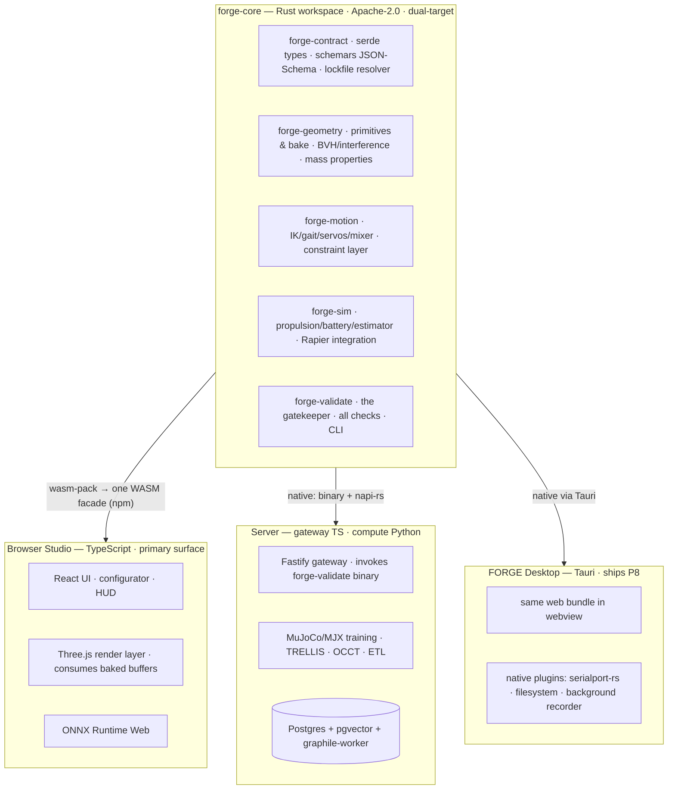

# FORGE — A Text-to-CAD Robotics Studio
### The Definitive Plan, v3.0 — Vision · Positioning · Runtime Architecture · Decisions · Roadmap
*Working codename: **FORGE** — Fabricate · Operate · Rehearse · Generate · Export*
*Version 3.0 · June 2026 · Status: definitive — positioning settled, runtime settled, decisions recorded*

**Changes from v2.0:** the runtime question is answered for good — **Rust core, web face** (D16): the contract, geometry, motion, simulation models, and validator become Rust crates dual-compiled to native and WASM, while the UI, render layer, and gateway stay TypeScript and the compute plane stays Python. **FORGE Desktop (Tauri) is a scheduled product surface at P8**, not a contingency (D15). The validator ships as one implementation everywhere — static binary, npm WASM package, and crate (D17), upgrading the determinism story. The market positioning is settled as **"upstream of CAD"** with explicit non-goals and a four-rung success ladder (D18). The roadmap absorbs the honest schedule cost of the Rust core.

---

## 0. Abstract

FORGE is a studio in which a person describes a machine in natural language, receives a fully realized, animated, physically parameterized 3D model, swaps its components for real purchasable parts with exact geometry and real electrical and mass properties, verifies on paper and in simulation that the machine works, trains autonomous behaviors in a rehearsal space, deploys the parts list and the trained behavior onto the physical machine built from those parts — and keeps evolving it, because every real flight, drive, and repair feeds the digital twin. The loop is **describe → assemble → verify → rehearse → deploy → evolve**. FORGE is **not mechanical CAD and does not compete with geometry kernels**: it is the integrated tool for the workflow that today is scattered across CAD-to-URDF exporters, hand-written simulator XML, web calculators, firmware configurators, and prayer. Its doctrine is **mass-properties-correct over surface-exact**; its escape hatch is first-class STEP export so that mechanical CAD consumes FORGE's output. The runtime is **Rust at the core, web at the face**: one set of Rust crates — contract, geometry, motion, simulation models, validator — compiled to native for the server, CLI, and desktop shell, and to WASM for the browser studio, guaranteeing that the same bits judge a model everywhere. The browser remains the primary distribution surface; FORGE Desktop (Tauri) arrives with the hardware bridge as the power surface for builders and pilots. This document is complete and self-contained: positioning and the success ladder, strategy and economics, the contract, the runtime architecture and its boundary, the five engines, AI integrations, the component database, training and sim-to-real, co-design, environments, interop and manufacturing, lifecycle products, legal posture, performance budgets, the twelve-phase roadmap, the risk register, and the full decision record D1–D18.

---

## 1. Vision and positioning

### 1.1 The loop

A user types: *"a 5-inch freestyle quad with a long-range battery option and ducted props, under 650 g."* Thirty seconds later they orbit a rendered, explodable, flyable model whose motors, stack, battery, and props are schema-generated parts or real SKUs. The HUD reads all-up weight, thrust-to-weight, hover throttle, and endurance — computed, with inspectable assumptions. They click the battery; the configurator offers real packs that physically fit and electrically suffice; the numbers update live. They press Drive and fly it on real thrust curves. They open Training, pick "gate slalom," and a policy trains overnight against a physics-accurate twin. In the morning the policy flies the virtual quad through a community-built course; they export the BOM, order the parts — including the 3D-printed structural parts, ordered in the same flow — build the machine, and walk the same policy up a guarded deployment ladder onto the real aircraft. Every subsequent flight is logged: the ghost overlay shows where reality diverged from the twin, system identification tightens the twin, logs become training curriculum, and when something breaks, the explode view becomes the repair manual with reorder links. The same loop holds for rovers, arms, quadrupeds, and in time bipeds. And because every design is a document, the loop has a final gear: an optimizer that searches design space itself — *"the lightest quad that finishes this course in twenty seconds with eight minutes of endurance."*

### 1.2 Positioning: upstream of CAD **(D18)**

FORGE answers a different question than mechanical CAD. SolidWorks-class tools answer *"give me exact, manufacturable geometry for an arbitrary mechanical part"* — a question whose price of entry is a thirty-year B-rep kernel that nobody, including funded startups, writes anymore (they license Parasolid, as Onshape and Shapr3D did, or adopt OCCT, as FreeCAD did). FORGE answers *"give me a verified, simulated, trainable machine assembled from parts that already exist, plus printable structural geometry"* — the question working robotics actually asks, and one whose geometry bar is **correct masses, inertias, joints, contacts, and clearances**, not exact NURBS surfaces. The most advanced robots on earth are developed in simulators with no CAD kernel at all; every FPV builder makes real spend-money decisions in a web calculator. That is FORGE's territory, and it has no integrated incumbent.

**Non-goals, stated plainly:** tolerance-stacked drawings, GD&T, surfacing, injection-mold tooling, certified-aerospace workflows. **Escape hatches, stated plainly:** OCCT inside for the B-rep work we do need (STEP I/O, fillets, DfM); **STEP export as a first-class citizen** so mechanical CAD consumes FORGE's output rather than competing with it; and a Parasolid/CGM license documented as an option revenue can buy someday — a component purchase, never a roadmap item, never on the critical path of any rung below.

### 1.3 The success ladder

Four rungs, each independently valuable, each funding belief in the next:

**R1 — The best build-verification surface for FPV and hobby robotics** (delivered by P1–P4): real 3D, real parts, honest physics, compatibility explained on every greyed card. Replaces the spreadsheet-era incumbent for real engineering decisions involving real money.

**R2 — The standard way hobby and research robotics gets simulation-ready models** (P5–P7): validated contracts compiling to MJCF/URDF with correct mass properties, an importer so existing robots walk in, and `forge-validate` as the embeddable gatekeeper anyone can run in CI. "Used for actual engineering" by working roboticists — the geometry bar is mass-properties-correct, which is exactly what the contract enforces.

**R3 — The autonomy loop as product** (P7–P9): rehearsal, scorecards, the deployment ladder, the recorder and ghost. No incumbent can enter this category sideways; it is orthogonal to CAD DNA.

**R4 — The platform** (P10–P12): courses, skills, classrooms, co-design, the maintenance twin — the flywheel at scale.

### 1.4 The three promises and the flywheel

**Generate.** Machines are created through conversation with Claude (the Fable 5 class model via the Anthropic API), emitting schema-constrained contracts the gatekeeper must admit. Generated machines are never static: materials everywhere, blueprint projection, idle animation, working archetype driver, staged explode — completeness is enforced, not encouraged. **Real parts.** A curated component database turns datasheets and manufacturer CAD into exact parametric parts with mass, electrical constants, mount patterns, and purchase links; the long tail enters through photographs via image-to-3D reconstruction and primitive refitting. **Autonomy.** Each model compiles to a physics description, trains under randomization, and exports a portable policy with an honest scorecard, runnable on the twin in-browser and — through the safety-gated protocol — on the real machine. **The flywheel** binds them: every admitted model enriches the pattern library that grounds generation; every catalog part makes generation more real; every telemetry log tightens a twin and seeds curriculum; every shared course, model, and skill gives the next user a head start.

### 1.5 Doctrine: not a toy

Seven commitments. **(1)** SI units everywhere. **(2)** Mass and inertia computed from geometry and density or sourced from datasheets — never invented. **(3)** Electrical and mechanical compatibility checked, not assumed. **(4)** Every HUD claim derived from a stated, inspectable model. **(5)** Manufacturability is an export target: STEP/3MF with DfM checks, BOMs naming real SKUs. **(6)** The validator is sovereign: nothing enters the registry, marketplace, or training queue without passing it. **(7)** Provenance everywhere: every artifact carries its origin chain — model versions, prompt hashes, seeds, validator reports, telemetry lineage.

---

## 2. Strategy: wedge, openness, economics

### 2.1 Verify-first wedge **(D1)**

FORGE enters as the place where an FPV build is verified before money is spent. Builders arrive for truth — currently served by aging calculators — and stay for generation, simulation, and training, which no incumbent has. The component database and proof pair (P3) get marketing attention before text-to-CAD GA (P4); the first public artifact is a configurator that is simply *right*.

### 2.2 Open-core **(D2)** — sharpened by the Rust core

The **contract schema, the core crates, and `forge-validate` are open source (Apache-2.0)**; the platform — generation orchestrator, catalog and its data, compute services, marketplace, accounts — is proprietary. The Rust core makes the open half *more* valuable as strategy: `forge-validate` is a single static binary (plus an npm WASM package and a crates.io crate) that any lab, classroom, or CI pipeline can embed — the R2 rung is literally a distributable artifact. The moat is explicitly the data, not the code: the validated-model corpus and pattern library, the curated catalog with its license ledger and thrust tables, the provenance graph, and the community's courses, skills, and scorecards. Terms state from day one that admitted models contribute anonymized structural patterns (opt-out per model; marketplace listings opt-in by default).

### 2.3 Economics **(D3)** and sharing **(D4)**

**Bring-your-own Anthropic API key** from day one — the vetted, compliant pattern — makes generation self-funding per user; **metered credits** cover keyless users and all GPU work at transparent cost-plus. Paid tiers arrive with platform phases (training passes, catalog pro, marketplace fees). The studio — viewing, configuring, validating, local simulation — is free forever; it is the wedge. **Read-only share URLs ship at P4**: any model renders for anyone with the link — orbit, explode, blueprint, drive demo — no account. Sharing is the growth loop, and it is the single strongest argument for the web face (§5).

---

## 3. Prototype audit — the executable specification

The single-file prototype proved the data model and interaction language. **Carried forward:** the node/part/slot/port contract with procedural couplers generated from equipped variants' port dimensions; the animation stack (phase gait with closed-form 2-bone IK and planted-feet idle, FPV angle-mode flight with a per-motor mixer, critically damped servo layer, detents, telltales, per-joint limits, click-to-move, follow camera); the inspection language (staged explode with leader lines, blueprint mode, component-scoped selection, jog, pause and frame-step); the configurator (31 validated variants across 11 slots, rebuild-in-place preserving state); the five-class material system; and above all the **headless validation harness** — simulated clock, synthetic input, NaN scans, ground-contact probes, joint-sweep clearance, variant sweeps, drive regressions — now promoted twice over: into the sovereign gatekeeper *and* into the parity oracle for the Rust port (§5.4). **At end of life:** the painter's-algorithm renderer (made stable by deterministic sorting, bias layers, cap fans, and strut de-interpenetration — but a painter can be stable, never *true*, where solids deliberately overlap; the residual shimmer is structural), the single-file monolith, the CPU raster budget, and drivers-as-closures. **Binding conclusions:** the depth-buffered renderer is Phase 1 with "shimmer gone" as a literal exit criterion; and the part format (vertices, faces, normals, materials) is already exactly what both a GPU pipeline and a Rust buffer-bake consume, so the model layer survives both migrations untouched.

---

## 4. The Model Contract v2.1 — data, not code

A model is a JSON document; the only code lives in versioned engine libraries the document references by name and parameterizes. This makes models LLM-generable, machine-checkable, diffable, shareable, and safe — and now, language-portable: the contract is the boundary the Rust core and the web face agree on.

### 4.1 Schema overview

A `ModelSpec` contains: **`meta`** (id, name, semver, archetype, license, provenance chain); **`skeleton`** (named nodes with parent, pose, per-axis limits, joint blocks `{type, axis, maxTorqueNm, maxVelRad}` — one tree drives visuals and physics export); **`parts`** (tagged-union geometry over `box | cbox | taper | cyl | lathe | squircle | loft | mesh(ref)`, material class, color, explode windows, render-bias hint, component tag, mass-or-density, collision policy); **`slots`** (mount nodes, joint, variants — inline parts or `componentRef` into the catalog — each with port declarations); **`ports`** (typed connection points from the connector taxonomy; couplers, fasteners, and wire lists are *generated* from port resolution); **`chains`** (staged disassembly); **`driver`** (`archetype` + parameter block — never code; the future user-controller path is sandboxed WASM with a capability-limited API, post-P7); **`materials`** (five classes mapped to PBR, extensible to textured PBR for imports); **`sim`** (masses, collision compounds, propulsion, estimator); **`env`** (gravity 9.80665 m/s², air density, wind) so no physical constant is ambient.

### 4.2 The encoded decisions

**Lockfile and pinning (D5):** every `componentRef` and pattern reference is semver-pinned; each model carries a lockfile resolving refs to immutable catalog revisions; upgrades are explicit, re-validated, and diffed (mass, hover throttle, price) before acceptance. **Collision compounds (D7):** colliders are per-node compounds of primitives/hulls with validator-enforced budgets (≤ 8 convex pieces per node, ≤ 24 per model) — contact fidelity where it matters, no 136-collider physics cliff. **Estimator block (D8):** the sim block specifies the state estimator (complementary or EKF with noise/bias/latency); policies train on the **estimator's output, never ground truth**. **License classes (D10):** mesh assets carry `open | attribution | no-redistribution | view-only`, consumed by the export matrix (§17.3).

### 4.3 Completeness gates — "no static models"

Admission requires: a material on every part; the blueprint projection renders cleanly; a declared driver archetype passing its smoke test (biped walks 1 m without NaN or >1 mm ground penetration; multirotor holds altitude ±5 cm; rover tracks a 1 m arc); an idle pose holding ground contact in tolerance; explode coverage ≥ 80 % with at least one leader-flagged subassembly per slot; all ports resolved or explicitly capped; mass closure within 2 %; collider compounds within budget.

### 4.4 Compile targets — both directions

One contract, many artifacts: GPU mesh buffers and scene graph (render); **MJCF** (training); **URDF + ros2_control** (deployment, third-party sims); **STEP / 3MF / STL** (manufacturing, license-filtered); **BOM** (purchasing); firmware configuration diffs (bridge); the **ONNX policy I/O header**. And backwards: the **URDF/MJCF importer** (§14.1) turns the existing robotics world's models into contracts — the cheapest large adoption lever in the plan.

---

## 5. Runtime architecture: Rust core, web face **(D15, D16, D17)**

This section settles the question v2 left as a contingency. The decision is not "browser versus native" — those were never the real alternatives — but a split along the grain of the system: **everything that must be correct is Rust, compiled everywhere; everything that must be seen is web; everything that must be trained is Python.**

### 5.1 The shape



### 5.2 What lives where — the definitive split

**Rust (`forge-core`):** the contract types with JSON-Schema emission (one source of truth for the schema that the LLM is constrained against); geometry bake (primitives → vertex/normal/index buffers with smoothing groups), BVH interference, mass properties; the motion stack (closed-form IK, gait, servos, mixer, constraint layer); the simulation models (propulsion, battery sag, estimator) and Rapier integration — **Rapier is a Rust crate we currently consume through WASM; in this architecture the boundary simply disappears natively and remains the same library in the browser**; and the validator with every check. **TypeScript:** the React UI, the Three.js render layer (a thin consumer of core-baked buffers — rebuilding rendering in wgpu was always the expensive, non-differentiating rewrite, so it stays web), studio state, the gateway (Fastify, which shells out to the `forge-validate` binary — process isolation plus guaranteed bit-equality with CI), and the WebSerial bridge logic. **Python:** training (MuJoCo/MJX, SB3, offline RL), TRELLIS/COLMAP, OCCT jobs, catalog ETL — the ecosystem gravity is unmoved.

### 5.3 The core boundary

The studio talks to core-WASM through a deliberately narrow, allocation-disciplined interface: **(a) bake** — contract JSON in (edit-time only), baked geometry out as views over WASM linear memory (`Float32Array` positions/normals, `Uint32Array` indices, material ids) consumed directly as Three.js BufferAttributes — zero copy, no per-frame JSON ever; **(b) tick** — fixed-step motion/sim advance writing pose matrices and HUD scalars into a shared region the render layer interpolates from; **(c) validate** — full suite or incremental checks returning structured diagnostics; **(d) patch** — JSON-Patch application with incremental re-bake of affected parts. The same API is exposed natively via napi-rs where the gateway ever needs hot-path calls, but the default server integration is spawning the binary.

### 5.4 The port, de-risked

This is a port of *proven* code with an unusual safety net: the prototype plus its harness are the executable specification, and the existing TS/JS implementations of every formula remain as the oracle. The port is complete not when the Rust "looks right" but when **`forge-validate` produces identical diagnostics and the golden-number suite produces identical trajectories** against the monolith's recorded outputs. Core crates are math-and-data-structures Rust — the gentle kind: no async, no lifetime gymnastics, mostly arithmetic over flat buffers. CSG sits behind a trait with Manifold bound natively via its C API and as its WASM build in the browser; OCCT stays server-side.

### 5.5 Determinism, upgraded **(D17, superseding D6)**

One implementation compiled to every target turns "bit-exact replay" from a server privilege into a property of the system. Policy: no fast-math anywhere in core; a cross-target **golden-number suite** (canonical scenes, recorded trajectories, exact comparison native↔WASM) runs in CI on every core change; if a platform ever breaks exactness, that platform degrades to declared ULP tolerance and the suite says so. Replay tapes `{contract hash + lockfile, env, seed, input tape}` therefore verify anywhere — in the browser, in CI, on the gateway. Official leaderboard runs are still re-verified server-side, but as anti-cheat hygiene, not as the only place truth exists.

### 5.6 Distribution surfaces **(D15)**

**The browser is the primary surface, permanently**: share URLs are the growth loop, the wedge persona opens a tab, and the capped workload (§6 budgets) fits WASM comfortably. **FORGE Desktop (Tauri) ships at P8 as a scheduled product surface** — not a contingency — because that is when it acquires a real job: serialport-rs gives the bridge raw serial on every OS and every browser-less platform; a background recorder ingests telemetry with the lid closed; big log archives live on a real filesystem instead of OPFS. Desktop v1 is the same web bundle in a webview plus native plugins (serial, fs, recorder daemon); a native-core fast path inside the shell is available later if profiling asks. Safari/Firefox/iOS remain viewer-grade by declaration (subsuming D11), and the docs say so plainly.

### 5.7 What would have been wrong, for the record

Full-native Rust (egui/Bevy) kills the share-link loop, triples distribution toil, and rebuilds Three.js's decade of CAD-adjacent conveniences for no workload reason — our geometry ceiling is doctrine (§1.2), not a limitation to escape. Electron buys install friction without native power. Game engines fight contract-as-data and DOM-grade UI. And TS-everywhere (v2's stance) was *good* — but it left the validator's bit-exact, embeddable, single-binary destiny (the R2 rung) on the table, and it would have meant porting the proven math twice. Rust-core/web-face takes the one benefit big enough to justify a language — **one implementation of truth, everywhere** — and pays for it exactly once, at P1, with the oracle watching.

---

## 6. Technology stack — the settled table

| Layer | Decision | Why |
|---|---|---|
| Core language | **Rust** — `forge-core` workspace: `forge-contract`, `forge-geometry`, `forge-motion`, `forge-sim`, `forge-validate`; dual-target (native + WASM via a single wasm-pack facade crate, budget ≤ 2 MB gz) | one implementation of truth everywhere (D16/D17); Rapier native; the validator as a distributable artifact |
| Face language | **TypeScript**, strict — React 19 + Zustand; Vite + pnpm + Turborepo monorepo alongside the cargo workspace | UI velocity; schema types codegen'd from `forge-contract`'s schemars output (Rust is the schema's single source) |
| 3D | **Three.js** (WebGL2 baseline, WebGPURenderer behind a flag) as a thin consumer of core-baked buffers | the decade of lines/outlines/AO/post conveniences; rendering is presentation, not truth — it stays web by design |
| Client physics | **Rapier** — the same crate natively and as WASM in the browser, driven from `forge-sim` | the dual-target poster child; 240 Hz substeps in a worker |
| In-browser inference | ONNX Runtime Web (WASM/WebGPU EP) | ONNX is the policy lingua franca |
| CSG / B-rep | Manifold behind a core trait (native C API / WASM build); **OpenCascade server-side** for STEP I/O, fillets, DfM | OCCT is heavy and ours is batch work; Manifold covers interactive CSG |
| Mesh tooling | meshoptimizer (native + WASM) for decimation/LOD | catalog parts ≤ 800 tris LOD0 / ≤ 150 LOD1 |
| Gateway | Fastify + TypeBox on Node 22; invokes the `forge-validate` binary (napi-rs bindings available for hot paths) | thin, boring, schema-validated; process isolation for the gatekeeper |
| Compute workers | Python 3.12, queue-driven, no public surface | MuJoCo/MJX, SB3, TRELLIS, COLMAP, OCCT gravity is unmoved |
| DB / queue / search | Postgres 16 + pgvector + graphile-worker — one stateful service | transactional jobs; embeddings at catalog scale; the proven single-database discipline |
| Object storage | S3-compatible (Hetzner Object Storage / Cloudflare R2) | meshes, photos, policies, logs, renders |
| Training sim | MuJoCo (CPU) → MJX (GPU/JAX) when batch RL or co-design demands | MJCF is our compile target; contact quality per unit of ops burden |
| RL stack | PyTorch + Stable-Baselines3 (PPO/SAC); BC/offline-RL for log-derived curricula | reproducible baselines before cleverness |
| Image→3D | TRELLIS-class single-image + COLMAP multi-view on burst GPU, cached forever | none of it belongs client-side |
| LLM | Anthropic API — Fable 5 class for synthesis/repair, smaller tiers for edits/ETL; tool use constrained by the schemars-emitted JSON Schema; prompt caching; Batch API; **BYO key (D3)** | strings/limits/pricing pinned at implementation from https://docs.claude.com/en/api/overview |
| Desktop | **Tauri — FORGE Desktop at P8**: same web bundle + native plugins (serialport-rs, fs, background recorder) | the bridge's power surface; serial beyond Chromium; real filesystem for logs (D15) |
| Deploy | Docker Compose on a Hetzner VM + CDN; GPU burst (Modal/RunPod) | single-VM €-discipline; k8s is a someday-problem |
| Auth / observability | Auth.js, anonymous-local-first; pino + Sentry, optional OTel | identity and SRE are not the product |

**Two physics engines remain a feature** — Rapier for interactive truth-enough, MuJoCo for training-grade contact — both consuming the same compiled MJCF from the same contract, held together by the parity suite on every engine or exporter upgrade; training-side stays canonical where they disagree.

---

## 7. The five engines

### 7.1 Geometry Engine (`forge-geometry` + server jobs)

The primitive vocabulary (1:1 port with smoothing groups and analytic normals — the bake emits the flat buffers everything else consumes); CSG via the Manifold trait; fillets, STEP, and DfM via OCCT server jobs; **mass properties** by signed-tetrahedron sums (volume, centroid, inertia; density by material class or override); **interference detection** via per-part BVHs — the validator sweeps every joint through its limit box asserting solid-solid penetration ≤ 0.5 mm; **procedural connections v2** — port-graph resolution emitting couplers sized from equipped variants, fastener sets at mount patterns, and a wire list from electrical port pairs (wiring v1 is cosmetic verlet splines plus an exact BOM wire list; routed harness design through joints is deferred research, **D-r1**); **primitive refit** for scans (efficient RANSAC for planes/cylinders/spheres/cones; lathe profiles via PCA axis, radial binning, spline fit; acceptance: ≥ 70 % surface-area fit coverage and Hausdorff residual ≤ 1.5 % of bounding diagonal, else mesh-class admission, **D13**); **decimation/LOD** via quadric error metrics; **DfM checks** for printable parts (min wall, overhang angle, support volume, bed fit per FDM/SLA profile).

### 7.2 Render Engine (TypeScript, deliberately)

Three.js scene graph mirroring the node tree; core-baked parts as indexed BufferGeometries batched per material class — a model is a handful of draw calls. Material classes map to PBR (gloss 0.05/0.12 + clearcoat; metal 0.95/0.35; satin 0.1/0.45; matte 0.0/0.85; rubber 0.0/0.95 + sheen). Three-point IBL-lite rig: key directional with PCF soft shadows, cool sky hemisphere, warm ground bounce. Blueprint mode is a normal/depth-edge post pass over a flat pass with the grid shader. Explode reuses the chain/window math on instance matrices; leader lines are dashed Line2 with datum dots; selection is a stencil outline; AO via N8AO at quality tiers. **The shimmer dies by construction** — a z-buffer resolves interpenetrating solids per pixel; `renderBias` survives only as a polygon-offset hint for true coplanar decals.

### 7.3 Motion Engine (`forge-motion`)

A deterministic fixed-step (120 Hz) layer stack ticked in core, render-interpolated in TS. **Base layer:** archetype drivers — biped (the proven phase gait, closed-form 2-bone IK, planted-feet idle, heading spring, arrive controller), multirotor (angle-mode, physics-coupled when sim is active), rover (differential/Ackermann), arm (damped-least-squares IK with null-space posture), quadruped (trot/walk with per-leg 3-DOF IK — the first new archetype, proving the contract generalizes). **Constraint layer:** joint limits, velocity clamps, self-collision guards from interference queries. **Secondary layer:** critically damped servos (ω, ζ per joint class), detents, telltales, verlet cables. **Policy layer:** an active ONNX policy writes targets *into* the pipeline beneath the constraint layer — trained behavior can never command an invalid pose.

### 7.4 Simulation Engine (`forge-sim`)

Rapier bodies from the contract — per-node compound colliders within budget (D7) — revolute joints with motors honoring contract torque/velocity limits, friction-materialed ground, slopes and steps native. **Propulsion:** per-motor n ≈ Kv·V_eff·u with V_eff = V₀ − I·R_total; T = C_T·ρ·n²·D⁴, Q = C_Q·ρ·n²·D⁵, coefficients interpolated from catalog thrust tables where published, blade-element-lite estimates where not; battery sag and capacity integration. The HUD's AUW, TWR, hover throttle, current, and endurance are closed-form consequences with inspectable assumptions. **Estimator-in-sim (D8):** the estimator block runs inside the simulation, producing the noisy, latent state policies actually observe. Disturbance injectors (gusts, payload shifts, dropout). **Replay:** sessions serialize to {contract hash + lockfile, env, seed, input tape}, verifiable on any surface (D17). Server training uses MuJoCo from the same compiled MJCF under the parity discipline.

### 7.5 Learning Engine (Python)

**Tasks** as versioned environments: hover-hold, waypoint chain, gate slalom, velocity tracking; walk-to-target, rough-terrain traverse, push recovery; line-follow, obstacle course; reach/track. **Observation/action spaces derive from the contract** — estimator state, joint angles/velocities, targets in body frame; normalized joint or thrust targets out. **Algorithms:** PPO (clipped surrogate + GAE) as workhorse, SAC where sample efficiency matters; **behavior cloning and offline RL** over telemetry logs as the curriculum-from-reality path. **Domain randomization** as first-class config: mass ±15 %, Kv ±8 %, sag ±20 %, latency 0–30 ms, IMU noise/bias, friction 0.4–1.2, wind 0–4 m/s, observation dropout. **Outputs:** an ONNX policy plus a **scorecard** — success rate, robustness across the randomization grid, energy — itself a gatekeeper artifact; sub-threshold policies do not export. One consumer GPU handles CPU-MuJoCo PPO overnight for these morphologies; MJX unlocks the batch parallelism co-design demands (hedged until benchmarked).

---

## 8. AI integrations

### 8.1 Text-to-CAD — the validator-gated pipeline

**(1) Intent parse:** message + studio context → structured brief (archetype, scale, mass budget, style, real-part preferences). **(2) Retrieval:** pgvector over the catalog and the **pattern library** of validated part-group idioms (§2.2 consent); exemplars ride as schema-true few-shot context; the schemars-emitted schema and engine docs sit in a prompt-cached prefix. **(3) Constrained synthesis:** Claude emits *only* contract JSON via tool use with the schema enforced — skeleton/slots/ports/driver, then per-slot parts, then materials/explode/sim; multi-pass keeps emissions small and cheap to repair. **(4) Validator in the loop:** every pass runs `forge-validate` (in-process WASM for instant feedback, the binary in CI — same bits, D17); failures return machine diagnostics (`ground_penetration: an1 −4.2 mm @ phase 0.31`, `collider_budget: 31 > 24`) and the model self-repairs, bounded at three iterations. **(5) Admission or draft (D14):** passing contracts are provenance-stamped; exhausted repairs land as **editable drafts** carrying diagnostics — drafts render and edit but cannot train, export, or share. **Conversational editing** compiles to JSON-Patch, validated incrementally, applied with rebuild-in-place via the core's patch/re-bake path. **Cost discipline:** frontier tier for synthesis/repair; smaller tiers for edits/ETL; Batch API for ingestion; BYO key honored throughout.

### 8.2 Generation quality as CI **(D-evals)**

The **Brief-25** benchmark — twenty-five canonical briefs across archetypes, scales, and real-part constraints — is a permanent regression suite, re-run on every prompt, schema, pattern-library, or LLM-version change, tracking admission rate, repair iterations, and diversity. Generation quality is an engineering quantity with a dashboard.

### 8.3 Catalog ingestion, photoscan, environments, ambient agents

**ETL:** fetch manufacturer pages/datasheets/STEP → Claude-extracted specs with per-field citations → OCCT tessellation + LOD chain → dedupe → license-ledger entry; low-confidence extractions queue for review; nothing auto-publishes. **Image→3D:** photos → background removal → TRELLIS-class reconstruction (COLMAP when multi-view) → manifold repair → decimation → primitive refit (D13) → browser alignment UI (one known dimension sets scale, axis snap, port authoring) → datasheet merge → admission with `source: photoscan` provenance; burst-GPU, cached forever. **Environments:** the same pipeline against the smaller **EnvSpec** schema (§13) through the same gatekeeper. **Ambient:** embedding search across models, parts, patterns, courses, skills; the BOM agent resolving slots to live vendor offers (platform phase); the doc agent compiling any model into a build sheet — exploded steps in chain order, fastener counts, the wire list.

---

## 9. The component database and compatibility engine

### 9.1 Schema (Postgres)

`components(id, brand, model, rev, category, dims jsonb, mass_g, elec jsonb, mech jsonb, geometry_ref, lods, ports jsonb, price_ref, license_id, source, confidence, embedding vector)` with `elec = {kv, cells_min, cells_max, max_current_a, r_int_mohm, capacity_mah, c_rating}` and `mech = {mount_pattern, shaft, thread, prop_interface}` as applicable. Supporting tables: `connector_types` (the taxonomy: `stack-30.5×30.5-M3`, `stack-20×20-M2`, `motor-mount-16×16-M3`, `prop-shaft-M5`, `XT60`, `XT30`, `JST-PH`, `UART`, `I2C`, …), `licenses` (class + terms + source), `thrust_tables(component_id, voltage, throttle, thrust_g, current_a, rpm)`, `prices`, `provenance`, and `component_revisions` — immutable rows that lockfiles pin against (D5).

### 9.2 Compatibility rules

Declarative constraints evaluated at equip time and by the validator: mount-pattern equality across stack and frame; voltage-window intersection battery↔ESC↔motor; current budget (battery max discharge ≥ Σ motor max × 1.2); prop tip-circle clearance versus frame and adjacent tips; TWR floor per preset (reject < 1.8 freestyle, warn < 2.5); connector matching across electrical ports. Violations render as the explained reason a card is greyed.

### 9.3 The proof pair and the reference rigs **(D12)**

Phase 3 converts the VX-2's `rotors` and `battery` slots to `componentRef`-backed variants using one real 2207-class motor and one real 4S 1500 mAh-class pack — dimensions, masses, Kv, and sag taken from manufacturer datasheets at ingestion (the citation rule binds us too). Simultaneously the **reference rigs** are frozen: one 5-inch ArduPilot-capable quad (companion-computer-ready FC, 2207 motors, 4S) and one Pi-class differential rover, SKUs pinned at ingestion. The rigs become the P8 pilot hardware, the tutorial content, and the standing sim-to-real fixtures. Exit proof: rendered geometry matches datasheet dimensions in tolerance, HUD physics responds to the pack swap, the BOM exports purchasable SKUs.

---

## 10. Validation and QA as a product surface

`forge-validate` is the same bits everywhere (D17): in-studio WASM for instant feedback as users edit, the binary in gateway admission and CI, the crate for anyone embedding it — and at the R2 rung, *that distribution is the strategy*. The suite (Appendix B) runs on every contract write, at admission for generated content, at publish for marketplace submissions, plus: **upgrade re-validation** when lockfiles move (D5); **collider-budget enforcement** (D7); **estimator smoke** — ground-truth-trained policies rejected at scorecard time (D8); **DfM checks** on printable parts. Platform-scale additions: golden-image render tests (canonical cameras, perceptual diff); physics regression (trajectory tolerance bands per canonical scene); the cross-target **golden-number suite** (§5.5) guarding native↔WASM exactness; schema versioning with migrations and a compatibility matrix; generator fuzzing with failures minimized into regression cases; Brief-25 (§8.2). The gatekeeper is what makes a marketplace possible: community content is admitted by the same machine that admits ours, and the validator report ships with every listing.

---

## 11. Autonomy: training, the recorder, and sim-to-real

### 11.1 The deployment ladder

Never skipped, enforced by product flow. **(1) SITL:** the policy flies the twin under full randomization; the scorecard must pass. **(2) HITL:** the real FC/microcontroller runs in the loop over serial, validating timing and interfaces. **(3) Constrained reality:** tethered hover / wheels-off-ground / harness walking with the **safety supervisor** — geofence, attitude and rate envelopes, battery floor, hardware kill switch, fallback controller owning the air gap. **(4) Free operation** within declared envelopes. **Control-rate contract (D9):** the policy advises at ~50 Hz; the supervisor runs at ≥ 200 Hz; the FC rate loop is never touched; a missed inference tick degrades to the fallback by design, and the ladder UX states these numbers.

### 11.2 System identification

Bench thrust pulls, logged flights, and joint step responses flow through a fitting job updating the contract's sim block — true Kv under load, R_int, motor time constants, friction — and the policy fine-tunes against the corrected twin. A guided ritual, not an expert chore.

### 11.3 The flight recorder and ghost protocol

Every real session through the bridge logs into the same replay format as sim sessions. The studio replays reality with the twin's prediction overlaid — the **ghost** — making divergence visible second by second; crash forensics becomes scrubbing the last three seconds and watching where the ghost separated. Logs feed the system-ID fitter and the **curriculum-from-reality** path — behavior cloning and offline RL over the user's own flying. On FORGE Desktop the recorder runs as a background process (D15), so a field session logs with the laptop lid closed. The bridge becomes the data flywheel's heaviest gear.

### 11.4 Deployment targets and honesty

Multirotor policies do not run on rate-loop firmware; they run on a companion computer (**FORGE Link** image: Pi/Jetson-class, ONNX/TFLite, MAVLink offboard to ArduPilot/PX4-class stacks) or remain at trajectory-command level. Rovers and arms deploy via ROS 2 (URDF + ros2_control) or direct microcontrollers. Legged deployment targets small commercial quadruped/biped kits via vendor SDKs — late-phase, experimental, behind the harness-walking gate. We promise a rigorous rehearsal space, portable policies, honest scorecards, guided system ID, and a supervised path onto hardware the user owns; we do not promise any policy is safe in the open world, and the UX says so at every gate.

---

## 12. Objective-driven co-design

Because a design is a document, an optimizer can mutate it. The co-design orchestrator searches contract space against user objectives — *"lightest quad that finishes this course under 20 s with ≥ 8 min endurance"* — with the **validator as constraint oracle** and **multi-fidelity evaluation**: (tier 0) schema + compatibility + static physics in milliseconds — now native-fast via the core binary; (tier 1) Rapier smoke runs in seconds; (tier 2) short MuJoCo rollouts with a frozen or lightly tuned policy; (tier 3) full training for finalists. Search is gradient-free — CMA-ES or Bayesian optimization (Optuna) over the exposed manifold (slot choices as categoricals, dimensions and driver params as continuous, within validator bounds) — returning a **Pareto front** (mass × endurance × task time), each point a fully admitted contract the user can open, inspect, and build. Ships as P9 once training is boring.

---

## 13. Generative environments, courses, and community

An **EnvSpec** is the contract's sibling: terrain patches, gates and obstacles with poses, spawn points, win conditions, and an env block (wind, lighting). The same discipline applies — schema-constrained generation, a gatekeeper (reachability, bounds sanity, no degenerate colliders), provenance, sharing by URL. Courses become **community objects with leaderboards**: per-course, per-archetype, per-class (stock VX-2 versus open class), runs verified by replay — universally checkable under D17, officially re-verified server-side as anti-cheat hygiene. The FPV simulator culture has proven this loop commercially; for FORGE it doubles as training curriculum — every popular course is a ready-made RL task — and the first genuinely social surface. Ships P10.

---

## 14. Interop and manufacturing

### 14.1 URDF/MJCF import

The exporters' mapping, reversed: links → skeleton nodes; visual geoms → mesh parts (decimated, optionally primitive-refit); collision geoms → collision compounds; joints → joint blocks with limits; no slots initially — imported models are monolithic until the user carves slots in the editor. The existing robotics world walks into the studio with the robots it already has. Ships with the exporters in P6, where the mapping code lives.

### 14.2 Design-for-manufacture and print ordering

Generated structural parts pass DfM at validation (min wall, overhang, support volume, bed fit per FDM/SLA profile); failing parts carry diagnostics and suggested fixes. Passing parts export as oriented 3MF with print profiles, and the BOM gains a "printed parts" section handing off to print-service APIs alongside catalog SKUs — closing *build it* for custom geometry. Liability: we transmit geometry and recommended profiles; the service and the user own print outcomes (§17). And per the positioning (§1.2), **STEP export is first-class**: mechanical CAD is downstream of FORGE, not a competitor — a user who needs GD&T takes our STEP into SolidWorks and is better off for having started here.

---

## 15. Hardware bridge

Browser-native where the platform allows: **WebSerial** flight-controller configuration in the Betaflight-configurator pattern — the canonical proof that our early adopters already flash firmware from a browser tab — writing the config diffs the contract compiles; **WebSerial/WebUSB telemetry** feeding the recorder and system ID; the **ghost overlay** live. **FORGE Desktop (P8)** extends the bridge past the browser's edges: serialport-rs on every OS, background telemetry capture, real-filesystem log archives. **FORGE Link** — the flashable companion image (Pi-class; rosbridge + MAVLink router + ONNX runtime + pairing-code auth) — makes the ladder turnkey where a companion computer is required. The bridge never auto-arms anything; every transition up the ladder is a deliberate physical-confirmation interaction.

---

## 16. Lifecycle products

**Classroom mode.** Briefs become assignments; the gatekeeper becomes the grader — an instructor authors a brief plus a rubric (validator config + scorecard thresholds); grading is automatic, explainable, and identical to production admission. Education is a sim-only-safe beachhead with real budgets; `forge-validate` as a free binary makes institutional adoption frictionless. Ships with the platform phase.

**Skills marketplace.** Policies as tradeable artifacts: ONNX file + derived I/O header + scorecard ("gate-slalom v3 · success 94 % across the randomization grid"). Transfer is honest about limits — same archetype and compatible observation layout transfer directly; otherwise the listing offers a fine-tune job against the buyer's twin. Every skill carries provenance to its training run.

**Maintenance twin.** After deployment the model becomes the living manual: telemetry-driven wear estimates (motor hours, pack cycle counts and internal-resistance drift from logged sag), crash forensics via the ghost, damage mapping to the explode view as **repair steps in chain order with reorder links**. The model outlives the build — and pulls the user back into the loop where the flywheel spins again.

---

## 17. Security, safety, legal

**No code in contracts** remains the central security decision: drivers are parameterized references into versioned libraries; the future user-controller path is sandboxed WASM (no I/O, fuel-metered, capability-limited API), marketplace-reviewed, post-P7. **Provenance everywhere:** prompts and outputs hash-logged; every generated asset carries its validator report; every policy its training lineage; every deployment its ladder history.

### 17.1 Legal as gates, not posture

A real **terms-of-service and liability review is the entry condition for P8** — no hardware-deployment feature ships before counsel reviews the ladder UX, supervisor disclaimers, and telemetry consent. A **dual-use sanity check** (EU dual-use regulation, US EAR adjacency for autonomy software) is the entry condition for policy sharing in the P11 marketplace — exposure at hobby scale is expected minimal, but the check is scheduled, not assumed. A written **UGC moderation policy** (report flow, takedown SLA, repeat-infringer rule) ships with the marketplace.

### 17.2 Platform exclusions

FORGE excludes weapons: no targeting systems, munition payloads, or interdiction modules in the catalog, generation, or marketplace — briefs in that direction are refused and the refusal logged. The prototype's "combat" naming flavor does not survive into the product.

### 17.3 License-aware export matrix **(D10)**

| License class | Studio render | STEP / 3MF export | BOM |
|---|---|---|---|
| `open` | ✓ | ✓ full geometry | ✓ |
| `attribution` | ✓ | ✓ with embedded attribution manifest | ✓ |
| `no-redistribution` | ✓ (derived LODs only) | **excluded** — replaced by bounding envelope + datum ports + link-out to source CAD | ✓ (SKU link) |
| `view-only` | ✓ (derived LODs only) | **excluded** — envelope substitute | ✓ (SKU link) |

Whole-assembly exports are legal by construction: restricted meshes degrade to dimensioned envelopes preserving fit while the BOM points at the source. The license ledger is populated at ingestion and is non-optional.

### 17.4 Privacy and operating reality

Local-first contracts never leave the machine unless shared; server artifacts are user-scoped; the single-Postgres plane keeps the audit surface small. Photo uploads grant processing rights only — deletion on request, never training data without explicit opt-in. Telemetry logs are the user's; sharing one (leaderboard run, marketplace scorecard) is an explicit per-log action. Pattern-library contribution follows §2.2. The studio surfaces, but does not adjudicate, airspace and robotics rules (EU drone classes, Remote ID, RF regulation) with jurisdiction-aware pointers; operation remains the user's responsibility and the ladder gates repeat it. Print ordering transmits geometry and recommended profiles; outcomes belong to the service and the user.

---

## 18. Performance budgets

| Surface | Budget | Mechanism |
|---|---|---|
| Client frame | 16.6 ms: ≤ 6 ms render, ≤ 1.5 ms core tick (motion+sim models, WASM), ≤ 4 ms Rapier (worker, amortized), ≤ 2 ms UI | BatchedMesh ≤ 40 draw calls/model; 150 k-tri scene cap; LODs; zero-copy buffer views |
| Core WASM | facade module ≤ 2 MB gz; bake of the humanoid ≤ 60 ms; incremental patch re-bake ≤ 10 ms | single facade crate; flat-buffer outputs; no per-frame JSON |
| Scene scale | 3 models or 400 k tris before degradation tiers engage | quality tiers: AO off → shadow res → pixel ratio |
| Physics | 240 Hz substeps, 120 Hz driver tick, render-interpolated | shared-memory state mirror; zero per-frame allocation |
| Cold load | < 2.5 s to interactive on mid hardware; ONNX/CSG lazy | code-split; streaming WASM compile |
| Validator | full suite < 10 s per model (binary); incremental in-studio checks < 150 ms (WASM) | parallel checks; BVH reuse; same bits both places (D17) |
| Generation | < 60 s brief → validated model | multi-pass, cached prefix; slots stream into the viewport as they validate |
| Photoscan | < 5 min photo → parametric part on burst GPU | queue SLO; permanent cache |
| Training | hover-class task to passing scorecard overnight on one consumer GPU | SB3 PPO baseline; MJX when exceeded |
| Co-design | tier-0 candidate < 50 ms native; a 200-candidate CMA-ES generation overnight at tier 2 | multi-fidelity ladder; MJX batching |
| Replay/ghost | 60 fps scrubbing over a 10-min log | indexed telemetry tape; decimated overlay |

Budgets are stated against the **Chromium floor** for the full web studio (COOP/COEP for shared memory); Firefox/Safari/iOS are viewer-grade by declaration; FORGE Desktop carries the bridge past every browser limit (D15).

---

## 19. Roadmap — twelve phases

| Phase | Scope | Exit criteria | Est. (solo + AI pair) |
|---|---|---|---|
| **P0 Freeze & extract** | Monolith tagged as executable reference; contract schema v2.1 (env, estimator, lockfile, license classes, collider compounds) authored in `forge-contract` with schemars emission; mechanical translation of both models + 31 variants to JSON; cargo + pnpm monorepo scaffold; **core boundary API frozen (§5.3)** | both contracts validate in a first-cut runner with part/face counts byte-equivalent to the monolith; TS types codegen from the Rust schema | 1.5–2.5 wk |
| **P1 Core & studio** | `forge-core` crates ported from the proven JS with the **harness as parity oracle** (§5.4); WASM facade; Three.js studio (scene graph, PBR, blueprint, explode + leaders, selection, jog, pane, orbit) consuming core buffers; Rapier worker | golden-number suite green native↔WASM; parity gallery versus the monolith; **shimmer gone**; 60 fps mid hardware; `forge-validate` binary = WASM bit-identical on both contracts | 6–8 wk |
| **P2 Data-driven models** | Validator productized (check IDs, diagnostics, draft semantics); archetype driver library formalized; parametric family #1 — quadruped generator (leg count/wheelbase/mass sliders) | a quadruped spec walks with zero hand-written code; CI green on the full suite | 3 wk |
| **P3 Component DB + proof pair + rigs** | Schema, connector taxonomy, compatibility rules, ETL worker, license ledger, lockfile resolution; VX-2 rotors/battery component-backed; **reference rigs frozen (D12)** | proof pair renders to datasheet dimensions; HUD responds to the pack swap; BOM exports purchasable SKUs | 2–3 wk |
| **P4 Text-to-CAD GA** | Generation orchestrator: retrieval, multi-pass constrained synthesis, validator-in-loop repair, draft fallback, JSON-Patch editing, provenance; **share URLs (D4)**; **BYO key + credits (D3)**; **Brief-25 live (D-evals)** | ≥ 20/25 briefs admitted without human repair; edits < 3 s; a shared link renders for a logged-out visitor | 3–4 wk |
| **P5 Image → 3D** | TRELLIS/photogrammetry workers, primitive refit (D13), alignment UI, photoscan admission | a photographed motor becomes an equipable parametric component end to end | 3 wk |
| **P6 Sim depth + interop** | Full Rapier coupling, propulsion/battery/estimator, HUD analytics, disturbance injectors; MJCF/URDF exporters + parity suite; **URDF/MJCF importer** | hover trim agrees Rapier↔MuJoCo in tolerance; an external URDF round-trips into a driveable contract | 3–4 wk |
| **P7 Training service** | Task suite v1, SB3 PPO/SAC, randomization config, scorecards, ONNX export, in-browser playback; estimator-smoke gate | a trained hover+waypoint policy flies the twin in-browser from a one-click job; ground-truth-trained policies rejected | 4 wk |
| **P8 Bridge + Desktop** | WebSerial config writer, telemetry ingest, system-ID fitting, **flight recorder + ghost**, **FORGE Desktop (Tauri): serial plugin, fs, background recorder**, **FORGE Link image**, ladder UX with supervisor + control-rate contract; pilots on both reference rigs; **ToS/liability review as entry gate** | a real quad configured from its contract; SITL→HITL→tethered demonstrated and documented; a field log captured by Desktop replays with visible ghost divergence | 5–7 wk |
| **P9 Co-design** | CMA-ES/BO orchestrator, multi-fidelity ladder, Pareto-front UI; MJX batching as needed | "lightest quad for this course under constraints" returns ≥ 3 admitted Pareto points overnight | 4 wk |
| **P10 Environments & courses** | EnvSpec schema + gatekeeper, environment generation, course sharing, leaderboards with replay verification | a community course races with a verified leaderboard; a popular course doubles as an RL task | 3–4 wk |
| **P11 Platform** | Accounts, marketplace (models + skills with scorecards), classroom mode, BOM vendor links, DfM + print ordering, moderation policy, **dual-use check as entry gate** | first external user publishes a model strangers equip; first printed part ordered through the flow | open |
| **P12 Maintenance twin** | Wear models, crash-forensics workflow, repair-steps-from-explode with reorder links, fleet view | a logged crash produces an actionable repair sheet with parts in the cart | 3 wk |

**Schedule honesty:** the Rust core moves the wedge (end of P4) from roughly 13–16 weeks (v2) to roughly **16–21 weeks** — the price of one-implementation-everywhere, paid once, at the start, with the oracle watching. Every later phase is *cheaper* for it: P2's validator productization is mostly packaging an existing binary, and D17 deletes an entire class of client/server consistency work.

**Cross-cutting backlog** (tracked from day one): schemars→TypeBox codegen pipeline; harness check IDs + diagnostic format; golden-number suite harness; lockfile resolver + upgrade-diff UI; MJCF/URDF exporter goldens; URDF importer fixtures; thrust-table interpolation; battery-sag tests; estimator module with noise injection; BVH interference service; collider auto-fitter; coupler generator v2; wire-list emitter; pattern harvester with consent flags; prompt-cache prefix builder; Brief-25 corpus + dashboard; draft-state UX; license export filter; DfM module; Tauri serial/recorder plugins; FORGE Link image build; pairing-code auth; ghost-overlay view; scorecard renderer; quality-tier autoswitcher; schema migration runner; fuzz corpus; leaderboard replay verifier.

---

## 20. Risk register

| Risk | Likelihood | Impact | Mitigation |
|---|---|---|---|
| Rust port costs more than estimated (solo, TS-native builder) | Med–High | Med | core is math-not-frameworks Rust; harness-as-oracle makes "done" objective; per-crate landing order (contract → motion → geometry → sim → validate); AI pair; the fallback is shipping any lagging crate as TS first behind the frozen boundary |
| Sim-to-real gap (especially legged) | High | High | archetype gradient, estimator-in-sim (D8), randomization + system ID as rituals, ladder gating, honest scorecards |
| LLM emits plausible-but-invalid geometry | High | Med | schema-constrained output, bounded self-repair on machine diagnostics, pattern grounding, drafts (D14), Brief-25 CI |
| Cross-target float divergence breaks D17 | Low–Med | Med | no fast-math; golden-number suite in CI; declared ULP-tolerance degradation per offending platform |
| CAD/license entanglement | Med | High | license ledger from day one, export matrix (D10), derived-LOD serving, link-out fallback, counsel before marketplace |
| Open-core commoditization | Med | Med | the moat is data, not code: catalog + ledger, pattern corpus, provenance graph, community courses/skills |
| Generation-eval drift across model versions | Med | Med | Brief-25 re-runs on every prompt/schema/model change with tracked metrics |
| GPU cost creep | Med | Med | burst-only GPUs, permanent caching, Batch API ETL, multi-fidelity ladder, MJX only when CPU saturates |
| Print/build liability | Low–Med | High | DfM diagnostics not guarantees; service/user own outcomes; ToS review gates P8 |
| Scope gravity — it wants to be five products | High | High | the loop is the spine; the ladder (§1.3) names the rungs; every phase has exit criteria; platform last |
| Two-engine physics divergence | Med | Med | one compiled source of truth; parity suite on every upgrade; training side canonical |
| Solo bus factor | High | Med | boring choices everywhere but one; the one (Rust core) is the most documentable, testable part; this document |
| Browser API churn | Low | Med | WebGL2 baseline; Chromium floor declared; Desktop carries the bridge past the browser |

---

## 21. Decision record

| # | Decision | One-line rationale |
|---|---|---|
| D1 | Verify-first wedge; P3 before P4 marketing | builders arrive for honest numbers, stay for the wow |
| D2 | Open-core: schema + core crates + forge-validate Apache-2.0; platform/catalog/compute proprietary | trust and contributions from code; the moat is data |
| D3 | BYO Anthropic key + metered credits day one; studio free forever | generation self-funding; GPU at cost-plus |
| D4 | Read-only share URLs at P4 | sharing is the growth loop — and the standing argument for the web face |
| D5 | Pinned componentRefs + lockfile + explicit re-validated upgrades | catalog changes never silently change a model |
| D6 | *(superseded by D17)* tolerance-banded client replay, bit-exact server | obsolete: one implementation made exactness universal |
| D7 | Per-node collision compounds, ≤ 8/node, ≤ 24/model, validator-enforced | fidelity where it matters, no physics cliff |
| D8 | Estimator block in the contract; train on estimator output, never ground truth | deletes a top-three sim-to-real killer by schema |
| D9 | Control-rate contract: policy ~50 Hz advisory, supervisor ≥ 200 Hz, FC loop untouched | stated numbers, stated degradation, stated authority |
| D10 | License classes + export matrix; restricted meshes degrade to dimensioned envelopes | whole-assembly exports legal by construction |
| D11 | *(subsumed by D15)* Chromium floor for the full web studio; others viewer-grade | honesty over pretense |
| D12 | Reference rigs frozen at P3 (ArduPilot 5-inch quad, Pi rover), SKUs pinned at ingestion | de-risks P8; becomes tutorials and fixtures |
| D13 | Refit acceptance: ≥ 70 % fit coverage, Hausdorff ≤ 1.5 % bounding diagonal, else mesh-class | "parametric" is a measured claim |
| D14 | Failed generations persist as editable drafts with diagnostics; no train/export/share | no vanishing work; the gatekeeper stays sovereign |
| D15 | Browser is the primary surface permanently; **FORGE Desktop (Tauri) ships at P8** as the bridge/power surface; iOS/Safari viewer-grade | the tab wins distribution; the shell arrives when it has a real job |
| D16 | **Rust core, web face**: contract/geometry/motion/sim/validator as dual-target Rust crates behind a frozen DOM-free boundary; render/UI stay TS+Three.js; gateway TS; compute Python; direct JS→Rust port with the harness as parity oracle | one implementation of truth, paid for once |
| D17 | One validator everywhere: static binary + npm WASM + crate, bit-exact across targets, golden-number suite in CI | replay verifies anywhere; the R2 rung becomes a distributable artifact |
| D18 | Positioning: **upstream of CAD** — mass-properties-correct over surface-exact; OCCT inside, STEP out first-class; Parasolid licensing documented as a purchasable option, never a roadmap item; non-goals stated (GD&T, surfacing, tooling, certified workflows) | fight where there is no incumbent, export to where there is |
| D-r1 | Wiring v1: cosmetic verlet splines + exact BOM wire list; routed harness design deferred research | honest scoping |
| D-evals | Brief-25 generation benchmark as permanent CI | generation quality is an engineering quantity |

---

## 22. Remaining open items (non-blocking)

Naming — FORGE pending a trademark scan. Left/right asymmetric slot UX (the contract supports it). WASM user-controller sandbox design (post-P7). Marketplace economics detail (decide in P11 with usage data). Fixed-wing archetype priority. Photoscan alignment UI timing (before or with P5 GA). napi-rs hot-path bindings versus binary-spawn in the gateway (measure in P2). None blocks a phase boundary.

---

## Appendix A — Contract schema sketch (abridged, v2.1)

```json
{
  "meta": {"id":"vx2-hornet","name":"VX-2 Hornet","version":"2.1.0",
    "archetype":"multirotor","provenance":{"kind":"human"},"license":"CC-BY-NC"},
  "env": {"gravity":9.80665,"airDensity":1.225,"wind":{"mean":0,"gust":0}},
  "skeleton":[
    {"name":"root","parent":null,"pos":[0,0.40,0]},
    {"name":"m0","parent":"root","pos":[0.106,0.018,0.106],"joint":{"type":"fixed"}},
    {"name":"s0","parent":"m0","pos":[0,0.030,0],
     "joint":{"type":"revolute","axis":[0,1,0],"maxVelRad":3000}}
  ],
  "parts":[
    {"node":"root","geom":{"kind":"cbox","w":0.085,"h":0.0075,"d":0.105,"ch":0.003},
     "material":"matte","color":"#23262c","collision":"primitive"},
    {"node":"s0","geom":{"kind":"loft","profile":{"kind":"sq","e":2.0,"n":8},
      "stations":[{"y":0.005,"sx":0.0017,"sz":0.0057,"r":0.55},
                  {"y":0.082,"sx":0.0009,"sz":0.0018,"r":0.16}]},
     "material":"matte","color":"#22262e",
     "explode":{"dir":[0,1,0],"mag":0.035,"t0":0.62,"t1":0.92}}
  ],
  "slots":[
    {"id":"battery","label":"POWER","mountNodes":["batt"],
     "variants":[{"id":"b-real-1","componentRef":"cmp_pack_4s1500@^2",
                  "ports":{"elec":"XT60"}}]}
  ],
  "lockfile":{"cmp_pack_4s1500@^2":"cmp_pack_4s1500@2.3.1",
              "cmp_motor_2207@^1":"cmp_motor_2207@1.0.4"},
  "ports":[{"id":"batt-out","node":"batt","type":"XT60",
            "frame":[[0,0.03,0.082],[0,0,0]]}],
  "driver":{"archetype":"multirotor",
    "params":{"tiltMaxRad":0.40,"yawRate":2.4,"mixer":"x4","pen":[1.25,0.12,1.45]}},
  "sim":{
    "battery":{"cells":4,"capacity_mAh":1500,"r_int_mohm":18},
    "motors":[{"ref":"cmp_motor_2207@^1","mount":"m0"}],
    "colliders":{"policy":"per-node-compound","budget":{"perNode":8,"perModel":24}},
    "estimator":{"kind":"complementary","gyroNoise":0.02,"accelNoise":0.08,
                 "bias":0.01,"latency_ms":8}
  }
}
```

## Appendix B — Validation suite (gatekeeper checks)

**Geometry:** NaN/Inf scan over all baked vertices across animation frames; ground contact within [−1 mm, +4 mm] across the idle cycle; joint-limit sweep with BVH solid-solid penetration ≤ 0.5 mm; face budget per quality tier; degenerate and zero-area face scan; mass closure within 2 %. **Contract:** schema validity; port resolution or explicit caps; slot default coverage; explode coverage ≥ 80 % with ≥ 1 leader-flagged subassembly per slot; a material on every part; lockfile resolves against immutable revisions; collider compounds within budget (D7). **Behavior:** archetype smoke tests (biped 1 m walk, NaN-free, ≤ 1 mm penetration; multirotor altitude ± 5 cm; rover 1 m arc); servo stability at dt = 50 ms; explode/assemble round-trip determinism; pick resolution. **Simulation:** hover trim below 75 % throttle; TWR floor per preset; battery current budget; estimator smoke — ground-truth-trained policies rejected (D8). **Manufacturing:** DfM on printable parts (min wall, overhang, support volume, bed fit). **Render:** golden-image perceptual diff; the blueprint pass renders. **Cross-target:** the golden-number suite — canonical scenes bit-identical native↔WASM (D17). **Lifecycle:** upgrade re-validation when lockfiles move (D5). **Provenance:** prompt/seed hashes on generated content; lineage on skills.

## Appendix C — Algorithms and formula reference

**2-bone leg IK (closed form, as shipped):** hip-frame target (dy, dz): D = √(dy² + dz²) clamped below L1 + L2; knee β = acos((D² − L1² − L2²) / 2L1L2); γ = atan2(dz, −dy); δ = atan2(L2 sin β, L1 + L2 cos β); hip pitch = −γ − δ; level ankle = −(hip + knee). **DLS (arms):** Δθ = Jᵀ(JJᵀ + λ²I)⁻¹e; **FABRIK** as N-bone fallback. **Servo layer:** ẍ = ω²(x_t − x) − 2ζω·ẋ, semi-implicit Euler, stable for ω·dt < 2 (ω 14–16, ζ 0.8–0.85). **Quad mixer:** rpm_i = base + k_t·thr − k_p·p·s_z(i) − k_r·r·s_x(i) + k_y·y·dir(i). **Propulsion:** n ≈ Kv·V_eff·u; T = C_T·ρ·n²·D⁴; Q = C_Q·ρ·n²·D⁵; V_eff = V₀ − I·R_int; endurance ≈ 0.8·C / I_avg. **Estimator:** complementary θ̂ = α(θ̂ + ω·dt) + (1−α)·θ_accel; EKF with bias states at P7+. **Decimation:** quadric error metrics. **Primitive refit:** efficient RANSAC (Schnabel et al. 2007); lathe profiles via PCA axis + radial binning + spline fit; D13 acceptance. **Mass properties:** signed-tetrahedron sums. **PPO:** L = E[min(r_t(θ)·Â_t, clip(r_t, 1 ± ε)·Â_t)] with GAE(λ). **BC:** max-likelihood over logged (o, a); **offline RL:** conservative value methods over telemetry tapes. **Co-design:** CMA-ES — sample θ ~ N(m, σ²C), rank by multi-fidelity objective, update m, σ, C from elites; Optuna TPE for categorical-heavy slot spaces; validator as constraint oracle. **Domain randomization** per Tobin et al. (2017) / Peng et al. (2018).

## Appendix D — Primary references

Anthropic API, tool use, structured outputs, Batch, prompt caching: https://docs.claude.com/en/api/overview (strings, limits, pricing pinned at implementation). Three.js — threejs.org. Rapier — rapier.rs. Tauri — tauri.app. wasm-bindgen/wasm-pack — rustwasm.github.io. napi-rs — napi.rs. schemars — docs.rs/schemars. MuJoCo / MJX — mujoco.org. Manifold — github.com/elalish/manifold. OpenCascade — dev.opencascade.org. meshoptimizer — github.com/zeux/meshoptimizer. ONNX Runtime — onnxruntime.ai. TRELLIS — github.com/microsoft/TRELLIS. COLMAP — colmap.github.io. Stable-Baselines3 — stable-baselines3.readthedocs.io. Optuna — optuna.org. serialport-rs — crates.io/crates/serialport. Schnabel, Wahl, Klein — *Efficient RANSAC for Point-Cloud Shape Detection* (2007). Garland & Heckbert — *Surface Simplification Using QEM* (1997). Schulman et al. — *PPO* (2017). Tobin et al. — *Domain Randomization* (2017). Hansen — *The CMA Evolution Strategy: A Tutorial* (2016). Levine et al. — *Offline RL: Tutorial, Review, and Perspectives* (2020).

---

*End of plan. Version 3.0 is definitive: the positioning is settled upstream of CAD, the runtime is settled as Rust core / web face, the desktop is scheduled rather than feared, and the prototype remains where it belongs — as the executable specification and the parity oracle for the system this document builds.*
