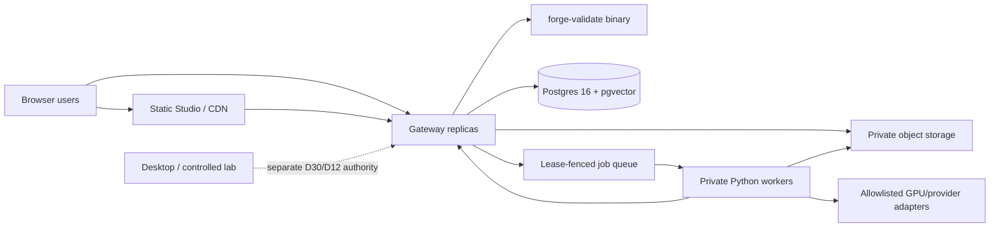

# Production operations contract

Owner: platform/release maintainers

Decisions: D68, D69

Machine policy: [`infra/deployment/deployment-policy.v1.json`](../infra/deployment/deployment-policy.v1.json)

Manifest schema: [`schema/forge-deployment-manifest.schema.json`](../schema/forge-deployment-manifest.schema.json)

Hardened runtime: [`infra/deployment/hardened-runtime.v1.json`](../infra/deployment/hardened-runtime.v1.json)

Deployable profile: [`infra/compose.hardened.json`](../infra/compose.hardened.json)

Current maturity: **D68 is protected at contract/fixture maturity; the D69 runtime is an unprotected contract/fixture candidate; no managed environment or live service is proven**

This document owns OPS-001..010. It defines the supported operating shape and the
ordered path from the current local/prod-like Compose profile to a controlled
external beta. It does not claim that sandbox, staging, production, backup,
observability, support, or on-call infrastructure exists. `PROJECT-STATE.md` owns
dated evidence; the JSON policy owns exact machine-enforced names, requirements,
promotion edges, and authority ceilings.

## 1. Operating doctrine

1. Build once from a clean protected-main revision and promote identical digests.
2. The validator remains sovereign; deployment tooling cannot waive admission.
3. Postgres owns relational state and authority. Object storage owns private,
   checksum-bound bytes. Workers never materialize authoritative results directly.
4. Manifests contain no secret values. They contain only versioned,
   environment-specific secret references.
5. Managed processes fail closed when the manifest, digest, source, environment,
   status, or required component does not match.
6. Database migrations are forward-only. Application rollback uses an already
   admitted artifact/manifest pair and never edits migration history.
7. Production user data never moves down to staging or sandbox. Any separately
   authorized test export must be sanitized, purpose-limited, and lifecycle-bound.
8. Browser, provider, Desktop, and hardware authority remain separate. A service
   deployment cannot confer device, lab, field, or field-proven maturity.
9. Kubernetes, active-active multi-region, and public worker ingress require
   measured need and a new decision; they are not launch prerequisites.

The local command remains:

```sh
docker compose -f infra/docker-compose.yml --profile app up
```

That profile has source mounts and development credentials. It is intentionally
excluded from all managed-environment and production claims.

The separately governed D69 profile is validated with:

```sh
pnpm verify:hardened-runtime
docker compose -f infra/compose.hardened.json config --quiet
```

It is not a replacement local-development command. It requires deployment-supplied
immutable application image references, exact manifest and artifact digests,
file-backed secrets, and TLS material. A successful configuration render or CI smoke
is fixture evidence, not an installed sandbox or rollback result.

The single-host substrate does not support Compose service-level `uid`, `gid`, or
`mode` controls for local file-backed secrets/configs; Compose ignores those fields.
Before rendering or starting this profile, the deployment secret materializer must
write every referenced source outside the repository, set the source bytes to
`root:10999` and mode `0440`, and expose supplemental GID `10999` only to declared
consumers. The checked profile encodes that group with `group_add` and deliberately
omits unsupported per-mount ownership fields. Do not make sources world-readable to
work around a staging error. The ephemeral CI fixture uses an already reviewed,
digest-pinned service image for the bounded ownership/mode operation; a managed host
must use its privileged deployment agent or secret-manager materializer and retain a
metadata-only inspection of path class, numeric owner/group, mode, and version.

## 2. Supported first topology



The first supported operating shape is one region and one failure domain small
enough to operate deliberately: static Studio, at least one gateway, Postgres,
private object storage, private workers, the exact validator artifact, and optional
credentialed providers. Horizontal replica counts are an OPS-010 outcome, not an
assumption. Postgres may be managed, but its version, extension, backups, recovery,
ownership, and migration evidence remain ForgedTTC responsibilities.

| Component | State/authority | Network boundary | Required proof owner |
|---|---|---|---|
| Studio static bundle | presentation and interaction only | public HTTPS/CDN | release maintainer |
| Gateway | authentication, admission, mutation, lifecycle, cross-store orchestration | only public application ingress | platform operator |
| Validator | sovereign contract/export/replay admission | invoked by gateway/CI; no public independent service required | release maintainer |
| Postgres | users, ownership, revisions, jobs, consent, lifecycle, audit | private; gateway/workers use scoped credentials | data owner |
| Object storage | private checksum-bound payload bytes | private endpoint or tightly scoped presigned operation | data owner |
| Workers | lease-fenced compute and provider adapters | no public ingress | platform operator |
| GPU/provider | bounded external capability | allowlisted egress from explicit adapter only | platform + security owner |
| Desktop/lab | local filesystem/serial custody | separate controlled-lab path | lab supervisor |

## 3. Environments and authority ceilings

| Environment | Purpose | Data | Credentials | Maximum maturity/authority |
|---|---|---|---|---|
| `local` | development and owner-local exploration | fixtures or owner-local | development-only | no public, provider, hardware, live, or field authority |
| `ci` | ephemeral deterministic acceptance | fixtures only | keyless/test-only | no external authority |
| `sandbox` | credentialed provider integration | synthetic or explicitly consented test | sandbox-only | provider calls only; not public/live |
| `staging` | production-like system validation | synthetic or independently sanitized | staging-only | no real-user/public/live authority |
| `production` | controlled external service | real user data under lifecycle policy | production-only | public/live/external-beta only after every policy gate |
| `controlled-lab` | named D12 hardware exercises | explicitly consented lab evidence | lab/signing only | hardware gate only; never public/live/field-proven |

An environment name is not maturity evidence. An active manifest is necessary but
not sufficient: every evidence URI, digest, owner, signoff, deployed resource, and
external observation must be independently reviewable. The current repository has
no active managed manifest.

Only these direct promotions exist:

```text
clean protected main -> sandbox -> staging -> production
clean protected main -> controlled-lab
```

Skipping a stage, rebuilding between stages, copying a secret reference, or changing
the source/tree/artifact digests is a new deployment candidate and fails promotion.

## 4. Accountable ownership

Every active managed manifest resolves required roles to a named person or named
rotation. `TBD`, a team name without a rotation, repository bots, and CI identities
are not accountable owners.

| Role | Accountable for | Cannot self-approve alone |
|---|---|---|
| `releaseMaintainer` | source/tag, artifact/SBOM/provenance identity, release and rollback candidate | security/data exceptions |
| `platformOperator` | runtime, network, health, capacity, deployment and rollback execution | security signoff |
| `securityOwner` | identity, secret classes, egress, threat-model deltas, emergency revocation | business launch decision |
| `dataOwner` | migrations, backup/restore, retention, privacy/deletion and data movement | release artifact identity |
| `incidentCommander` | severity, coordination, status updates, recovery and follow-up | retrospective acceptance alone |
| `supportOwner` | intake, user communication, escalation and closure | production mutation without operator |
| `labSupervisor` | physical D30/D12 gate, kill switch, props-off and confirmation | product/live authority |
| `evidenceReviewer` | independent lab evidence completeness and nonclaim review | hardware execution alone |

Sandbox requires release/platform/security/data ownership. Staging additionally
requires an incident commander. Production additionally requires support. The lab
path requires release/security/lab/evidence roles. Changes to that segregation are
policy changes and require D68-compatible review.

## 5. Configuration contract

### 5.1 Bootstrap variables

Managed gateway and worker startup requires these process-level bindings:

| Variable | Meaning |
|---|---|
| `NODE_ENV=production` | enables managed fail-closed behavior; it does not mean the target is the production environment |
| `FORGE_DEPLOYMENT_ENVIRONMENT` | exact target: `sandbox`, `staging`, or `production` for server processes |
| `FORGE_SOURCE_REVISION` | exact 40-character protected-main source revision |
| `FORGE_DEPLOYMENT_MANIFEST` | path to the mounted non-secret manifest bytes |
| `FORGE_DEPLOYMENT_MANIFEST_SHA256` | exact SHA-256 of those bytes |
| `FORGE_DEPLOYMENT_ARTIFACT_SHA256` | exact digest for the current gateway or worker image; it must match that component in the manifest |
| `FORGE_RUNTIME_SECRETS_DIRECTORY` | absolute mount directory from which only exact allowlisted secret-value filenames are loaded; TLS material may coexist but is not ingested as an application secret value |
| `FORGE_RUNTIME_SECRETS_SOURCE=files` | runtime proof that managed secrets came from files rather than inherited environment values |

These bootstrap values are intentionally not all embedded as manifest configuration;
requiring a manifest to contain its own path or digest would be self-referential.
Gateway and worker startup independently hash the file and require current schema,
active status, matching environment/source, clean protected source, matching
configuration bindings, and their own component declaration. `FORGE_ENV` is a
legacy local alias and is rejected in managed startup.

Gateway and worker secret loaders inspect only the exact secret-value allowlist
declared by the deployment policy; unrelated mounted TLS/config files are not loaded
into environment variables. The directory must be absolute and real; each present
allowlisted entry must be a non-empty regular non-symlink file of at most 16 KiB with
no NUL or multiline content. A secret already present in the process environment is
ambiguous and fails closed. Neither filenames nor values may be logged as evidence.

### 5.2 Manifest content

Version 1 records:

- immutable source revision/tree and clean/protected state;
- one digest-, SBOM-, and provenance-bound artifact per component;
- enabled capabilities and declared non-secret values;
- versioned secret references, never secret values;
- accountable ownership, evidence gates, direct promotion lineage and signoffs;
- explicit authority booleans capped by the target environment.

Managed artifact URIs must bind the exact digest as `@sha256:<digest>` or
`#sha256=<digest>`. An `active` manifest must include all components, gates, owners,
and signoffs required by its environment. Planned or retired manifests cannot claim
authority. No manifest can set `field=true`.

The canonical runtime-variable inventory is
`configuration.valueVariables`, `secretVariables`, `runtimeManagedVariables`, and
`localOnlyVariables` in `deployment-policy.v1.json`. Adding or renaming an operator
variable requires updating that registry, compatibility, tests, operations docs,
and the changelog in the same change. Production rejects development auth, legacy
environment aliases, MinIO root credentials, insecure object transport overrides,
and sandbox quote/vendor flags.

### 5.3 Validation commands

```sh
pnpm verify:deployment
pnpm verify:hardened-runtime
node scripts/deployment-policy.mjs validate /private/path/manifest.json
node scripts/deployment-policy.mjs promote /private/path/source.json /private/path/target.json
```

Deployment manifests and their signoff/evidence records belong in the controlled
operations evidence store, not in the public repository. Do not commit real account
IDs, resource topology, private endpoints, secret references, or live evidence URIs.
The repository stores only the schema, policy, validators, tests, and redacted
evidence summaries.

## 6. Secret classes and rotation

References follow `secret://<authority>/<environment>/<name>@<immutable-version>`.
The deployer resolves them; the application receives the value through its runtime
secret mechanism. Values must never enter source, manifest, logs, screenshots,
evidence, generated documentation, support tickets, or promotion records.

| Class | Maximum age | Overlap | Examples/handling |
|---|---:|---|---|
| auth signing | 90 days | optional | rotation may invalidate sessions; communicate explicitly |
| database | 90 days | required | introduce new credential, drain old pools, then revoke |
| object storage | 90 days | required | issue second key, prove reads/writes, then revoke old key |
| OAuth | 180 days | where provider supports | validate redirect/origin and sandbox before cutover |
| external provider | 90 days | required | sandbox test, bounded target cutover, reconcile cost |
| review authority | 90 days | optional | invalidate existing review sessions |
| Desktop signing | 365 days | required | old/new signed artifacts remain independently verifiable |

Normal rotation procedure:

1. Open a tracked change naming class, environment, owner, deadline, and rollback.
2. Create a new immutable secret version in the target environment; never overwrite.
3. Grant least privilege and validate it in the lower corresponding environment.
4. Create a new target manifest referencing the new version and collect signoffs.
5. Deploy the exact manifest; prove authentication plus representative read/write or
   provider call without logging values.
6. Observe the overlap/drain window and confirm no old-version use.
7. Revoke the old version, verify refusal, update inventory/expiry, and retain
   redacted evidence.

Suspected disclosure bypasses the normal age: revoke or disable within the policy's
four-hour maximum, stop affected capability if safe overlap is unavailable, rotate
all derived credentials, invalidate sessions/tokens where applicable, search
bounded/redacted logs, notify the incident commander/security/data owners, and
record scope and follow-up without reproducing the secret.

## 7. Build, promotion, rollback, and retirement

### 7.1 Build once

1. Start from a clean protected `main` commit with all required checks green.
2. Build each deployable component once using pinned toolchains and dependencies.
3. Produce immutable digest-addressed artifacts, SPDX SBOMs, and provenance bound to
   the source revision/tree.
4. Record required migration, rollback, and database-plan digests.
5. Create a planned sandbox manifest and validate it offline.
6. Store the exact manifest bytes and record their SHA-256 as deployment input.

### 7.2 Promote

1. Confirm the source environment is active and its evidence/SLO window is current.
2. Copy artifact identities—not mutable tags—to the target manifest.
3. Keep source revision, tree, artifact, SBOM, and provenance digests byte-identical.
4. Resolve new target-specific secret references and ownership rotations.
5. Add every target gate and independent signoff.
6. Run `deployment-policy.mjs validate` and `promote` before any mutation.
7. Apply forward migrations, deploy private stateful/data services, workers,
   gateway, then static Studio; keep public traffic disabled.
8. Run readiness, migration, object, queue, auth, lifecycle, smoke, and rollback
   checks. Enable traffic only within the approved rollout envelope.
9. Retain the exact active manifest, digest, deployment events, and redacted evidence.

### 7.3 Roll back or roll forward

Stop rollout on manifest mismatch, migration refusal, readiness failure, elevated
error budget burn, security/privacy boundary failure, unexplained cost, or lost
observability. Disable public/provider capability first. Application rollback uses
the last admitted artifact plus its exact manifest and environment-specific secrets.
Do not reverse a committed database migration or restore an old database merely to
match application code. If the old application cannot read the additive schema,
keep traffic stopped and ship a corrected roll-forward. Restore is reserved for
verified data-loss/corruption response under OPS-005.

Retirement disables traffic/jobs, drains or cancels attempts, preserves lifecycle
and audit obligations, revokes unique credentials, records retained/deleted data,
marks the manifest retired (all authority false), and verifies that resource removal
does not delete required evidence or backups.

## 8. OPS-002..010 dependency-complete roadmap

OPS tasks do not run as ten independent checklists. The safe sequence is:

```text
OPS-001 contract
  -> OPS-002 hardened deployable artifacts
  -> OPS-003 telemetry/redaction foundation
  -> OPS-004 SLOs + OPS-005 backup/restore + OPS-006 job/cost controls
  -> OPS-007 provider resilience
  -> OPS-008 incident/support readiness + OPS-009 unit economics
  -> OPS-010 load/capacity/launch limits
  -> staged external beta decision
```

| Task | Deliverables | Required acceptance evidence | Depends on / unlocks |
|---|---|---|---|
| OPS-002 hardened runtime | immutable images/artifacts; non-root/read-only where viable; writable-path inventory; health/readiness/startup probes; resource requests/limits; TLS/private network; migration job; deploy/rollback scripts | image digests, SBOM/provenance, vulnerability review, privilege/filesystem/network tests, clean sandbox deploy and rollback | OPS-001; unlocks real sandbox |
| OPS-003 observability | structured redacted logs; request/user/job/provider/deployment correlation; metrics and traces; dashboards; alert routing; clock/source/version fields | redaction adversarial tests, trace continuity, dashboard query validation, synthetic alerts delivered and acknowledged | OPS-002; prerequisite for every live exercise |
| OPS-004 SLOs | service indicators, targets and error budgets for API/auth/generation/queue/object/provider/training/photoscan; burn alerts; maintenance windows | measured staging baselines, alert thresholds, owner/action per SLO, deliberate burn exercise | OPS-003; governs rollout/stop |
| OPS-005 data resilience | Postgres and object backups; encryption/access; retention/capacity; independent restore; migration recovery; DR runbook with RPO/RTO | empty/populated migration proof plus isolated full restore, object checksum reconciliation, timed regional/failure exercise | OPS-002/003; required before real user data |
| OPS-006 job and spend control | owner/global quotas, concurrency, idempotency, cancellation/refund, dead-letter/reconciliation, cost attribution, kill switch | provider outage/late result/duplicate/crash tests plus credentialed sandbox hard-stop and billing reconciliation | OPS-003/004; unlocks bounded provider use |
| OPS-007 provider resilience | capability discovery, sandbox/prod split, timeouts, retry/circuit/rate policies, egress allowlist, credential rotation, degraded UX | current primary-provider contract, sandbox outage/rotation/recovery evidence, no silent fallback or maturity promotion | OPS-005/006; unlocks staged provider traffic |
| OPS-008 incidents/support | severity model, on-call/escalation, status/security intake, user communication, evidence preservation, postmortem and corrective-action tracking | tabletop plus one technical incident exercise with timestamps, handoffs, notification and restoration | OPS-003..007; required before external beta |
| OPS-009 economics | token/GPU/CPU/storage/egress/provider/credit/refund/margin ledger by workflow and owner; privacy-safe reporting | reconciled sandbox invoices, allocation invariants, refund/negative-cost cases, dashboard and alert review | OPS-003/006/007; informs launch caps |
| OPS-010 capacity/launch | load model, representative datasets, API/DB/queue/object/provider tests, bottleneck/cost curves, safe concurrency/rate/storage limits, expansion triggers | reproducible staging report, failure/degradation test, recovery, cost envelope, owner-approved beta limits | OPS-004..009; enables launch decision only |

### OPS-002 implementation slices

Current D69 candidate status: slices 1–5 have repository contract/fixture
implementations; slice 6 is deliberately open. The repository now contains pinned
multi-stage application targets, a digest-pinned single-host Compose profile,
file-secret loaders, gateway and worker readiness, resource/privilege/network
constraints, a forward-only migration job, a CI image/SBOM/provenance/vulnerability
and runtime-smoke lane, and exact nonclaims. Local Docker configuration validation
and deterministic tests do not replace the still-required protected CI artifact or
managed sandbox install/rollback evidence.

1. Inventory deployable artifacts, writable paths, ports, identities, and health
   dependencies; choose the deployment substrate without introducing Kubernetes.
2. Add pinned multi-stage gateway/worker/Studio/validator images and exact lockfile
   installs; generate SBOM/provenance in CI.
3. Run as non-root with read-only roots, explicit temporary/cache volumes, dropped
   capabilities, private workers/data services, and bounded egress.
4. Add startup/readiness/liveness semantics that distinguish invalid configuration,
   migration dependency, validator availability, database/object readiness, and
   provider degradation. Liveness must not restart a process for a downstream outage.
5. Add CPU/memory/time/concurrency/storage limits and graceful termination/drain.
6. Prove clean sandbox install, upgrade, application rollback, and corrected
   roll-forward with exact manifest bindings.

### OPS-002 artifact and probe contract

- `infra/docker/runtime.Dockerfile` builds `gateway`, `workers`, and `studio` from
  exact reviewed bases. Gateway and workers carry the release validator; Studio is a
  static TLS edge. Images label the exact source revision and run as
  `10001:10001`, `10002:10002`, and `101:101` respectively.
- `infra/compose.hardened.json` is the single-host substrate. Only Studio publishes
  `8443`; Postgres, object storage, Gateway, migration, and workers remain private.
  Root-only Postgres/object-volume ownership initialization is short-lived and
  separately bounded. Every secret/config consumer is non-root and receives only
  supplemental GID `10999`; mounted source files must already be `root:10999`/`0440`
  outside the checkout before Compose starts.
- Liveness means that the process can execute; readiness means that declared local
  dependencies are usable. Gateway readiness checks the validator, Postgres, and
  object bucket. Worker readiness checks its deployment fence, validator, and
  Postgres. A downstream outage must not be converted into a process-only liveness
  success claim.
- The Studio edge terminates TLS and retains COOP/COEP plus defensive headers. The
  object store also requires TLS. Development HTTP remains confined to the explicit
  source-mounted profile.
- CI builds the exact targets, records build metadata, emits an SPDX image SBOM and
  vulnerability report per component, then checks effective identity, read-only
  root, capabilities, security options, limits, staged source ownership/mode,
  configured and effective supplemental groups, health, TLS, isolation headers,
  private networking, graceful stop, and same-artifact restart. Startup failures
  retain bounded Compose status and service logs for diagnosis. The structured smoke
  record permanently sets managed-sandbox, rollback, live, production, and external-
  beta claims false.
- A sandbox closeout must additionally publish immutable application image
  references, independently bind their registry manifest digests to a protected D68
  manifest, retain downloaded SBOM/provenance/vulnerability evidence, execute the
  forward migration, perform representative read/write and queue smoke, install the
  last admitted candidate, exercise rollback to it, and prove corrected roll-forward.
  Record exact timestamps, identities, outcomes, and limitations in the private
  operations evidence store before marking OPS-002 done.

### OPS-003/004 measurement rules

- Correlation IDs are generated/validated at trusted boundaries and propagated to
  jobs/provider calls; never accept a client claim as audit identity.
- Logs are structured, bounded, UTC timestamped, source/version/environment bound,
  and redacted before transport. Prompts, model bytes, telemetry, secret references,
  presigned URLs, auth headers, and personal data are deny-by-default.
- Metrics must not use user/job/resource IDs as unbounded labels.
- Traces sample deliberately and preserve error/slow paths without payload capture.
- Every alert names an owner, urgency, user impact, dashboard, first action, and
  silence/expiry behavior. Delivery failure itself alerts through a separate route.
- SLOs measure user-visible outcomes; host uptime alone is not an SLI.

### OPS-005/006/007 recovery rules

- Backups are not proof until an isolated restore is timed and checksummed.
- Postgres and object-store recovery points must reconcile; orphaned/staged objects
  remain non-authoritative and cleanup is lifecycle-aware.
- Retry budgets are finite, idempotency is owner-scoped, and lease/token authority
  fences late results. Cancellation is a persisted state transition, not a UI hint.
- Spend limits exist both before dispatch and at the provider/account boundary where
  available. An internal ledger without provider reconciliation is an estimate.
- Capability discovery never silently substitutes a different model/GPU/version or
  weakens validation. Degraded mode is explicit in UI, API, evidence, and billing.

### OPS-008/009/010 launch rules

- Severity considers safety, security, privacy, irreversible data loss, authority
  corruption, widespread unavailability, and runaway spend—not request count alone.
- Security reports have a private intake and coordinated disclosure path.
- Unit economics distinguish simulated vehicle energy, host estimates, measured
  provider usage, invoices, credits, refunds, taxes, and unallocated overhead.
- Load tests use synthetic/sanitized data and exercise backpressure, queue fairness,
  database/object hot spots, provider throttling, cancellation, and recovery.
- Launch limits are configuration/policy with owners and stop thresholds. Raising a
  limit requires evidence; it is not an emergency response to overload.

## 9. Launch gate and evidence ledger

External beta remains no-go until all of the following are current on one exact
protected revision and active production manifest:

- every required repository, security, deployment, migration, and compatibility gate;
- immutable artifacts/SBOM/provenance and downloaded verification;
- sandbox then staging promotions with identical artifact identities;
- hardened runtime and least-privilege review;
- working dashboards, trace continuity, alert delivery, SLO/error-budget policy;
- isolated Postgres/object restore with measured RPO/RTO;
- bounded job/provider cancellation, reconciliation, kill switch, and secret rotation;
- incident/support tabletop and security-reporting path;
- reconciled unit economics and owner-approved launch budget;
- representative capacity/failure/recovery result and explicit beta limits;
- privacy, consent, export/deletion, retention, backup, and lifecycle checks;
- explicit external-beta rollout approval with rollback owner and stop conditions.

Record each run outside the public repository with environment, exact source/tree,
manifest/artifact/evidence hashes, timestamps, tools/versions, named operators and
reviewers, findings, limitations, pass/fail/stop verdict, and retention/deletion
dates. Summarize only redacted hashes and conclusions in `PROJECT-STATE.md` and the
changelog. Fixture/contract proof stays labelled fixture/contract.

## 10. Change checklist

Before merging an operations change:

- update the machine policy/schema first, then runtime bindings and tests;
- preserve format compatibility or introduce a coordinated major and migration;
- add secret, authorization, malformed input, stale source, skipped-stage,
  substitution, rollback, and boundary tests;
- update `COMPATIBILITY.md`, `DECISIONS.md`, threat model/risk register as needed;
- add golden review records for registered policy/schema drift;
- run `pnpm verify:deployment`, `pnpm verify:hardened-runtime`, the narrow surface gates, full `pnpm verify`, and
  database/browser/deployment gates required by the changed surface;
- inspect `git diff --check`, the full diff, dependency/security impact, and current
  remote checks;
- state exact maturity and nonclaims. Never infer live, production, hardware, field,
  or external acceptance from a schema, image, manifest, test, or successful deploy.
