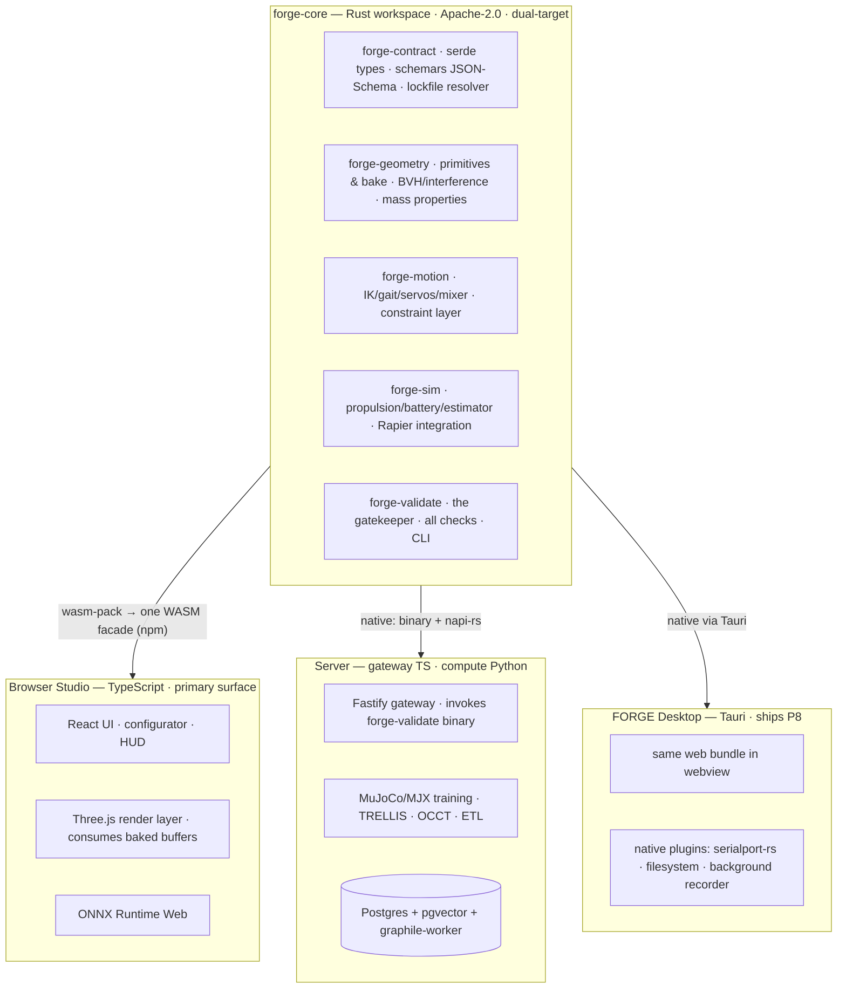

# ARCHITECTURE — runtime split, layout, stack, deployment, budgets

Source: plan §5–§6, §18 (v3.0, binding); expanded with the planned repository layout.
Implementation detail beyond the plan is marked *(proposed)*.

## 1. The runtime split: Rust core, web face (D15, D16, D17)

The grain of the system: **everything that must be correct is Rust, compiled
everywhere; everything that must be seen is web; everything that must be trained is
Python.**



**What lives where (the definitive split, plan §5.2):**
- **Rust (`forge-core`):** contract types with schemars JSON-Schema emission (the
  schema's single source — the same schema the LLM is constrained against); geometry
  bake to flat buffers, BVH interference, mass properties; the motion stack; the
  simulation models and Rapier integration (the same crate natively and as WASM); and
  `forge-validate` with every check.
- **TypeScript:** React UI, the Three.js render layer (a thin consumer of core-baked
  buffers — rendering is presentation, not truth), studio state, the Fastify gateway
  (spawns the `forge-validate` binary; napi-rs available for hot paths, OD-08), and
  WebSerial bridge logic.
- **Python:** training (MuJoCo/MJX, SB3, offline RL), TRELLIS/COLMAP, OCCT jobs,
  catalog ETL.

Cross-store lifecycle authority remains in the gateway/Postgres plane: D35 retention
policies, append-only legal holds, backup catalog records, pseudonymous deletion
tombstones, restore tests, and causal authority backfill live in `packages/gateway`
plus migrations 0017..0019.
Provider-specific backup deletion is an injected operations adapter; no worker or UI
may mark a physical copy deleted. Full contract: [`DATA-LIFECYCLE.md`](DATA-LIFECYCLE.md).

The separate P11 commerce queue boundary is migration 0020: the Fastify gateway
enqueues an idempotent local `commerce.vendor-refresh` row, the Python worker alone
invokes and normalizes the deployment command, and Postgres transactionally
materializes accepted `vendor_offers` with job success. The gateway has no parallel
direct-live vendor HTTP path.

Full port methodology, boundary signatures, and golden-number suite:
[`systems/core-runtime.md`](systems/core-runtime.md).

## 2. The core boundary (plan §5.3 — frozen at P0)

The studio talks to core-WASM through a narrow, allocation-disciplined interface:

| Call | Direction | Discipline |
|---|---|---|
| **bake** | contract JSON in (edit-time only) → baked geometry out | views over WASM linear memory (`Float32Array` positions/normals, `Uint32Array` indices, material ids) consumed directly as Three.js BufferAttributes — zero copy, no per-frame JSON ever |
| **tick** | fixed-step motion/sim advance | writes pose matrices + HUD scalars into a shared region the render layer interpolates from |
| **validate** | full suite or incremental checks | structured diagnostics out (validation-harness doc §4) |
| **patch** | JSON-Patch in | incremental re-bake of affected parts only |

The same API is exposed natively via napi-rs where the gateway ever needs hot-path
calls; the default server integration is spawning the binary (process isolation +
guaranteed bit-equality with CI).

## 3. Repository layout *(current; `schema/` and `scripts/codegen-contract.mjs` carry the XC-01 pipeline)*

```
TTC/
├── prototype/cad-object-studio.html   # frozen executable reference + parity oracle (PRE-002)
├── crates/                            # Rust core (cargo workspace, Apache-2.0)
│   ├── forge-contract/                # serde types, schemars emission, lockfile resolver, migrations
│   ├── forge-geometry/                # primitives & bake, CSG trait (Manifold), massprops, BVH, couplers, DfM
│   ├── forge-motion/                  # drivers, IK/gait/servos/mixer, constraint layer
│   ├── forge-sim/                     # propulsion/battery/estimator, Rapier integration, replay
│   ├── forge-validate/                # the gatekeeper: checks, CLI, report assembly
│   └── forge-wasm/                    # single wasm-pack facade (bake/tick/validate/patch) ≤ 2 MB gz
├── packages/                          # TypeScript face (pnpm workspace)
│   ├── studio/                        # React app + Three.js render layer + ONNX playback
│   ├── gateway/                       # Fastify API, registries, orchestrators (spawns forge-validate)
│   └── desktop/                       # Tauri shell + lab-gated serial/recorder contracts
├── workers/                           # Python 3.12 compute plane + deterministic fixture/live adapters
├── docs/                              # this documentation system
└── infra/                             # Docker Compose, CI, deploy scripts
```

Dependency rules *(proposed)*: `forge-contract` depends on nothing; other crates
depend on it (+ each other narrowly: validate → all); nothing in `crates/` touches
the DOM or any I/O beyond the CLI in `forge-validate`. TS packages consume the core
only through the facade (browser) or the binary/napi-rs (server). Python workers
validate payloads against the schemars-emitted JSON Schema — the schema artifact is
the inter-language contract; never hand-mirror types.

## 4. Technology stack (settled — see plan §6 for full rationale)

| Layer | Decision |
|---|---|
| Core language | **Rust** — `forge-core` workspace, dual-target (native + WASM via single facade crate ≤ 2 MB gz) |
| Face language | TypeScript strict — React 19 + Zustand; Vite + pnpm workspace beside the cargo workspace; TS types codegen'd from schemars output |
| 3D | Three.js — WebGL2 baseline, WebGPURenderer behind a flag; thin consumer of core-baked buffers |
| Client physics | Rapier — same crate natively and as WASM, driven from `forge-sim`; 240 Hz substeps in a worker |
| In-browser inference | ONNX Runtime Web (WASM/WebGPU EP) |
| CSG / B-rep | Manifold behind a core trait (native C API / WASM build); OpenCascade **server-side** (STEP I/O, fillets, DfM) |
| Mesh tooling | meshoptimizer (native + WASM) for decimation/LOD |
| Gateway | Fastify + TypeBox on Node 24; invokes the `forge-validate` binary (D22 keeps binary-spawn until a measured hot path justifies change) |
| Compute | Python 3.12 queue-driven workers (MuJoCo/MJX, SB3, TRELLIS, COLMAP, OCCT) |
| Data | Postgres 16 + pgvector + graphile-worker; S3-compatible object storage |
| Training sim | MuJoCo (CPU) → MJX (GPU/JAX) when benchmarks demand (P7-010) |
| RL | PyTorch + Stable-Baselines3 (PPO/SAC); BC/offline-RL for telemetry curricula |
| Image→3D | TRELLIS-class + COLMAP on burst GPU (Modal/RunPod), cached forever |
| LLM | Anthropic API — frontier tier for synthesis/repair, smaller tiers for edits/ETL; tool use constrained by the schemars-emitted schema; prompt caching; Batch API; BYO key (D3). Strings/limits/pricing pinned at implementation from https://docs.claude.com/en/api/overview |
| Desktop | **Tauri — FORGE Desktop at P8**: same web bundle + native plugins (serialport-rs, fs, background recorder) (D15) |
| Auth | Auth.js; anonymous-local mode first-class |
| Observability | pino structured logs + Sentry; OpenTelemetry optional |

**Two physics engines is a feature (D20):** Rapier interactive, MuJoCo canonical;
same compiled MJCF; parity suite on every upgrade.

## 5. Determinism (D17)

One implementation compiled to every target makes bit-exact replay a property of the
system, not a server privilege. Policy: **no fast-math anywhere in core**; the
cross-target **golden-number suite** (canonical scenes, recorded trajectories, exact
native↔WASM comparison) runs in CI on every core change; a platform that breaks
exactness degrades to declared ULP tolerance and the suite says so. Replay tapes
`{contract hash + lockfile, env, seed, input tape}` verify anywhere; official
leaderboard runs are re-verified server-side as anti-cheat hygiene only.

## 6. Deployment, surfaces & operations

The binding topology, environment, ownership, configuration, secret-rotation,
promotion, rollback, and OPS-002..010 closure contract is
[`OPERATIONS.md`](OPERATIONS.md) under D68. Exact machine policy lives in
[`deployment-policy.v1.json`](../infra/deployment/deployment-policy.v1.json); this
architecture section is a summary, not independent deployment authority.

D69's first deployable substrate is governed by
[`hardened-runtime.v1.json`](../infra/deployment/hardened-runtime.v1.json) and
`infra/compose.hardened.json`: a single-host TLS Studio edge, private Gateway,
Postgres/object store/workers, exact multi-stage application images, file secrets,
least privilege, probes, and finite resources. It remains contract/fixture evidence
until a protected immutable artifact is installed and rolled back in a managed
sandbox.

- **Current state:** `infra/docker-compose.yml` is a local/prod-like development
  profile with development defaults and source mounts. It is not production proof.
- **Deployable candidate:** `infra/compose.hardened.json` is the D69 single-host
  contract/fixture profile. Only the Studio TLS port is published; its CI smoke does
  not prove sandbox, rollback, live, or production maturity.
- **Target topology:** a single-VM gateway/Postgres/worker deployment plus CDN/static
  Studio and burst GPU providers remains the intended first operating shape. It must
  satisfy OPS-001..010 before being described as production. Kubernetes and
  multi-region remain out of scope until measured need and a decision record.
- **Surfaces (D15):** the **browser is primary, permanently** (share URLs are the
  growth loop). Full web studio requires the Chromium floor (COOP/COEP for shared
  memory); Firefox/Safari/iOS are viewer-grade by declaration — say so in user-facing
  docs. **FORGE Desktop (Tauri) ships at P8**: same web bundle in a webview + native
  plugins (serialport-rs, filesystem, background recorder); a native-core fast path
  inside the shell is available later if profiling asks.
- **Distribution of the validator (D17/D2):** static binary (CLI), npm WASM package,
  crates.io crate — the R2 rung as an artifact.
- **Backups/audit:** one stateful service (Postgres) keeps backup and audit surface
  small; object storage is content-addressed where possible *(proposed)*.
- **User authority (D33/D34/D35):** primary export/deletion, append-only consent,
  retention, legal holds, backup cataloguing, tombstones, and restore suppression
  live in the gateway/Postgres boundary. Consent is purpose- and subject-scoped;
  consent actions and hold-aware deletion serialize authority with the affected
  owner/objects, and worker materialization cannot resurrect a cancelled job. Real
  backup-provider deletion and disaster-recovery proof remain OPS-005.
- **Secrets:** platform API keys stay server-side only; BYO Anthropic keys are held
  client-side, passed per request to `POST /v1/generate` (`x-forge-anthropic-key` or
  request body), forwarded to Anthropic for that call, and never persisted
  server-side. Studio settings and metered-credit account plumbing remain P4/P11
  surface work.

## 7. Performance budgets (binding acceptance criteria, plan §18)

| Surface | Budget | Mechanism |
|---|---|---|
| Client frame | 16.6 ms: ≤ 6 ms render · ≤ 1.5 ms core tick (motion+sim models, WASM) · ≤ 4 ms Rapier (worker, amortized) · ≤ 2 ms UI | BatchedMesh ≤ 40 draw calls/model; 150 k-tri scene cap; LODs; zero-copy buffer views |
| Core WASM | facade ≤ 2 MB gz; humanoid bake ≤ 60 ms; incremental patch re-bake ≤ 10 ms | single facade crate; flat-buffer outputs; no per-frame JSON |
| Scene scale | 3 models or 400 k tris before degradation | quality tiers: AO off → shadow res → pixel ratio (XC-22) |
| Physics | 240 Hz substeps, 120 Hz driver tick, render-interpolated | shared-memory state mirror; zero per-frame allocation |
| Cold load | < 2.5 s to interactive on mid hardware | code-split; ONNX/CSG lazy; streaming WASM compile |
| Validator | full suite < 10 s per model (binary); incremental in-studio checks < 150 ms (WASM) | parallel checks; BVH reuse; same bits both places (D17) |
| Generation | < 60 s brief → validated model | multi-pass, cached prefix; slots stream in as they validate |
| Photoscan | < 5 min photo → parametric part | burst GPU queue SLO; permanent cache |
| Training | hover-class task → passing scorecard overnight, one consumer GPU | SB3 PPO baseline; MJX when exceeded |
| Co-design | tier-0 candidate < 50 ms native; 200-candidate CMA-ES generation overnight at tier 2 | multi-fidelity ladder; MJX batching |
| Replay/ghost | 60 fps scrubbing over a 10-min log | indexed telemetry tape; decimated overlay geometry |

Catalog geometry: ≤ 800 tris LOD0, ≤ 150 tris LOD1 per part.

## 8. Cross-plane data flows (the load-bearing ones)

1. **Generation:** studio → gateway → Anthropic API (multi-pass, schema-tooled) →
   `forge-validate` on every pass (WASM in-studio, binary in CI — same bits) →
   admitted contract or draft → registry → studio bakes and renders.
2. **Validation:** any contract write (CI / admission / publish / lockfile upgrade) →
   `forge-validate` → report stored with the artifact; the report is provenance.
3. **Training:** contract → MJCF compile (`forge-sim`) → queue job → MuJoCo/SB3
   worker → ONNX + scorecard → object storage + registry → in-browser playback.
4. **Catalog:** ETL worker → extracted specs (cited) + OCCT-tessellated LODs →
   review queue → immutable `component_revisions` → lockfiles pin them.
5. **Telemetry:** bridge (browser WebSerial or Desktop serial plugin) → recorder →
   ghost overlay; logs → system-ID fitter → updated sim block → fine-tune; logs →
   BC/offline-RL curricula.
