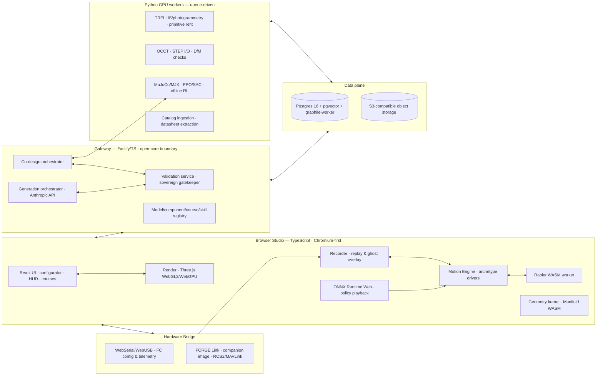

# ARCHITECTURE — planes, layout, stack, deployment, budgets

Source: plan §5–§6, §18 (binding); expanded with the planned repository layout.
Implementation detail beyond the plan is marked *(proposed)*.

## 1. The five planes



**Client studio** — everything interactive; **local-first**: contracts live on the
user's machine; viewing, configuring, validating, and simulating work offline. The
server exists for generation, heavy geometry, training, catalog, courses, sharing.
**Gateway** — thin, typed; owns the validation service (the sovereign gatekeeper) and
the generation/co-design orchestrators. Also the open-core boundary: everything
above it in the client plus contract/engines/harness is Apache-2.0; the gateway's
services, catalog data, and compute are proprietary (D2).
**Data plane** — deliberately **one Postgres** (pgvector for embeddings,
graphile-worker for transactional jobs) + S3-compatible object storage (meshes,
photos, policies, logs, renders) with presigned browser uploads.
**Compute plane** — Python 3.12 queue-driven workers, no public surface; lives where
the ML/geometry ecosystem's gravity is.
**Hardware bridge** — browser-native where possible (WebSerial); FORGE Link
companion image where not. Never auto-arms (details:
[`systems/hardware-bridge.md`](systems/hardware-bridge.md)).

## 2. Cross-plane data flows (the load-bearing ones)

1. **Generation:** studio → gateway GEN → Anthropic API (multi-pass, schema-tooled) →
   VAL on every pass → admitted contract or draft → registry → studio renders.
2. **Validation:** any contract write (CI / admission / publish / lockfile upgrade) →
   headless runner → report stored with the artifact; report is part of provenance.
3. **Training:** contract → MJCF compile → queue job → MuJoCo/SB3 worker → ONNX +
   scorecard → object storage + registry → in-browser playback via the motion
   engine's policy layer.
4. **Catalog:** ETL worker → extracted specs (cited) + OCCT-tessellated LODs →
   review queue → published immutable `component_revisions` → lockfiles pin them.
5. **Telemetry:** bridge → recorder (replay format) → ghost overlay; logs → system-ID
   fitter → updated sim block → fine-tune; logs → BC/offline-RL curricula.

## 3. Repository layout *(proposed — confirm at P0 scaffold, P0-003)*

```
TTC/
├── prototype/cad-object-studio.html   # frozen executable reference (PRE-002)
├── packages/                          # TypeScript (pnpm + Turborepo)
│   ├── contract/                      # JSON Schema v2.1, TypeBox codegen, migrations
│   ├── geometry/                      # primitives, CSG, massprops, BVH, couplers, refit-shared, DfM
│   ├── engines/
│   │   ├── render/                    # Three.js layer
│   │   ├── motion/                    # drivers, layer stack
│   │   ├── sim/                       # Rapier coupling, propulsion, estimator, replay
│   │   └── policy/                    # ONNX runtime wrapper, policy I/O headers
│   ├── harness/                       # validation runner + check catalog (headless)
│   ├── studio/                        # React app (the only React package)
│   ├── gateway/                       # Fastify API, registries, orchestrators
│   └── link/                          # FORGE Link daemon + image build
├── workers/                           # Python 3.12 compute plane
│   ├── photoscan/  ├── occt/  ├── training/  └── etl/
├── docs/                              # this documentation system
└── infra/                             # Docker Compose, CI, deploy scripts
```

Dependency rule *(proposed)*: `contract` depends on nothing; `geometry` and
`engines/*` depend only on `contract` (+ each other narrowly); `harness` depends on
contract+geometry+engines; `studio`/`gateway` depend on anything; nothing depends on
`studio`. Python workers consume the same JSON Schema (codegen or runtime
validation) — the schema is the inter-language contract.

## 4. Technology stack (decided — see plan §6 for full rationale)

| Layer | Decision |
|---|---|
| Language/repo | TypeScript strict end-to-end; Vite + pnpm + Turborepo monorepo |
| UI | React 19 + Zustand (loop state outside React); Solid revisited only if P1 profiling demands (OD-02) |
| 3D | Three.js — WebGL2 baseline, WebGPURenderer behind a flag |
| Client physics | Rapier (Rust→WASM) in a worker, 240 Hz substeps |
| In-browser inference | ONNX Runtime Web (WASM/WebGPU EP) |
| Geometry | own primitive library (TS port) + Manifold (CSG) + OpenCascade.js (lazy worker: STEP, fillets, DfM) + meshoptimizer (LOD) |
| Optimization | CMA-ES / Optuna (BO) server-side |
| Gateway | Fastify + TypeBox on Node 22 |
| Compute | Python 3.12 queue-driven workers |
| Data | Postgres 16 + pgvector + graphile-worker; S3-compatible object storage |
| Training sim | MuJoCo (CPU) → MJX (GPU/JAX) when benchmarks demand (P7-010) |
| RL | PyTorch + Stable-Baselines3 (PPO/SAC); BC/offline-RL for telemetry curricula |
| Image→3D | TRELLIS-class + COLMAP on burst GPU (Modal/RunPod), cached forever |
| LLM | Anthropic API — frontier tier for synthesis/repair, smaller tiers for edits/ETL; tool use with enforced JSON Schema; prompt caching; Batch API; BYO key (D3). Strings/limits/pricing pinned at implementation from https://docs.claude.com/en/api/overview |
| Auth | Auth.js; anonymous-local mode first-class |
| Observability | pino structured logs + Sentry; OpenTelemetry optional |

**Two physics engines is a feature (D16):** Rapier interactive, MuJoCo canonical;
same compiled MJCF; parity suite on every upgrade.

## 5. Deployment & operations

- **Topology:** Docker Compose on a single Hetzner-class VM (gateway + Postgres +
  workers) + CDN for the static studio. GPU is burst-only (Modal/RunPod) with
  permanent result caching. k8s is deliberately out of scope.
- **Browser floor (D11):** full studio + bridge on Chromium (COOP/COEP headers
  required for SharedArrayBuffer). Firefox/Safari: viewer-grade (no WebSerial,
  possible SAB/WebGPU gaps). iOS: viewer. State this in user-facing docs.
- **Backups/audit:** one stateful service (Postgres) keeps backup and audit surface
  small; object storage is content-addressed where possible *(proposed)*.
- **Secrets:** API keys server-side only; BYO Anthropic keys held client-side,
  passed per-request, never persisted server-side *(proposed — verify against the
  vetted integration pattern at P4)*.

## 6. Performance budgets (binding acceptance criteria, plan §18)

| Surface | Budget | Mechanism |
|---|---|---|
| Client frame | 16.6 ms: ≤ 6 ms render · ≤ 3 ms motion · ≤ 4 ms physics (worker, amortized) · ≤ 2 ms UI | BatchedMesh ≤ 40 draw calls/model; 150 k-tri scene cap; LODs on catalog parts |
| Scene scale | 3 models or 400 k tris before degradation | quality tiers: AO off → shadow res → pixel ratio (XC-22) |
| Physics | 240 Hz substeps, 120 Hz driver tick, render-interpolated | SharedArrayBuffer mirror; zero per-frame allocation |
| Cold load | < 2.5 s to interactive on mid hardware | code-split engines; OCCT/ONNX lazy; streaming WASM compile |
| Generation | < 60 s brief → validated model | multi-pass, cached prefix; slots stream in as they validate |
| Photoscan | < 5 min photo → parametric part | burst GPU queue SLO; permanent cache |
| Training | hover-class task → passing scorecard overnight, one consumer GPU | SB3 PPO baseline; MJX when exceeded |
| Co-design | tier-0/1 eval < 5 s; 200-candidate CMA-ES generation overnight at tier 2 | multi-fidelity ladder; MJX batching |
| Validator | < 10 s full suite per model | headless, parallel checks, BVH reuse |
| Replay/ghost | 60 fps scrubbing over a 10-min log | indexed telemetry tape; decimated overlay geometry |

Catalog geometry: ≤ 800 tris LOD0, ≤ 150 tris LOD1 per part.
